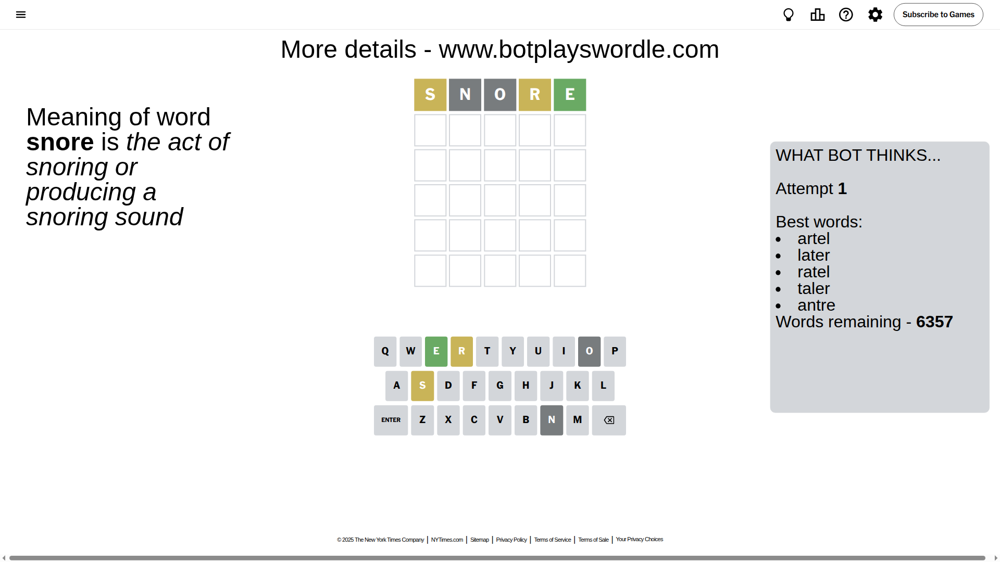
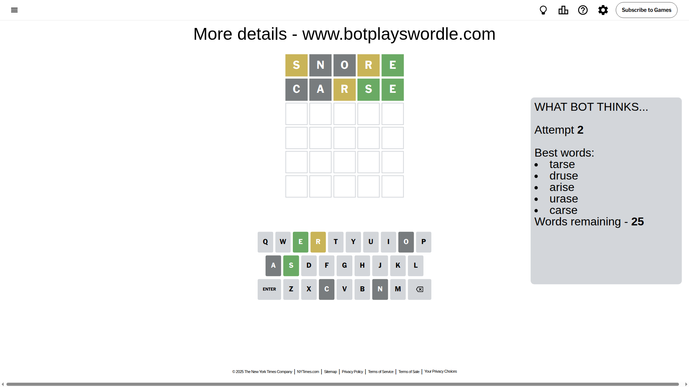
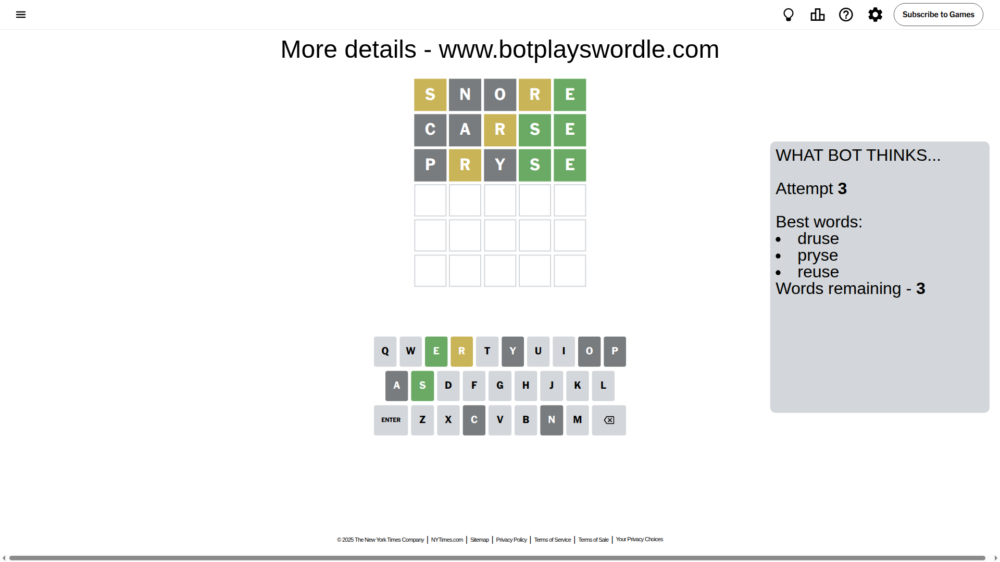
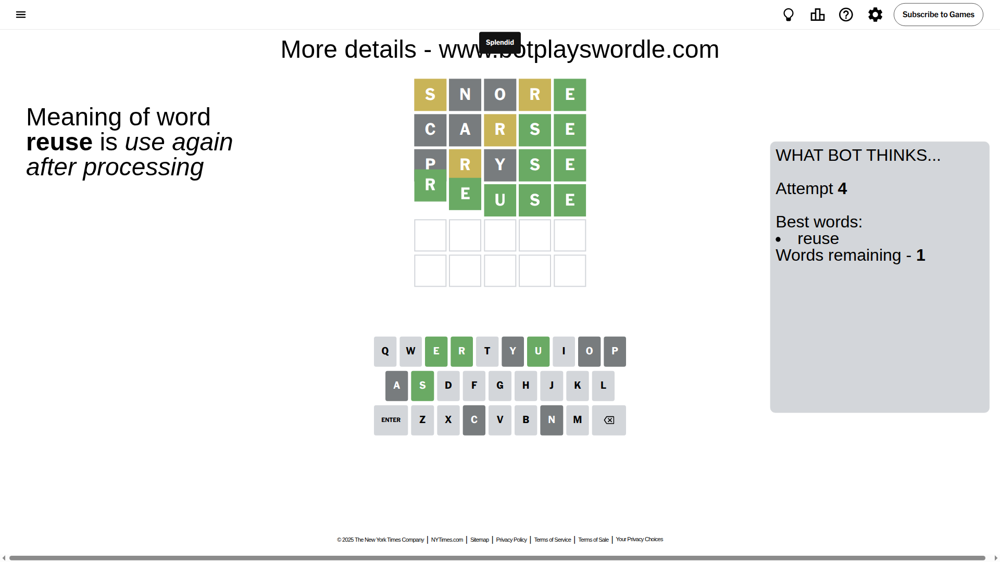

# Wordle for June 7, 2025 - \#1449

## Attempt 1

This is the first attempt and we'll choose a random word to start with.

Let's start with word `snore`

Attempt for `snore` gives us 1 correct letters, 2 present letters and 2 wrong letters.

If we look into details, we can see that:

Letter `s` is on a different spot - this means that it cannot be at position 1

Letter `n` is not present in the word and we will not use it any more

Letter `o` is not present in the word and we will not use it any more

Letter `r` is on a different spot - this means that it cannot be at position 4

Letter `e` should be at position 5

We got information about the correct letters and it should make next attempt easier

Some letters are missing (like `n`, `o`) but it's also important piece of information

Word should contain letters `[s r e]`

That was a great guess that limited number of remaining words

## Attempt 2

Right now we have 25 words to choose from and best of them seem to be `[tarse druse arise urase carse]`

So far we know that possible letters are:

At position 1: `[a b c d e f g h i j k l m p q r t u v w x y z]`

At position 2: `[a b c d e f g h i j k l m p q r s t u v w x y z]`

At position 3: `[a b c d e f g h i j k l m p q r s t u v w x y z]`

At position 4: `[a b c d e f g h i j k l m p q s t u v w x y z]`

At position 5: `[e]`

Next guess is `carse`, let's see what it gives us

Attempt for `carse` gives us 2 correct letters, 1 present letters and 2 wrong letters.

If we look into details, we can see that:

Letter `c` is not present in the word and we will not use it any more

Letter `a` is not present in the word and we will not use it any more

Letter `r` is on a different spot - this means that it cannot be at position 3

Letter `s` should be at position 4

We got information about the correct letters and it should make next attempt easier

Some letters are missing (like `c`, `a`) but it's also important piece of information

Word should contain letters `[s r e]`

That was a great guess that limited number of remaining words

## Attempt 3

Right now we have 3 words to choose from and best of them seem to be `[druse pryse reuse]`

So far we know that possible letters are:

At position 1: `[b d e f g h i j k l m p q r t u v w x y z]`

At position 2: `[b d e f g h i j k l m p q r s t u v w x y z]`

At position 3: `[b d e f g h i j k l m p q s t u v w x y z]`

At position 4: `[s]`

At position 5: `[e]`

Next guess is `pryse`, let's see what it gives us

Attempt for `pryse` gives us 2 correct letters, 1 present letters and 2 wrong letters.

If we look into details, we can see that:

Letter `p` is not present in the word and we will not use it any more

Letter `r` is on a different spot - this means that it cannot be at position 2

Letter `y` is not present in the word and we will not use it any more

Some letters are missing (like `p`, `y`) but it's also important piece of information

Word should contain letters `[s r e]`

Could be a better guess

## Attempt 4

Right now we have 1 words to choose from and best of them seem to be `[reuse]`

So far we know that possible letters are:

At position 1: `[b d e f g h i j k l m q r t u v w x z]`

At position 2: `[b d e f g h i j k l m q s t u v w x z]`

At position 3: `[b d e f g h i j k l m q s t u v w x z]`

At position 4: `[s]`

At position 5: `[e]`

It must be `reuse`

That's the correct answer! The word is `reuse`!

## Conclusion

Today's word is `reuse` and it took 4 attempts to guess it

