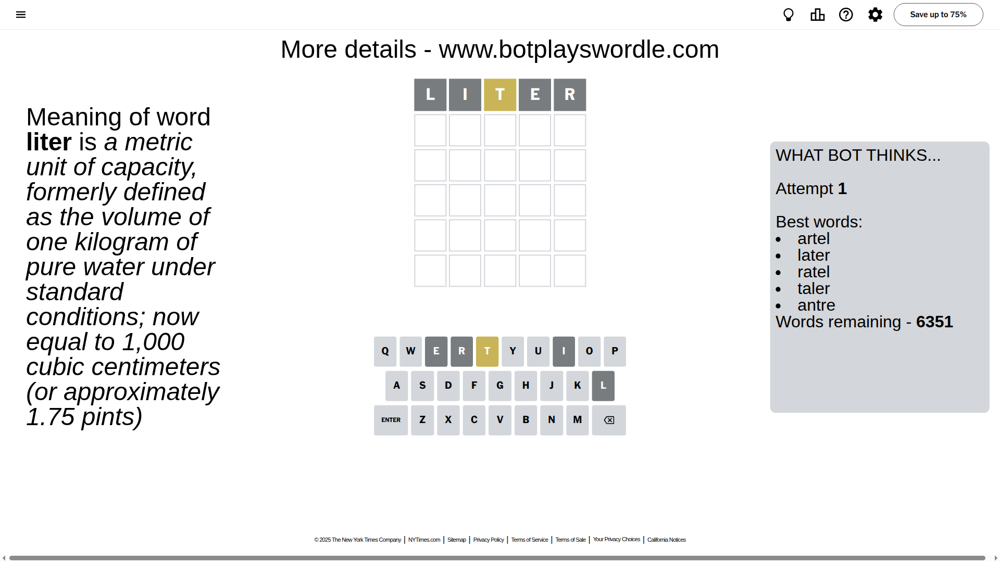
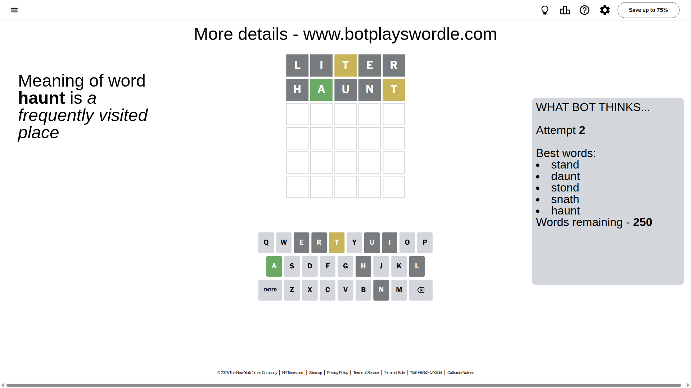
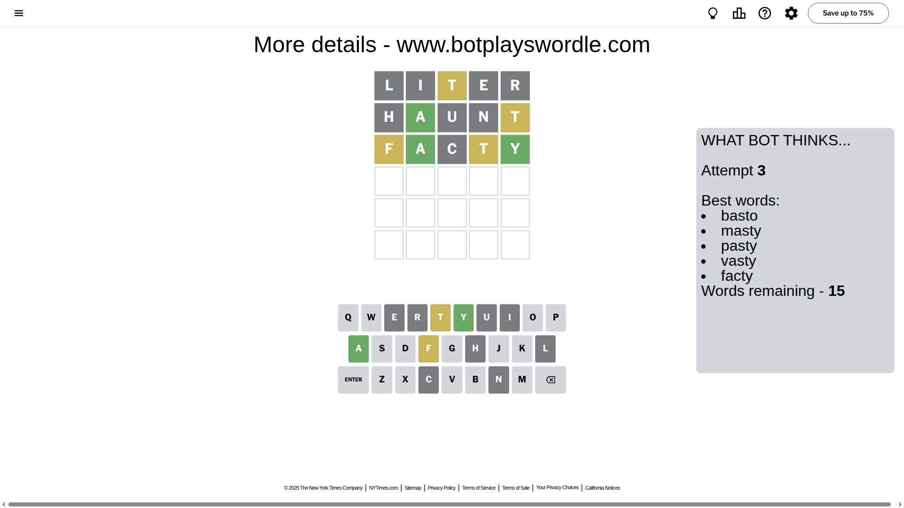
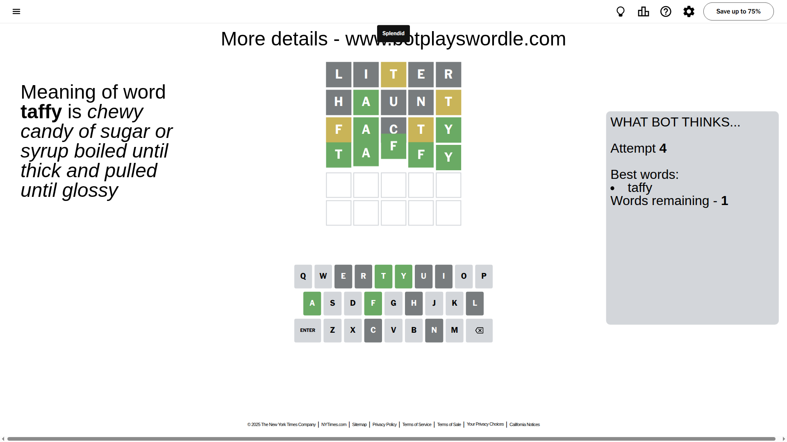

# Wordle for June 10, 2025 - \#1452

## Attempt 1

This is the first attempt and we'll choose a random word to start with.

Let's start with word `liter`

Attempt for `liter` gives us 0 correct letters, 1 present letters and 4 wrong letters.

If we look into details, we can see that:

Letter `l` is not present in the word and we will not use it any more

Letter `i` is not present in the word and we will not use it any more

Letter `t` is on a different spot - this means that it cannot be at position 3

Letter `e` is not present in the word and we will not use it any more

Letter `r` is not present in the word and we will not use it any more

Some letters are missing (like `l`, `i`, `e`, `r`) but it's also important piece of information

Word should contain letters `[t]`

That was a great guess that limited number of remaining words

## Attempt 2

Right now we have 250 words to choose from and best of them seem to be `[stand daunt stond snath haunt]`

So far we know that possible letters are:

At position 1: `[a b c d f g h j k m n o p q s t u v w x y z]`

At position 2: `[a b c d f g h j k m n o p q s t u v w x y z]`

At position 3: `[a b c d f g h j k m n o p q s u v w x y z]`

At position 4: `[a b c d f g h j k m n o p q s t u v w x y z]`

At position 5: `[a b c d f g h j k m n o p q s t u v w x y z]`

Next guess is `haunt`, let's see what it gives us

Attempt for `haunt` gives us 1 correct letters, 1 present letters and 3 wrong letters.

If we look into details, we can see that:

Letter `h` is not present in the word and we will not use it any more

Letter `a` should be at position 2

Letter `u` is not present in the word and we will not use it any more

Letter `n` is not present in the word and we will not use it any more

Letter `t` is on a different spot - this means that it cannot be at position 5

We got information about the correct letters and it should make next attempt easier

Some letters are missing (like `h`, `u`, `n`) but it's also important piece of information

Word should contain letters `[t a]`

That was a great guess that limited number of remaining words

## Attempt 3

Right now we have 15 words to choose from and best of them seem to be `[basto masty pasty vasty facty]`

So far we know that possible letters are:

At position 1: `[a b c d f g j k m o p q s t v w x y z]`

At position 2: `[a]`

At position 3: `[a b c d f g j k m o p q s v w x y z]`

At position 4: `[a b c d f g j k m o p q s t v w x y z]`

At position 5: `[a b c d f g j k m o p q s v w x y z]`

Next guess is `facty`, let's see what it gives us

Attempt for `facty` gives us 2 correct letters, 2 present letters and 1 wrong letters.

If we look into details, we can see that:

Letter `f` is on a different spot - this means that it cannot be at position 1

Letter `c` is not present in the word and we will not use it any more

Letter `t` is on a different spot - this means that it cannot be at position 4

Letter `y` should be at position 5

We got information about the correct letters and it should make next attempt easier

Some letters are missing (like `c`) but it's also important piece of information

Word should contain letters `[t a f y]`

That was a great guess that limited number of remaining words

## Attempt 4

Right now we have 1 words to choose from and best of them seem to be `[taffy]`

So far we know that possible letters are:

At position 1: `[a b d g j k m o p q s t v w x y z]`

At position 2: `[a]`

At position 3: `[a b d f g j k m o p q s v w x y z]`

At position 4: `[a b d f g j k m o p q s v w x y z]`

At position 5: `[y]`

It must be `taffy`

That's the correct answer! The word is `taffy`!

## Conclusion

Today's word is `taffy` and it took 4 attempts to guess it

