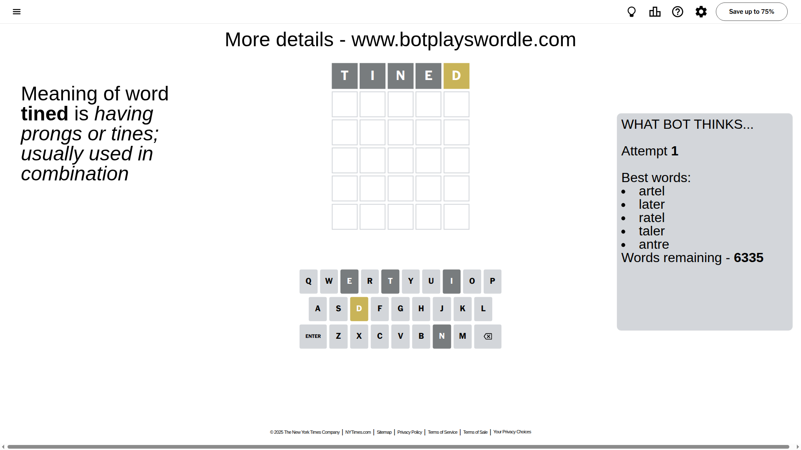
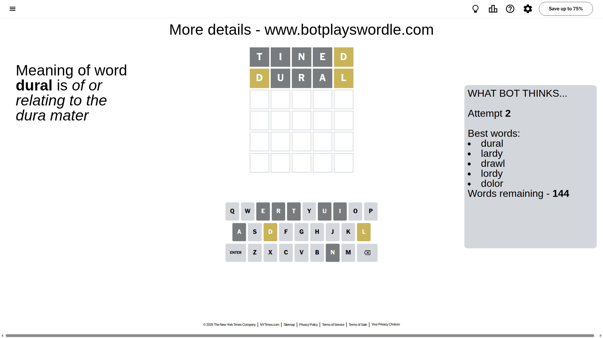
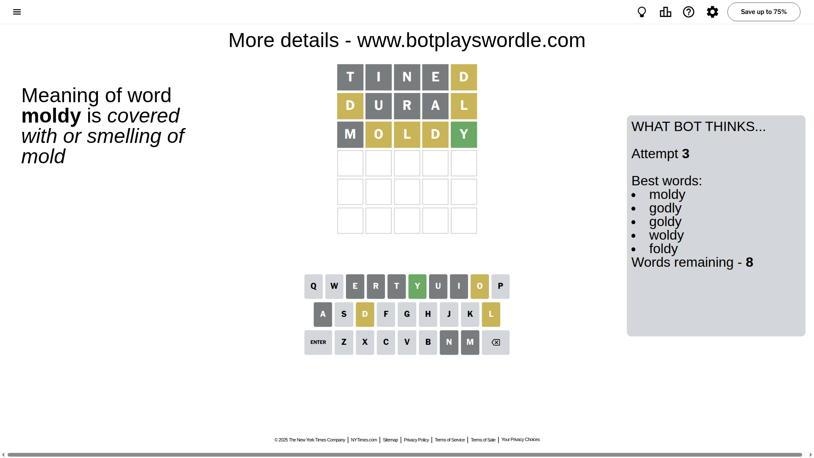
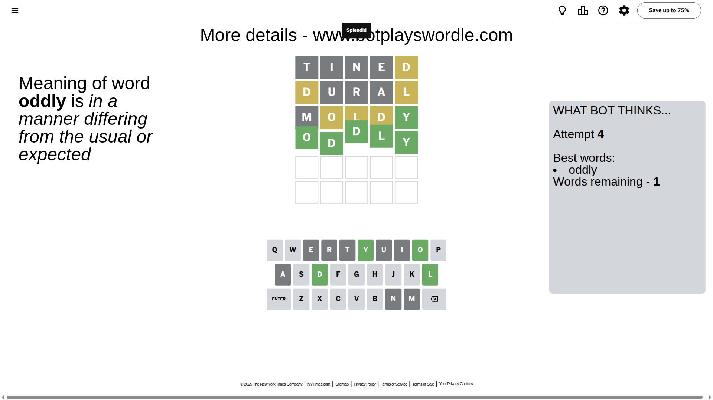

# Wordle for June 23, 2025 - \#1465

## Attempt 1

This is the first attempt and we'll choose a random word to start with.

Let's start with word `tined`

Attempt for `tined` gives us 0 correct letters, 1 present letters and 4 wrong letters.

If we look into details, we can see that:

Letter `t` is not present in the word and we will not use it any more

Letter `i` is not present in the word and we will not use it any more

Letter `n` is not present in the word and we will not use it any more

Letter `e` is not present in the word and we will not use it any more

Letter `d` is on a different spot - this means that it cannot be at position 5

Some letters are missing (like `t`, `i`, `n`, `e`) but it's also important piece of information

Word should contain letters `[d]`

That was a great guess that limited number of remaining words

## Attempt 2

Right now we have 144 words to choose from and best of them seem to be `[dural lardy drawl lordy dolor]`

So far we know that possible letters are:

At position 1: `[a b c d f g h j k l m o p q r s u v w x y z]`

At position 2: `[a b c d f g h j k l m o p q r s u v w x y z]`

At position 3: `[a b c d f g h j k l m o p q r s u v w x y z]`

At position 4: `[a b c d f g h j k l m o p q r s u v w x y z]`

At position 5: `[a b c f g h j k l m o p q r s u v w x y z]`

Next guess is `dural`, let's see what it gives us

Attempt for `dural` gives us 0 correct letters, 2 present letters and 3 wrong letters.

If we look into details, we can see that:

Letter `d` is on a different spot - this means that it cannot be at position 1

Letter `u` is not present in the word and we will not use it any more

Letter `r` is not present in the word and we will not use it any more

Letter `a` is not present in the word and we will not use it any more

Letter `l` is on a different spot - this means that it cannot be at position 5

Some letters are missing (like `u`, `r`, `a`) but it's also important piece of information

Word should contain letters `[d l]`

That was a great guess that limited number of remaining words

## Attempt 3

Right now we have 8 words to choose from and best of them seem to be `[moldy godly goldy woldy foldy]`

So far we know that possible letters are:

At position 1: `[b c f g h j k l m o p q s v w x y z]`

At position 2: `[b c d f g h j k l m o p q s v w x y z]`

At position 3: `[b c d f g h j k l m o p q s v w x y z]`

At position 4: `[b c d f g h j k l m o p q s v w x y z]`

At position 5: `[b c f g h j k m o p q s v w x y z]`

Next guess is `moldy`, let's see what it gives us

Attempt for `moldy` gives us 1 correct letters, 3 present letters and 1 wrong letters.

If we look into details, we can see that:

Letter `m` is not present in the word and we will not use it any more

Letter `o` is on a different spot - this means that it cannot be at position 2

Letter `l` is on a different spot - this means that it cannot be at position 3

Letter `d` is on a different spot - this means that it cannot be at position 4

Letter `y` should be at position 5

We got information about the correct letters and it should make next attempt easier

Some letters are missing (like `m`) but it's also important piece of information

Word should contain letters `[d l o y]`

Not a bad guess in general

## Attempt 4

Right now we have 1 words to choose from and best of them seem to be `[oddly]`

So far we know that possible letters are:

At position 1: `[b c f g h j k l o p q s v w x y z]`

At position 2: `[b c d f g h j k l p q s v w x y z]`

At position 3: `[b c d f g h j k o p q s v w x y z]`

At position 4: `[b c f g h j k l o p q s v w x y z]`

At position 5: `[y]`

It must be `oddly`

That's the correct answer! The word is `oddly`!

## Conclusion

Today's word is `oddly` and it took 4 attempts to guess it

