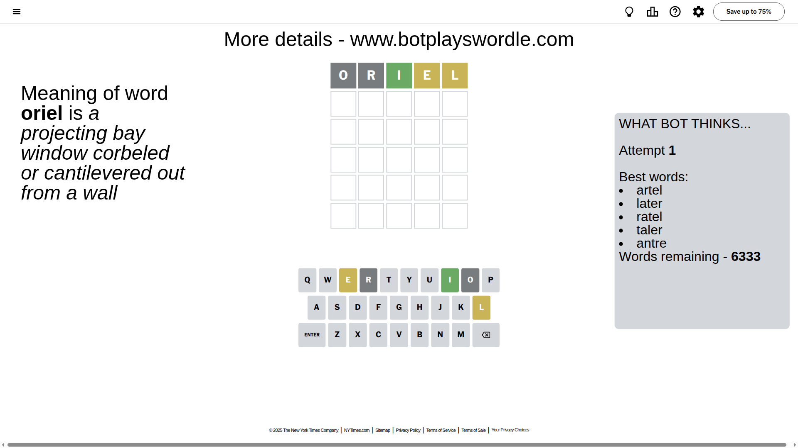
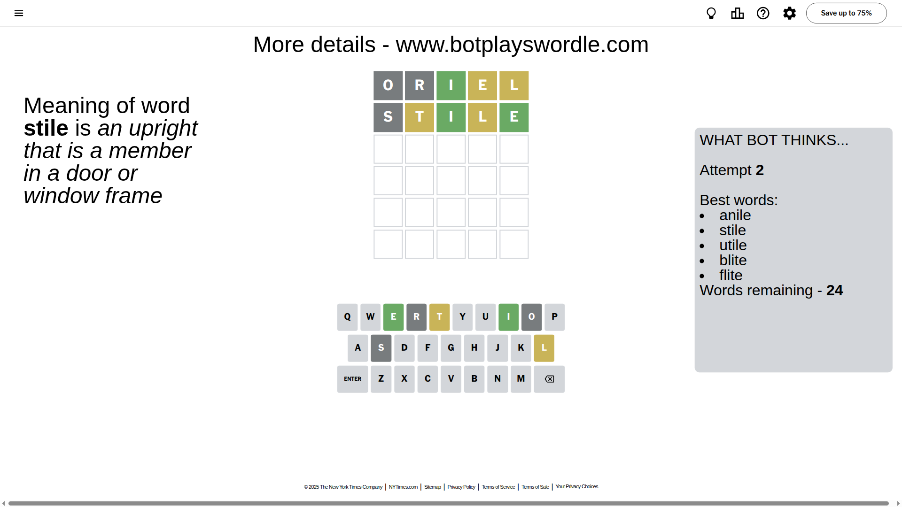
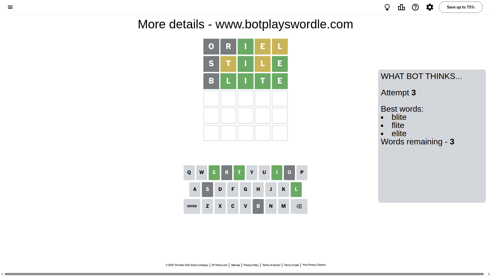
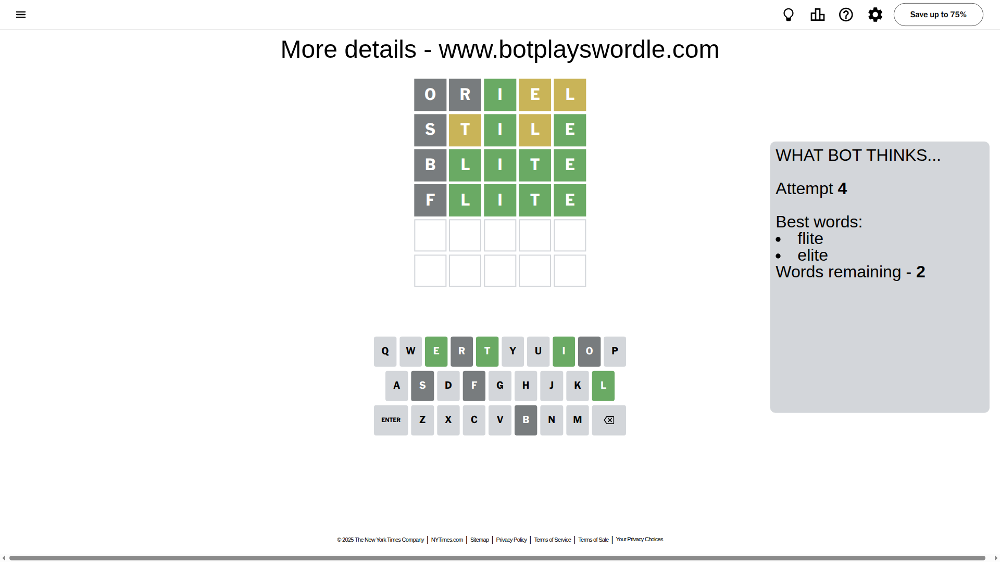
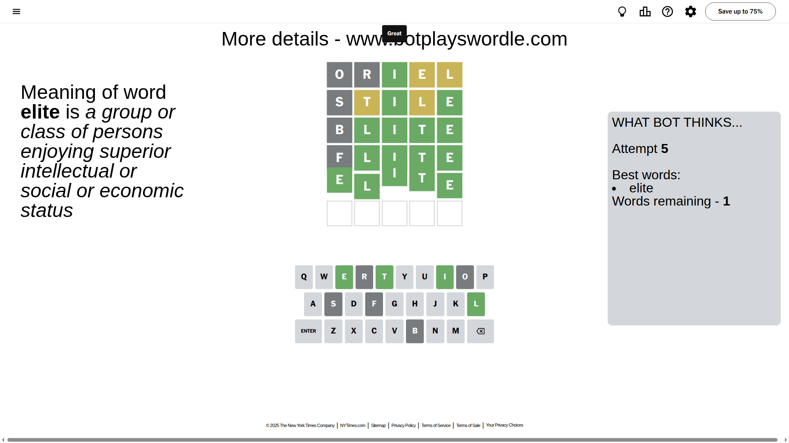

# Wordle for June 24, 2025 - \#1466

## Attempt 1

This is the first attempt and we'll choose a random word to start with.

Let's start with word `oriel`

Attempt for `oriel` gives us 1 correct letters, 2 present letters and 2 wrong letters.

If we look into details, we can see that:

Letter `o` is not present in the word and we will not use it any more

Letter `r` is not present in the word and we will not use it any more

Letter `i` should be at position 3

Letter `e` is on a different spot - this means that it cannot be at position 4

Letter `l` is on a different spot - this means that it cannot be at position 5

We got information about the correct letters and it should make next attempt easier

Some letters are missing (like `o`, `r`) but it's also important piece of information

Word should contain letters `[i e l]`

That was a great guess that limited number of remaining words

## Attempt 2

Right now we have 24 words to choose from and best of them seem to be `[anile stile utile blite flite]`

So far we know that possible letters are:

At position 1: `[a b c d e f g h i j k l m n p q s t u v w x y z]`

At position 2: `[a b c d e f g h i j k l m n p q s t u v w x y z]`

At position 3: `[i]`

At position 4: `[a b c d f g h i j k l m n p q s t u v w x y z]`

At position 5: `[a b c d e f g h i j k m n p q s t u v w x y z]`

Next guess is `stile`, let's see what it gives us

Attempt for `stile` gives us 2 correct letters, 2 present letters and 1 wrong letters.

If we look into details, we can see that:

Letter `s` is not present in the word and we will not use it any more

Letter `t` is on a different spot - this means that it cannot be at position 2

Letter `l` is on a different spot - this means that it cannot be at position 4

Letter `e` should be at position 5

We got information about the correct letters and it should make next attempt easier

Some letters are missing (like `s`) but it's also important piece of information

Word should contain letters `[i e l t]`

Not a bad guess in general

## Attempt 3

Right now we have 3 words to choose from and best of them seem to be `[blite flite elite]`

So far we know that possible letters are:

At position 1: `[a b c d e f g h i j k l m n p q t u v w x y z]`

At position 2: `[a b c d e f g h i j k l m n p q u v w x y z]`

At position 3: `[i]`

At position 4: `[a b c d f g h i j k m n p q t u v w x y z]`

At position 5: `[e]`

Next guess is `blite`, let's see what it gives us

Attempt for `blite` gives us 4 correct letters, 0 present letters and 1 wrong letters.

If we look into details, we can see that:

Letter `b` is not present in the word and we will not use it any more

Letter `l` should be at position 2

Letter `t` should be at position 4

We got information about the correct letters and it should make next attempt easier

Some letters are missing (like `b`) but it's also important piece of information

Word should contain letters `[i e l t]`

This was a waste, almost no valuable information...

## Attempt 4

Right now we have 2 words to choose from and best of them seem to be `[flite elite]`

So far we know that possible letters are:

At position 1: `[a c d e f g h i j k l m n p q t u v w x y z]`

At position 2: `[l]`

At position 3: `[i]`

At position 4: `[t]`

At position 5: `[e]`

Next guess is `flite`, let's see what it gives us

Attempt for `flite` gives us 4 correct letters, 0 present letters and 1 wrong letters.

If we look into details, we can see that:

Letter `f` is not present in the word and we will not use it any more

Some letters are missing (like `f`) but it's also important piece of information

Word should contain letters `[i e l t]`

This was a waste, almost no valuable information...

## Attempt 5

Right now we have 1 words to choose from and best of them seem to be `[elite]`

So far we know that possible letters are:

At position 1: `[a c d e g h i j k l m n p q t u v w x y z]`

At position 2: `[l]`

At position 3: `[i]`

At position 4: `[t]`

At position 5: `[e]`

It must be `elite`

That's the correct answer! The word is `elite`!

## Conclusion

Today's word is `elite` and it took 5 attempts to guess it

