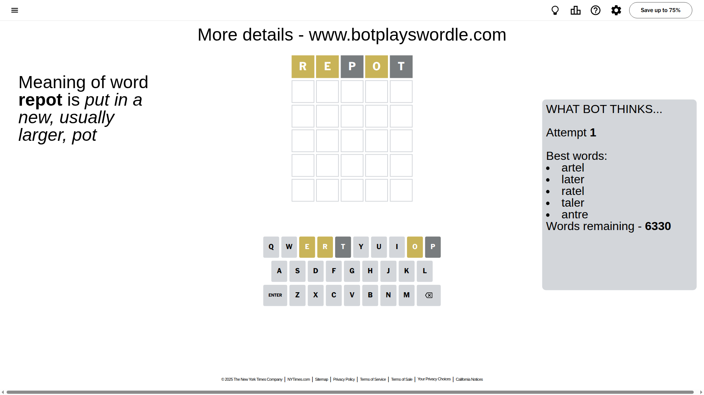
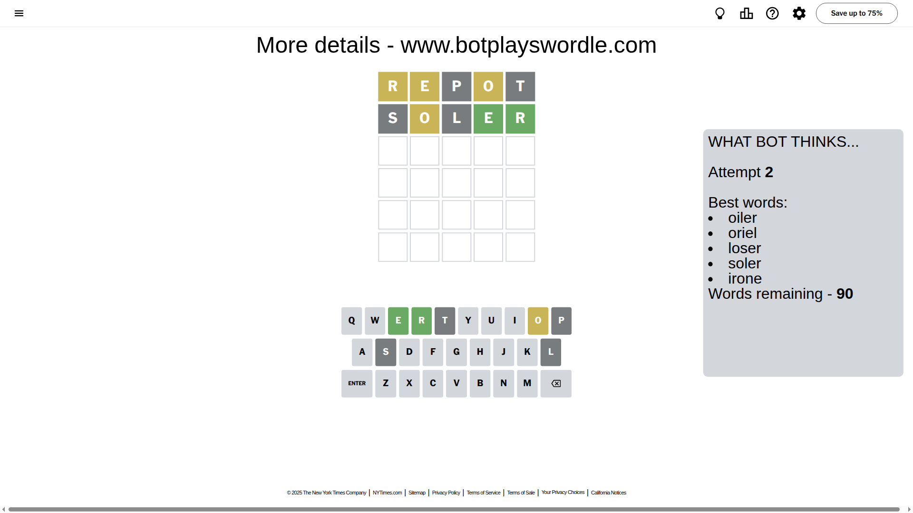
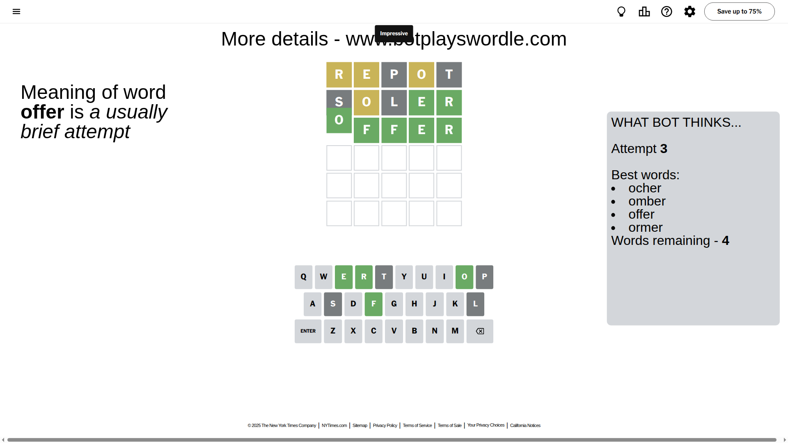

# Wordle for June 26, 2025 - \#1468

## Attempt 1

This is the first attempt and we'll choose a random word to start with.

Let's start with word `repot`

Attempt for `repot` gives us 0 correct letters, 3 present letters and 2 wrong letters.

If we look into details, we can see that:

Letter `r` is on a different spot - this means that it cannot be at position 1

Letter `e` is on a different spot - this means that it cannot be at position 2

Letter `p` is not present in the word and we will not use it any more

Letter `o` is on a different spot - this means that it cannot be at position 4

Letter `t` is not present in the word and we will not use it any more

Some letters are missing (like `p`, `t`) but it's also important piece of information

Word should contain letters `[r e o]`

That was a great guess that limited number of remaining words

## Attempt 2

Right now we have 90 words to choose from and best of them seem to be `[oiler oriel loser soler irone]`

So far we know that possible letters are:

At position 1: `[a b c d e f g h i j k l m n o q s u v w x y z]`

At position 2: `[a b c d f g h i j k l m n o q r s u v w x y z]`

At position 3: `[a b c d e f g h i j k l m n o q r s u v w x y z]`

At position 4: `[a b c d e f g h i j k l m n q r s u v w x y z]`

At position 5: `[a b c d e f g h i j k l m n o q r s u v w x y z]`

Next guess is `soler`, let's see what it gives us

Attempt for `soler` gives us 2 correct letters, 1 present letters and 2 wrong letters.

If we look into details, we can see that:

Letter `s` is not present in the word and we will not use it any more

Letter `o` is on a different spot - this means that it cannot be at position 2

Letter `l` is not present in the word and we will not use it any more

Letter `e` should be at position 4

Letter `r` should be at position 5

We got information about the correct letters and it should make next attempt easier

Some letters are missing (like `s`, `l`) but it's also important piece of information

Word should contain letters `[r e o]`

That was a great guess that limited number of remaining words

## Attempt 3

Right now we have 4 words to choose from and best of them seem to be `[ocher omber offer ormer]`

So far we know that possible letters are:

At position 1: `[a b c d e f g h i j k m n o q u v w x y z]`

At position 2: `[a b c d f g h i j k m n q r u v w x y z]`

At position 3: `[a b c d e f g h i j k m n o q r u v w x y z]`

At position 4: `[e]`

At position 5: `[r]`

Next guess is `offer`, let's see what it gives us

That's the correct answer! The word is `offer`!

## Conclusion

Today's word is `offer` and it took 3 attempts to guess it

