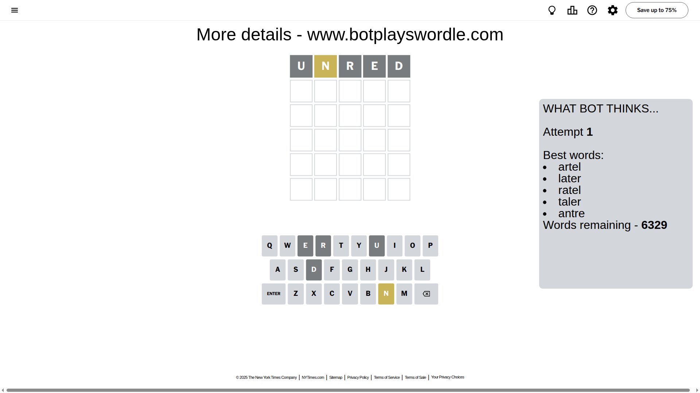
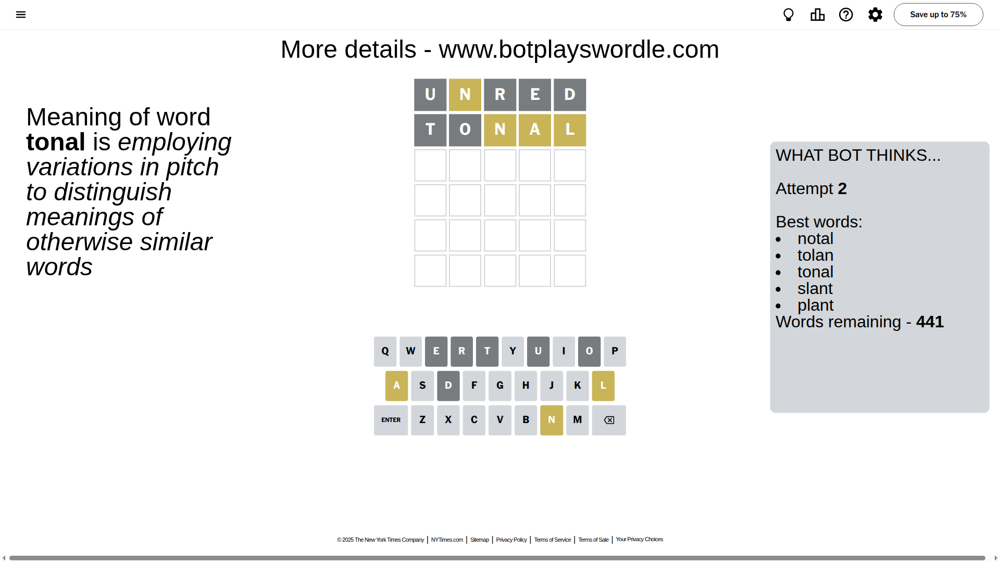
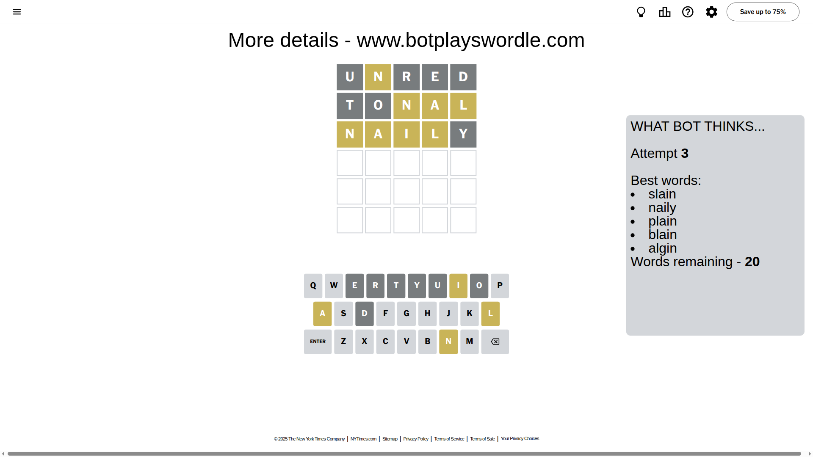
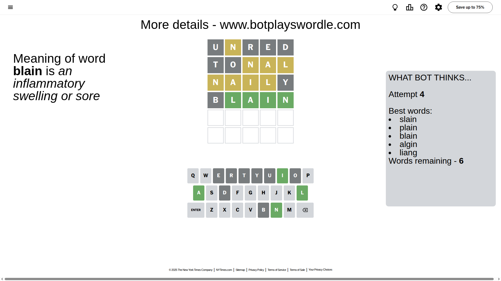
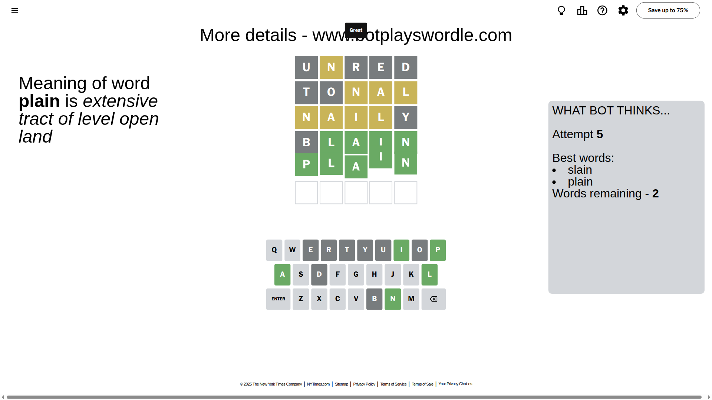

# Wordle for June 27, 2025 - \#1469

## Attempt 1

This is the first attempt and we'll choose a random word to start with.

Let's start with word `unred`

Attempt for `unred` gives us 0 correct letters, 1 present letters and 4 wrong letters.

If we look into details, we can see that:

Letter `u` is not present in the word and we will not use it any more

Letter `n` is on a different spot - this means that it cannot be at position 2

Letter `r` is not present in the word and we will not use it any more

Letter `e` is not present in the word and we will not use it any more

Letter `d` is not present in the word and we will not use it any more

Some letters are missing (like `u`, `r`, `e`, `d`) but it's also important piece of information

Word should contain letters `[n]`

That was a great guess that limited number of remaining words

## Attempt 2

Right now we have 441 words to choose from and best of them seem to be `[notal tolan tonal slant plant]`

So far we know that possible letters are:

At position 1: `[a b c f g h i j k l m n o p q s t v w x y z]`

At position 2: `[a b c f g h i j k l m o p q s t v w x y z]`

At position 3: `[a b c f g h i j k l m n o p q s t v w x y z]`

At position 4: `[a b c f g h i j k l m n o p q s t v w x y z]`

At position 5: `[a b c f g h i j k l m n o p q s t v w x y z]`

Next guess is `tonal`, let's see what it gives us

Attempt for `tonal` gives us 0 correct letters, 3 present letters and 2 wrong letters.

If we look into details, we can see that:

Letter `t` is not present in the word and we will not use it any more

Letter `o` is not present in the word and we will not use it any more

Letter `n` is on a different spot - this means that it cannot be at position 3

Letter `a` is on a different spot - this means that it cannot be at position 4

Letter `l` is on a different spot - this means that it cannot be at position 5

Some letters are missing (like `t`, `o`) but it's also important piece of information

Word should contain letters `[n a l]`

That was a great guess that limited number of remaining words

## Attempt 3

Right now we have 20 words to choose from and best of them seem to be `[slain naily plain blain algin]`

So far we know that possible letters are:

At position 1: `[a b c f g h i j k l m n p q s v w x y z]`

At position 2: `[a b c f g h i j k l m p q s v w x y z]`

At position 3: `[a b c f g h i j k l m p q s v w x y z]`

At position 4: `[b c f g h i j k l m n p q s v w x y z]`

At position 5: `[a b c f g h i j k m n p q s v w x y z]`

Next guess is `naily`, let's see what it gives us

Attempt for `naily` gives us 0 correct letters, 4 present letters and 1 wrong letters.

If we look into details, we can see that:

Letter `n` is on a different spot - this means that it cannot be at position 1

Letter `a` is on a different spot - this means that it cannot be at position 2

Letter `i` is on a different spot - this means that it cannot be at position 3

Letter `l` is on a different spot - this means that it cannot be at position 4

Letter `y` is not present in the word and we will not use it any more

Some letters are missing (like `y`) but it's also important piece of information

Word should contain letters `[n a l i]`

Could be a better guess

## Attempt 4

Right now we have 6 words to choose from and best of them seem to be `[slain plain blain algin liang]`

So far we know that possible letters are:

At position 1: `[a b c f g h i j k l m p q s v w x z]`

At position 2: `[b c f g h i j k l m p q s v w x z]`

At position 3: `[a b c f g h j k l m p q s v w x z]`

At position 4: `[b c f g h i j k m n p q s v w x z]`

At position 5: `[a b c f g h i j k m n p q s v w x z]`

Next guess is `blain`, let's see what it gives us

Attempt for `blain` gives us 4 correct letters, 0 present letters and 1 wrong letters.

If we look into details, we can see that:

Letter `b` is not present in the word and we will not use it any more

Letter `l` should be at position 2

Letter `a` should be at position 3

Letter `i` should be at position 4

Letter `n` should be at position 5

We got information about the correct letters and it should make next attempt easier

Some letters are missing (like `b`) but it's also important piece of information

Word should contain letters `[n a l i]`

Could be a better guess

## Attempt 5

Right now we have 2 words to choose from and best of them seem to be `[slain plain]`

So far we know that possible letters are:

At position 1: `[a c f g h i j k l m p q s v w x z]`

At position 2: `[l]`

At position 3: `[a]`

At position 4: `[i]`

At position 5: `[n]`

Next guess is `plain`, let's see what it gives us

That's the correct answer! The word is `plain`!

## Conclusion

Today's word is `plain` and it took 5 attempts to guess it

