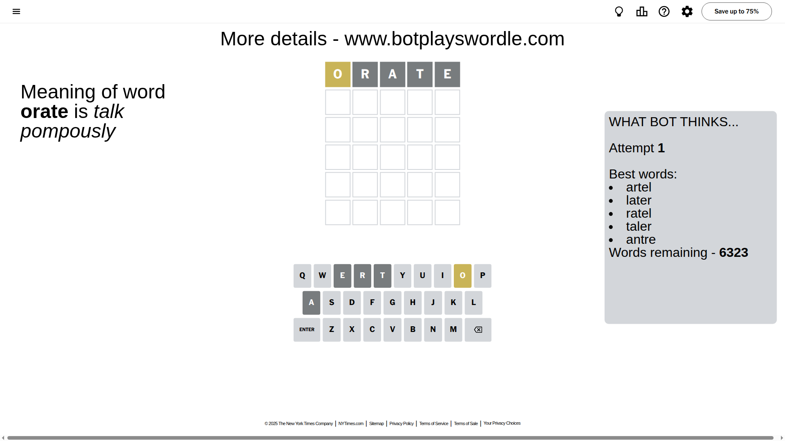
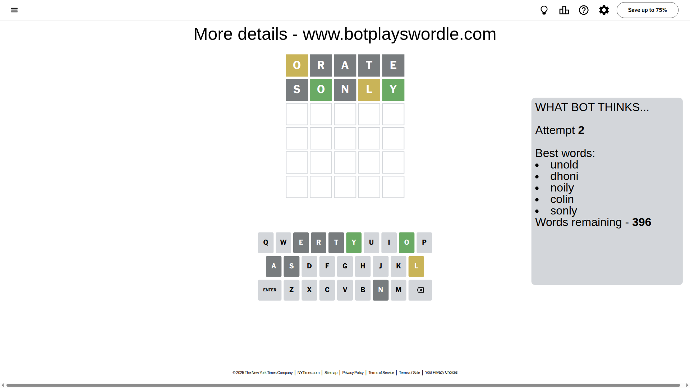

# Wordle for July 1, 2025 - \#1473

## Attempt 1

This is the first attempt and we'll choose a random word to start with.

Let's start with word `orate`

Attempt for `orate` gives us 0 correct letters, 1 present letters and 4 wrong letters.

If we look into details, we can see that:

Letter `o` is on a different spot - this means that it cannot be at position 1

Letter `r` is not present in the word and we will not use it any more

Letter `a` is not present in the word and we will not use it any more

Letter `t` is not present in the word and we will not use it any more

Letter `e` is not present in the word and we will not use it any more

Some letters are missing (like `r`, `a`, `t`, `e`) but it's also important piece of information

Word should contain letters `[o]`

That was a great guess that limited number of remaining words

## Attempt 2

Right now we have 396 words to choose from and best of them seem to be `[unold dhoni noily colin sonly]`

So far we know that possible letters are:

At position 1: `[b c d f g h i j k l m n p q s u v w x y z]`

At position 2: `[b c d f g h i j k l m n o p q s u v w x y z]`

At position 3: `[b c d f g h i j k l m n o p q s u v w x y z]`

At position 4: `[b c d f g h i j k l m n o p q s u v w x y z]`

At position 5: `[b c d f g h i j k l m n o p q s u v w x y z]`

Next guess is `sonly`, let's see what it gives us

Attempt for `sonly` gives us 2 correct letters, 1 present letters and 2 wrong letters.

If we look into details, we can see that:

Letter `s` is not present in the word and we will not use it any more

Letter `o` should be at position 2

Letter `n` is not present in the word and we will not use it any more

Letter `l` is on a different spot - this means that it cannot be at position 4

Letter `y` should be at position 5

We got information about the correct letters and it should make next attempt easier

Some letters are missing (like `s`, `n`) but it's also important piece of information

Word should contain letters `[o l y]`

That was a great guess that limited number of remaining words

## Attempt 3

Right now we have 11 words to choose from and best of them seem to be `[moldy goldy woldy lochy locky]`

So far we know that possible letters are:

At position 1: `[b c d f g h i j k l m p q u v w x y z]`

At position 2: `[o]`

At position 3: `[b c d f g h i j k l m o p q u v w x y z]`

At position 4: `[b c d f g h i j k m o p q u v w x y z]`

At position 5: `[y]`

Next guess is `goldy`, let's see what it gives us

Attempt for `goldy` gives us 4 correct letters, 0 present letters and 1 wrong letters.

If we look into details, we can see that:

Letter `g` is not present in the word and we will not use it any more

Letter `l` should be at position 3

Letter `d` should be at position 4

We got information about the correct letters and it should make next attempt easier

Some letters are missing (like `g`) but it's also important piece of information

Word should contain letters `[o l y d]`

Not a bad guess in general

## Attempt 4

Right now we have 2 words to choose from and best of them seem to be `[moldy woldy]`

So far we know that possible letters are:

At position 1: `[b c d f h i j k l m p q u v w x y z]`

At position 2: `[o]`

At position 3: `[l]`

At position 4: `[d]`

At position 5: `[y]`

Next guess is `moldy`, let's see what it gives us

That's the correct answer! The word is `moldy`!

## Conclusion

Today's word is `moldy` and it took 4 attempts to guess it

