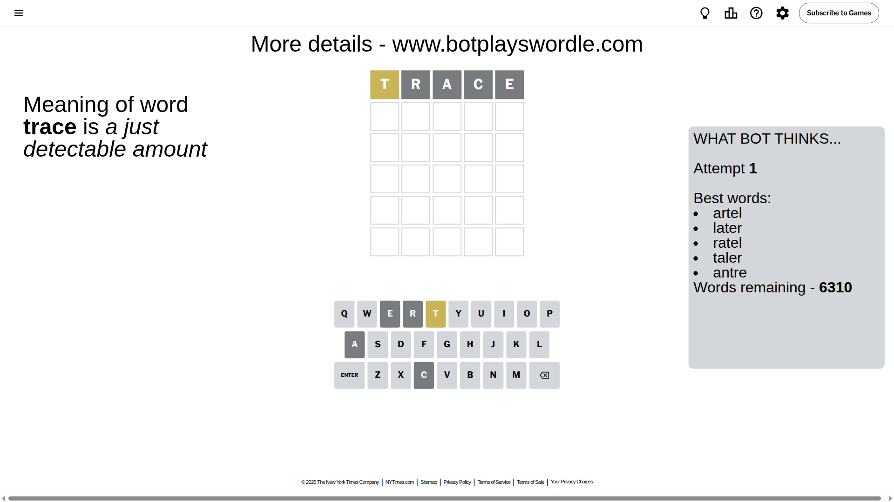
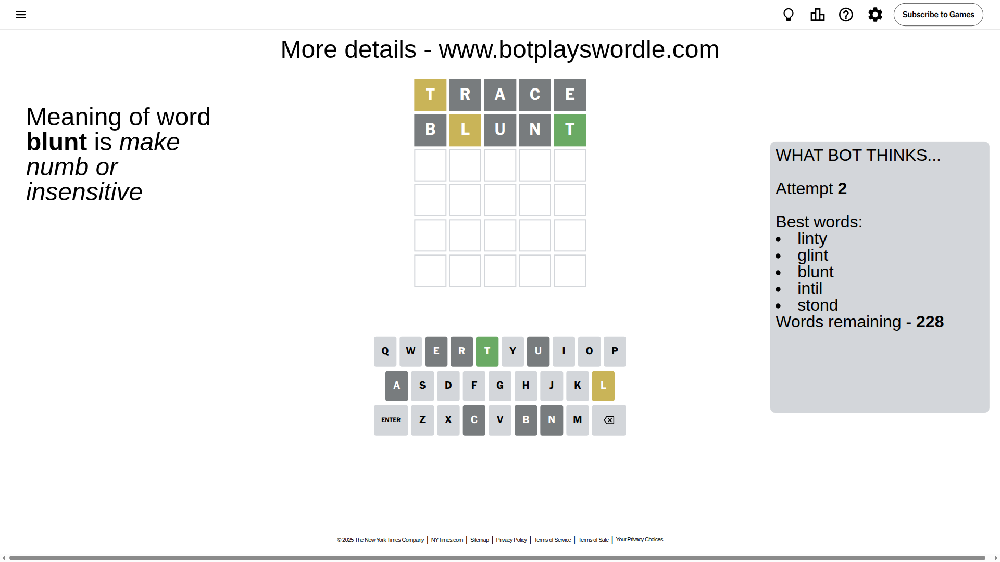
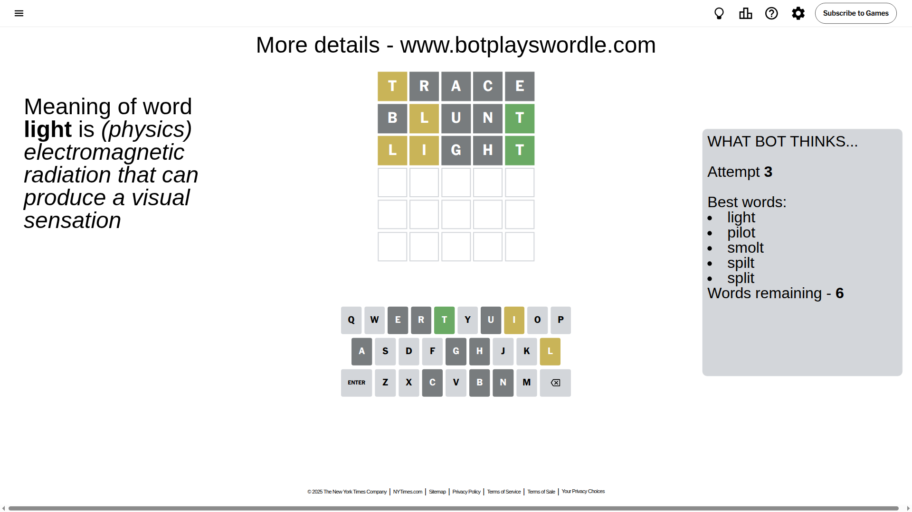
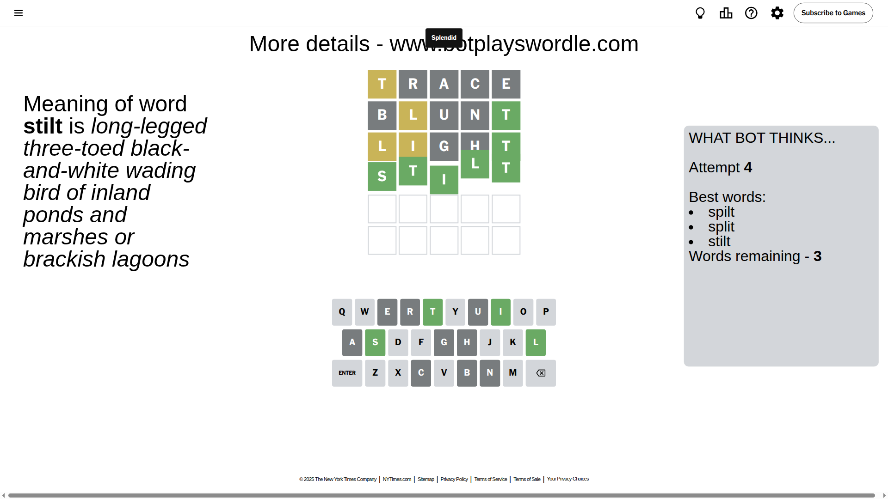

# Wordle for July 7, 2025 - \#1479

## Attempt 1

This is the first attempt and we'll choose a random word to start with.

Let's start with word `trace`

Attempt for `trace` gives us 0 correct letters, 1 present letters and 4 wrong letters.

If we look into details, we can see that:

Letter `t` is on a different spot - this means that it cannot be at position 1

Letter `r` is not present in the word and we will not use it any more

Letter `a` is not present in the word and we will not use it any more

Letter `c` is not present in the word and we will not use it any more

Letter `e` is not present in the word and we will not use it any more

Some letters are missing (like `r`, `a`, `c`, `e`) but it's also important piece of information

Word should contain letters `[t]`

That was a great guess that limited number of remaining words

## Attempt 2

Right now we have 228 words to choose from and best of them seem to be `[linty glint blunt intil stond]`

So far we know that possible letters are:

At position 1: `[b d f g h i j k l m n o p q s u v w x y z]`

At position 2: `[b d f g h i j k l m n o p q s t u v w x y z]`

At position 3: `[b d f g h i j k l m n o p q s t u v w x y z]`

At position 4: `[b d f g h i j k l m n o p q s t u v w x y z]`

At position 5: `[b d f g h i j k l m n o p q s t u v w x y z]`

Next guess is `blunt`, let's see what it gives us

Attempt for `blunt` gives us 1 correct letters, 1 present letters and 3 wrong letters.

If we look into details, we can see that:

Letter `b` is not present in the word and we will not use it any more

Letter `l` is on a different spot - this means that it cannot be at position 2

Letter `u` is not present in the word and we will not use it any more

Letter `n` is not present in the word and we will not use it any more

Letter `t` should be at position 5

We got information about the correct letters and it should make next attempt easier

Some letters are missing (like `b`, `u`, `n`) but it's also important piece of information

Word should contain letters `[t l]`

That was a great guess that limited number of remaining words

## Attempt 3

Right now we have 6 words to choose from and best of them seem to be `[light pilot smolt spilt split]`

So far we know that possible letters are:

At position 1: `[d f g h i j k l m o p q s v w x y z]`

At position 2: `[d f g h i j k m o p q s t v w x y z]`

At position 3: `[d f g h i j k l m o p q s t v w x y z]`

At position 4: `[d f g h i j k l m o p q s t v w x y z]`

At position 5: `[t]`

Next guess is `light`, let's see what it gives us

Attempt for `light` gives us 1 correct letters, 2 present letters and 2 wrong letters.

If we look into details, we can see that:

Letter `l` is on a different spot - this means that it cannot be at position 1

Letter `i` is on a different spot - this means that it cannot be at position 2

Letter `g` is not present in the word and we will not use it any more

Letter `h` is not present in the word and we will not use it any more

Some letters are missing (like `g`, `h`) but it's also important piece of information

Word should contain letters `[t l i]`

This was a waste, almost no valuable information...

## Attempt 4

Right now we have 3 words to choose from and best of them seem to be `[spilt split stilt]`

So far we know that possible letters are:

At position 1: `[d f i j k m o p q s v w x y z]`

At position 2: `[d f j k m o p q s t v w x y z]`

At position 3: `[d f i j k l m o p q s t v w x y z]`

At position 4: `[d f i j k l m o p q s t v w x y z]`

At position 5: `[t]`

Next guess is `stilt`, let's see what it gives us

That's the correct answer! The word is `stilt`!

## Conclusion

Today's word is `stilt` and it took 4 attempts to guess it

