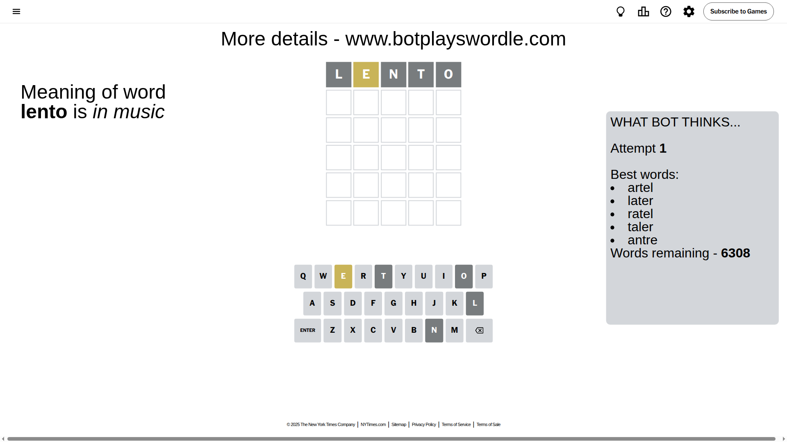
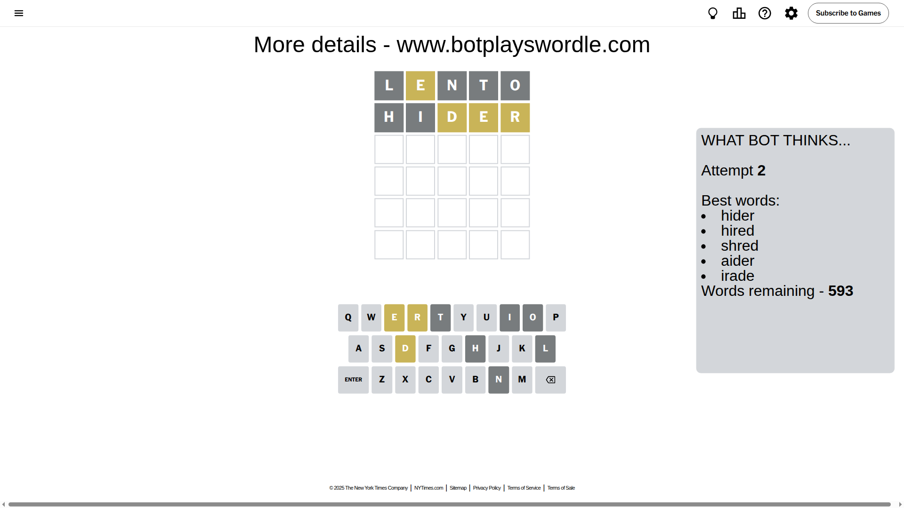
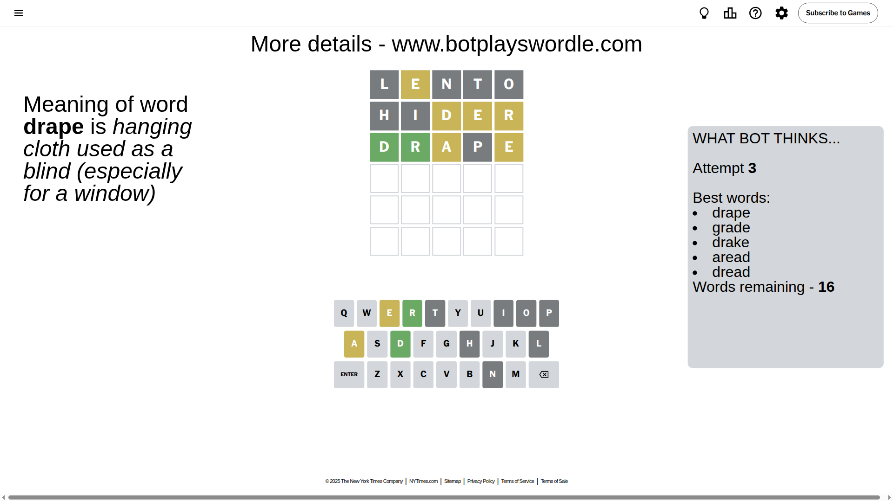
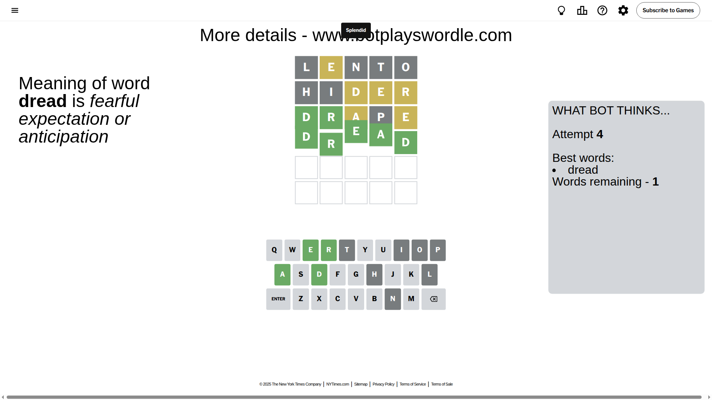

# Wordle for July 8, 2025 - \#1480

## Attempt 1

This is the first attempt and we'll choose a random word to start with.

Let's start with word `lento`

Attempt for `lento` gives us 0 correct letters, 1 present letters and 4 wrong letters.

If we look into details, we can see that:

Letter `l` is not present in the word and we will not use it any more

Letter `e` is on a different spot - this means that it cannot be at position 2

Letter `n` is not present in the word and we will not use it any more

Letter `t` is not present in the word and we will not use it any more

Letter `o` is not present in the word and we will not use it any more

Some letters are missing (like `l`, `n`, `t`, `o`) but it's also important piece of information

Word should contain letters `[e]`

That was a great guess that limited number of remaining words

## Attempt 2

Right now we have 593 words to choose from and best of them seem to be `[hider hired shred aider irade]`

So far we know that possible letters are:

At position 1: `[a b c d e f g h i j k m p q r s u v w x y z]`

At position 2: `[a b c d f g h i j k m p q r s u v w x y z]`

At position 3: `[a b c d e f g h i j k m p q r s u v w x y z]`

At position 4: `[a b c d e f g h i j k m p q r s u v w x y z]`

At position 5: `[a b c d e f g h i j k m p q r s u v w x y z]`

Next guess is `hider`, let's see what it gives us

Attempt for `hider` gives us 0 correct letters, 3 present letters and 2 wrong letters.

If we look into details, we can see that:

Letter `h` is not present in the word and we will not use it any more

Letter `i` is not present in the word and we will not use it any more

Letter `d` is on a different spot - this means that it cannot be at position 3

Letter `e` is on a different spot - this means that it cannot be at position 4

Letter `r` is on a different spot - this means that it cannot be at position 5

Some letters are missing (like `h`, `i`) but it's also important piece of information

Word should contain letters `[e d r]`

That was a great guess that limited number of remaining words

## Attempt 3

Right now we have 16 words to choose from and best of them seem to be `[drape grade drake aread dread]`

So far we know that possible letters are:

At position 1: `[a b c d e f g j k m p q r s u v w x y z]`

At position 2: `[a b c d f g j k m p q r s u v w x y z]`

At position 3: `[a b c e f g j k m p q r s u v w x y z]`

At position 4: `[a b c d f g j k m p q r s u v w x y z]`

At position 5: `[a b c d e f g j k m p q s u v w x y z]`

Next guess is `drape`, let's see what it gives us

Attempt for `drape` gives us 2 correct letters, 2 present letters and 1 wrong letters.

If we look into details, we can see that:

Letter `d` should be at position 1

Letter `r` should be at position 2

Letter `a` is on a different spot - this means that it cannot be at position 3

Letter `p` is not present in the word and we will not use it any more

Letter `e` is on a different spot - this means that it cannot be at position 5

We got information about the correct letters and it should make next attempt easier

Some letters are missing (like `p`) but it's also important piece of information

Word should contain letters `[e d r a]`

That was a great guess that limited number of remaining words

## Attempt 4

Right now we have 1 words to choose from and best of them seem to be `[dread]`

So far we know that possible letters are:

At position 1: `[d]`

At position 2: `[r]`

At position 3: `[b c e f g j k m q r s u v w x y z]`

At position 4: `[a b c d f g j k m q r s u v w x y z]`

At position 5: `[a b c d f g j k m q s u v w x y z]`

It must be `dread`

That's the correct answer! The word is `dread`!

## Conclusion

Today's word is `dread` and it took 4 attempts to guess it

