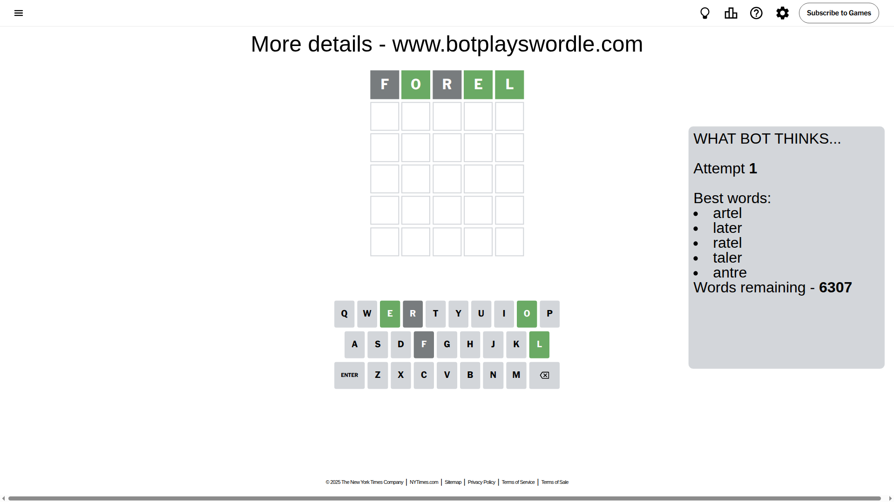
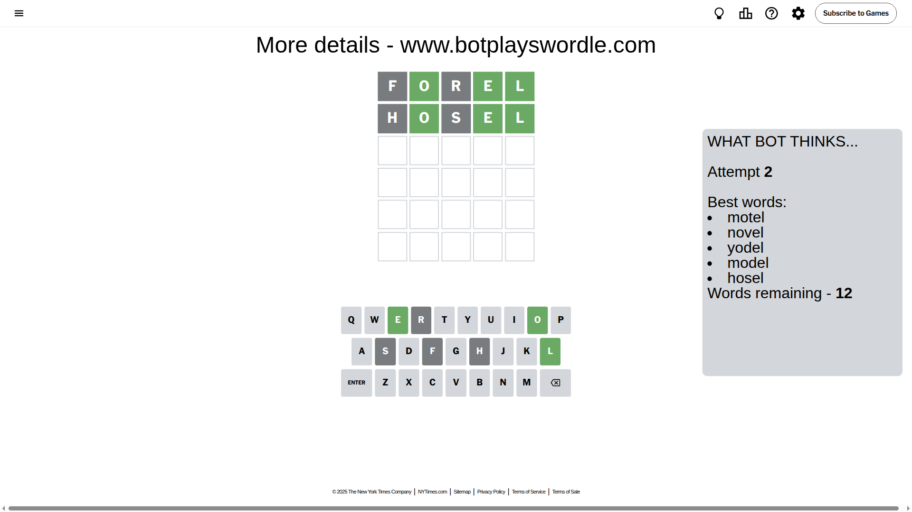
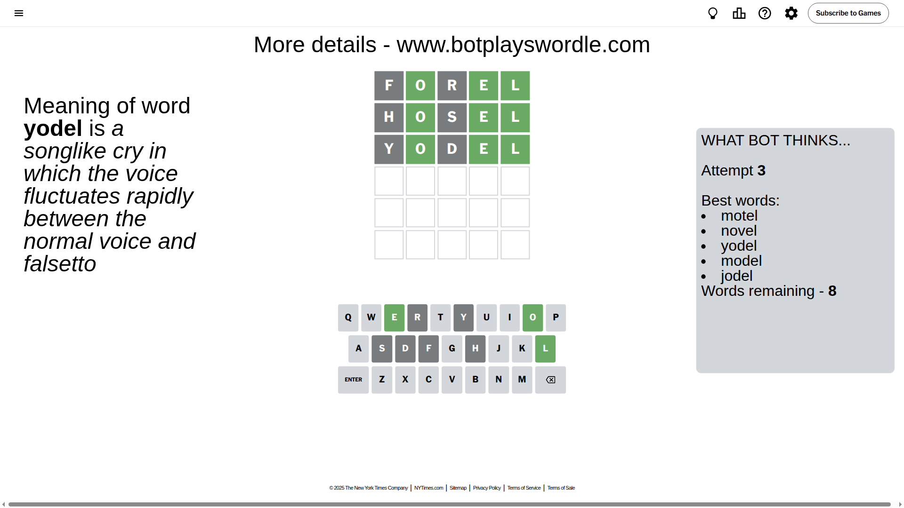
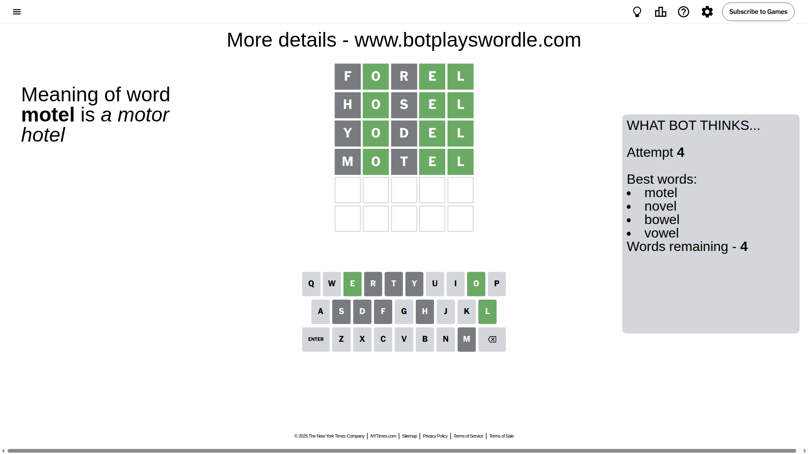
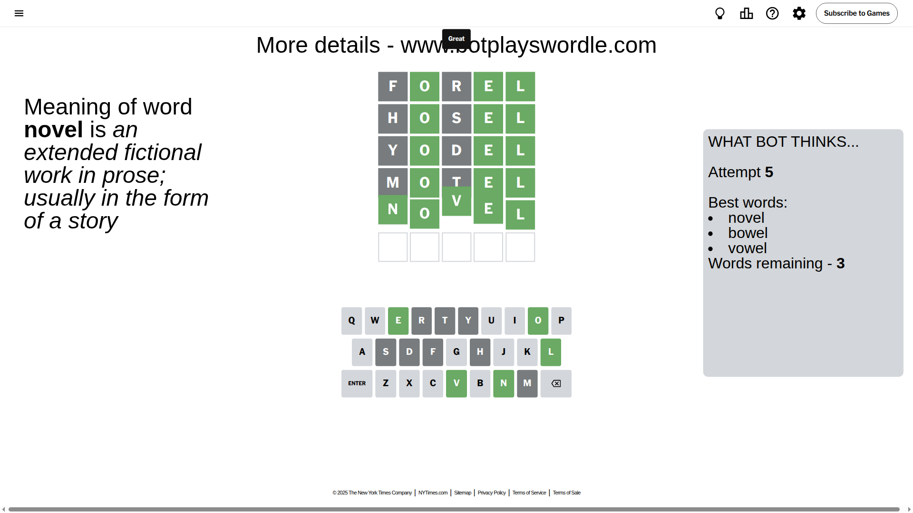

# Wordle for July 9, 2025 - \#1481

## Attempt 1

This is the first attempt and we'll choose a random word to start with.

Let's start with word `forel`

Attempt for `forel` gives us 3 correct letters, 0 present letters and 2 wrong letters.

If we look into details, we can see that:

Letter `f` is not present in the word and we will not use it any more

Letter `o` should be at position 2

Letter `r` is not present in the word and we will not use it any more

Letter `e` should be at position 4

Letter `l` should be at position 5

We got information about the correct letters and it should make next attempt easier

Some letters are missing (like `f`, `r`) but it's also important piece of information

Word should contain letters `[o e l]`

That was a great guess that limited number of remaining words

## Attempt 2

Right now we have 12 words to choose from and best of them seem to be `[motel novel yodel model hosel]`

So far we know that possible letters are:

At position 1: `[a b c d e g h i j k l m n o p q s t u v w x y z]`

At position 2: `[o]`

At position 3: `[a b c d e g h i j k l m n o p q s t u v w x y z]`

At position 4: `[e]`

At position 5: `[l]`

Next guess is `hosel`, let's see what it gives us

Attempt for `hosel` gives us 3 correct letters, 0 present letters and 2 wrong letters.

If we look into details, we can see that:

Letter `h` is not present in the word and we will not use it any more

Letter `s` is not present in the word and we will not use it any more

Some letters are missing (like `h`, `s`) but it's also important piece of information

Word should contain letters `[o e l]`

This was a waste, almost no valuable information...

## Attempt 3

Right now we have 8 words to choose from and best of them seem to be `[motel novel yodel model jodel]`

So far we know that possible letters are:

At position 1: `[a b c d e g i j k l m n o p q t u v w x y z]`

At position 2: `[o]`

At position 3: `[a b c d e g i j k l m n o p q t u v w x y z]`

At position 4: `[e]`

At position 5: `[l]`

Next guess is `yodel`, let's see what it gives us

Attempt for `yodel` gives us 3 correct letters, 0 present letters and 2 wrong letters.

If we look into details, we can see that:

Letter `y` is not present in the word and we will not use it any more

Letter `d` is not present in the word and we will not use it any more

Some letters are missing (like `y`, `d`) but it's also important piece of information

Word should contain letters `[o e l]`

This was a waste, almost no valuable information...

## Attempt 4

Right now we have 4 words to choose from and best of them seem to be `[motel novel bowel vowel]`

So far we know that possible letters are:

At position 1: `[a b c e g i j k l m n o p q t u v w x z]`

At position 2: `[o]`

At position 3: `[a b c e g i j k l m n o p q t u v w x z]`

At position 4: `[e]`

At position 5: `[l]`

Next guess is `motel`, let's see what it gives us

Attempt for `motel` gives us 3 correct letters, 0 present letters and 2 wrong letters.

If we look into details, we can see that:

Letter `m` is not present in the word and we will not use it any more

Letter `t` is not present in the word and we will not use it any more

Some letters are missing (like `m`, `t`) but it's also important piece of information

Word should contain letters `[o e l]`

This was a waste, almost no valuable information...

## Attempt 5

Right now we have 3 words to choose from and best of them seem to be `[novel bowel vowel]`

So far we know that possible letters are:

At position 1: `[a b c e g i j k l n o p q u v w x z]`

At position 2: `[o]`

At position 3: `[a b c e g i j k l n o p q u v w x z]`

At position 4: `[e]`

At position 5: `[l]`

Next guess is `novel`, let's see what it gives us

That's the correct answer! The word is `novel`!

## Conclusion

Today's word is `novel` and it took 5 attempts to guess it

