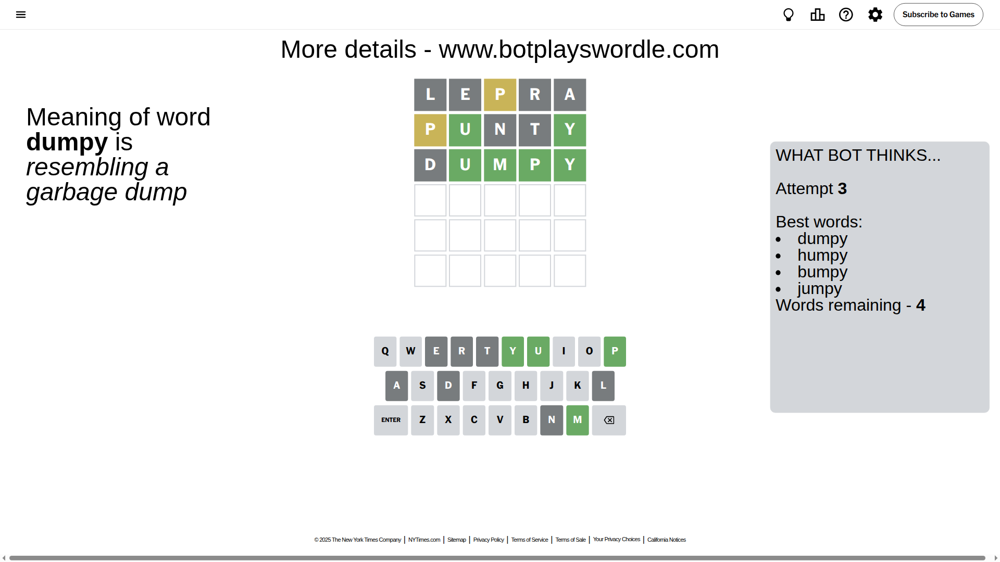

# Wordle for July 10, 2025 - \#1482

## Attempt 1

This is the first attempt and we'll choose a random word to start with.

Let's start with word `lepra`

Attempt for `lepra` gives us 0 correct letters, 1 present letters and 4 wrong letters.

If we look into details, we can see that:

Letter `l` is not present in the word and we will not use it any more

Letter `e` is not present in the word and we will not use it any more

Letter `p` is on a different spot - this means that it cannot be at position 3

Letter `r` is not present in the word and we will not use it any more

Letter `a` is not present in the word and we will not use it any more

Some letters are missing (like `l`, `e`, `r`, `a`) but it's also important piece of information

Word should contain letters `[p]`

That was a great guess that limited number of remaining words

## Attempt 2

Right now we have 118 words to choose from and best of them seem to be `[pinto point punto punti punty]`

So far we know that possible letters are:

At position 1: `[b c d f g h i j k m n o p q s t u v w x y z]`

At position 2: `[b c d f g h i j k m n o p q s t u v w x y z]`

At position 3: `[b c d f g h i j k m n o q s t u v w x y z]`

At position 4: `[b c d f g h i j k m n o p q s t u v w x y z]`

At position 5: `[b c d f g h i j k m n o p q s t u v w x y z]`

Next guess is `punty`, let's see what it gives us

Attempt for `punty` gives us 2 correct letters, 1 present letters and 2 wrong letters.

If we look into details, we can see that:

Letter `p` is on a different spot - this means that it cannot be at position 1

Letter `u` should be at position 2

Letter `n` is not present in the word and we will not use it any more

Letter `t` is not present in the word and we will not use it any more

Letter `y` should be at position 5

We got information about the correct letters and it should make next attempt easier

Some letters are missing (like `n`, `t`) but it's also important piece of information

Word should contain letters `[p u y]`

That was a great guess that limited number of remaining words

## Attempt 3

Right now we have 4 words to choose from and best of them seem to be `[dumpy humpy bumpy jumpy]`

So far we know that possible letters are:

At position 1: `[b c d f g h i j k m o q s u v w x y z]`

At position 2: `[u]`

At position 3: `[b c d f g h i j k m o q s u v w x y z]`

At position 4: `[b c d f g h i j k m o p q s u v w x y z]`

At position 5: `[y]`

Next guess is `dumpy`, let's see what it gives us

Attempt for `dumpy` gives us 4 correct letters, 0 present letters and 1 wrong letters.

If we look into details, we can see that:

Letter `d` is not present in the word and we will not use it any more

Letter `m` should be at position 3

Letter `p` should be at position 4

We got information about the correct letters and it should make next attempt easier

Some letters are missing (like `d`) but it's also important piece of information

Word should contain letters `[p u y m]`

This was a waste, almost no valuable information...

## Attempt 4

Right now we have 3 words to choose from and best of them seem to be `[humpy bumpy jumpy]`

So far we know that possible letters are:

At position 1: `[b c f g h i j k m o q s u v w x y z]`

At position 2: `[u]`

At position 3: `[m]`

At position 4: `[p]`

At position 5: `[y]`

Next guess is `jumpy`, let's see what it gives us

That's the correct answer! The word is `jumpy`!

## Conclusion

Today's word is `jumpy` and it took 4 attempts to guess it

