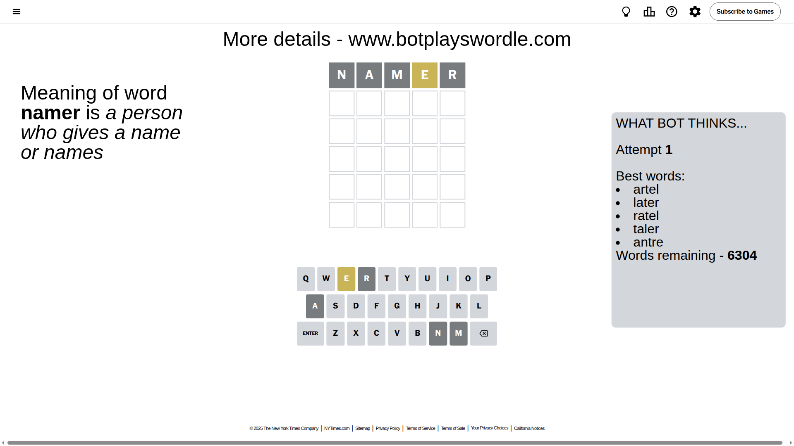
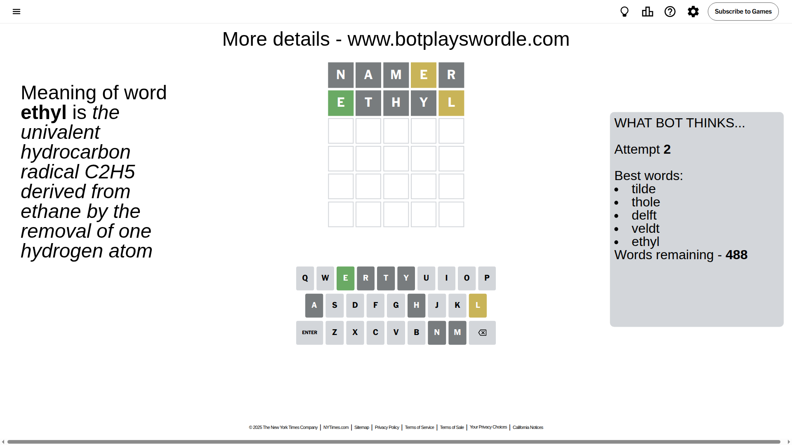
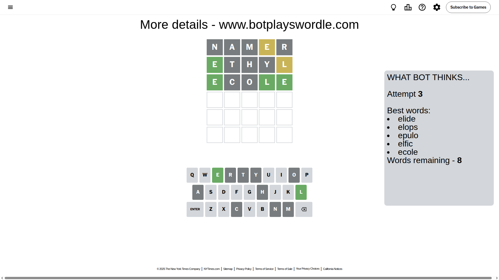
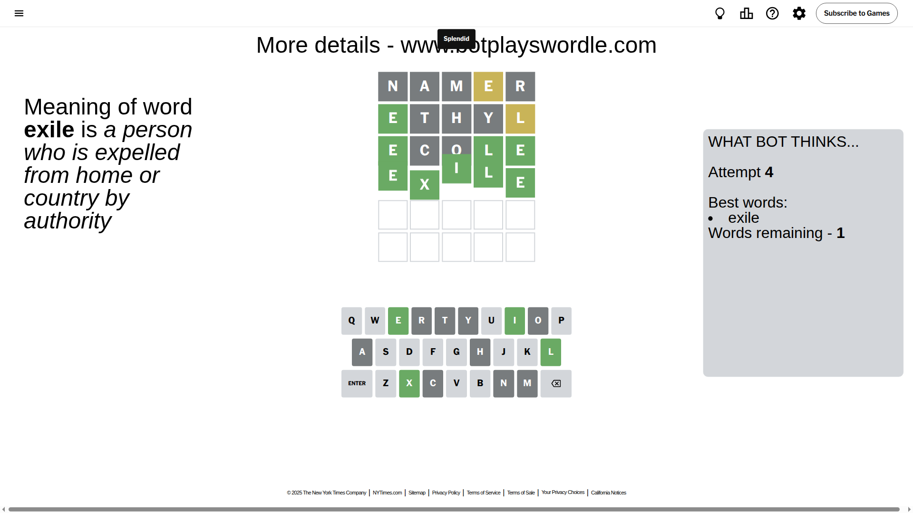

# Wordle for July 12, 2025 - \#1484

## Attempt 1

This is the first attempt and we'll choose a random word to start with.

Let's start with word `namer`

Attempt for `namer` gives us 0 correct letters, 1 present letters and 4 wrong letters.

If we look into details, we can see that:

Letter `n` is not present in the word and we will not use it any more

Letter `a` is not present in the word and we will not use it any more

Letter `m` is not present in the word and we will not use it any more

Letter `e` is on a different spot - this means that it cannot be at position 4

Letter `r` is not present in the word and we will not use it any more

Some letters are missing (like `n`, `a`, `m`, `r`) but it's also important piece of information

Word should contain letters `[e]`

That was a great guess that limited number of remaining words

## Attempt 2

Right now we have 488 words to choose from and best of them seem to be `[tilde thole delft veldt ethyl]`

So far we know that possible letters are:

At position 1: `[b c d e f g h i j k l o p q s t u v w x y z]`

At position 2: `[b c d e f g h i j k l o p q s t u v w x y z]`

At position 3: `[b c d e f g h i j k l o p q s t u v w x y z]`

At position 4: `[b c d f g h i j k l o p q s t u v w x y z]`

At position 5: `[b c d e f g h i j k l o p q s t u v w x y z]`

Next guess is `ethyl`, let's see what it gives us

Attempt for `ethyl` gives us 1 correct letters, 1 present letters and 3 wrong letters.

If we look into details, we can see that:

Letter `e` should be at position 1

Letter `t` is not present in the word and we will not use it any more

Letter `h` is not present in the word and we will not use it any more

Letter `y` is not present in the word and we will not use it any more

Letter `l` is on a different spot - this means that it cannot be at position 5

We got information about the correct letters and it should make next attempt easier

Some letters are missing (like `t`, `h`, `y`) but it's also important piece of information

Word should contain letters `[e l]`

That was a great guess that limited number of remaining words

## Attempt 3

Right now we have 8 words to choose from and best of them seem to be `[elide elops epulo elfic ecole]`

So far we know that possible letters are:

At position 1: `[e]`

At position 2: `[b c d e f g i j k l o p q s u v w x z]`

At position 3: `[b c d e f g i j k l o p q s u v w x z]`

At position 4: `[b c d f g i j k l o p q s u v w x z]`

At position 5: `[b c d e f g i j k o p q s u v w x z]`

Next guess is `ecole`, let's see what it gives us

Attempt for `ecole` gives us 3 correct letters, 0 present letters and 2 wrong letters.

If we look into details, we can see that:

Letter `c` is not present in the word and we will not use it any more

Letter `o` is not present in the word and we will not use it any more

Letter `l` should be at position 4

Letter `e` should be at position 5

We got information about the correct letters and it should make next attempt easier

Some letters are missing (like `c`, `o`) but it's also important piece of information

Word should contain letters `[e l]`

Not a bad guess in general

## Attempt 4

Right now we have 1 words to choose from and best of them seem to be `[exile]`

So far we know that possible letters are:

At position 1: `[e]`

At position 2: `[b d e f g i j k l p q s u v w x z]`

At position 3: `[b d e f g i j k l p q s u v w x z]`

At position 4: `[l]`

At position 5: `[e]`

It must be `exile`

That's the correct answer! The word is `exile`!

## Conclusion

Today's word is `exile` and it took 4 attempts to guess it

