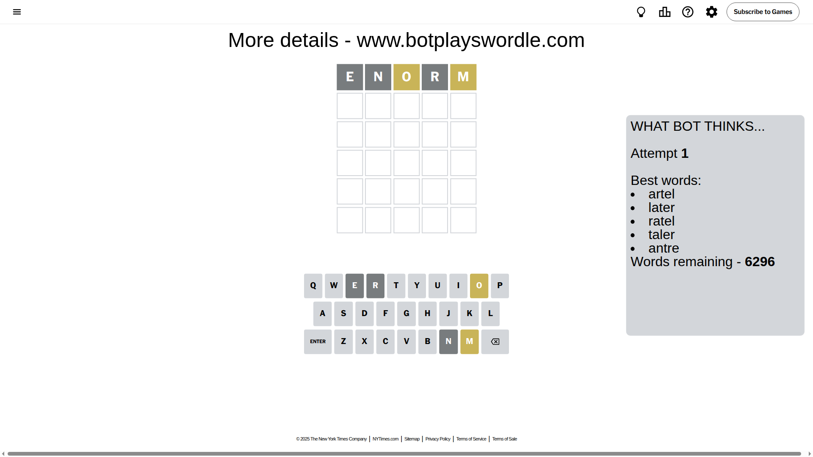
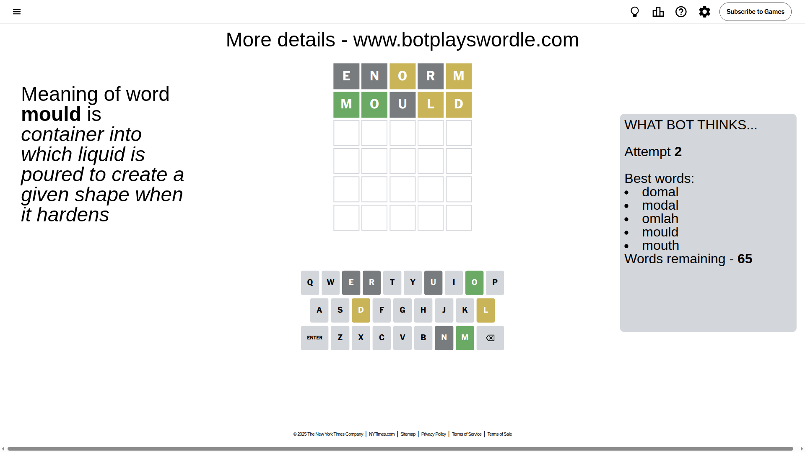
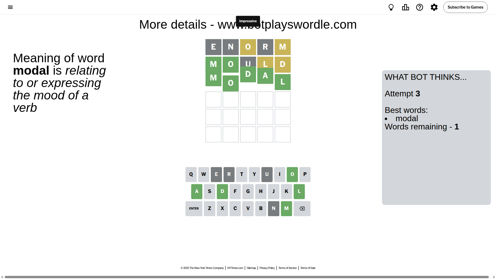

# Wordle for July 17, 2025 - \#1489

## Attempt 1

This is the first attempt and we'll choose a random word to start with.

Let's start with word `enorm`

Attempt for `enorm` gives us 0 correct letters, 2 present letters and 3 wrong letters.

If we look into details, we can see that:

Letter `e` is not present in the word and we will not use it any more

Letter `n` is not present in the word and we will not use it any more

Letter `o` is on a different spot - this means that it cannot be at position 3

Letter `r` is not present in the word and we will not use it any more

Letter `m` is on a different spot - this means that it cannot be at position 5

Some letters are missing (like `e`, `n`, `r`) but it's also important piece of information

Word should contain letters `[o m]`

That was a great guess that limited number of remaining words

## Attempt 2

Right now we have 65 words to choose from and best of them seem to be `[domal modal omlah mould mouth]`

So far we know that possible letters are:

At position 1: `[a b c d f g h i j k l m o p q s t u v w x y z]`

At position 2: `[a b c d f g h i j k l m o p q s t u v w x y z]`

At position 3: `[a b c d f g h i j k l m p q s t u v w x y z]`

At position 4: `[a b c d f g h i j k l m o p q s t u v w x y z]`

At position 5: `[a b c d f g h i j k l o p q s t u v w x y z]`

Next guess is `mould`, let's see what it gives us

Attempt for `mould` gives us 2 correct letters, 2 present letters and 1 wrong letters.

If we look into details, we can see that:

Letter `m` should be at position 1

Letter `o` should be at position 2

Letter `u` is not present in the word and we will not use it any more

Letter `l` is on a different spot - this means that it cannot be at position 4

Letter `d` is on a different spot - this means that it cannot be at position 5

We got information about the correct letters and it should make next attempt easier

Some letters are missing (like `u`) but it's also important piece of information

Word should contain letters `[o m l d]`

That was a great guess that limited number of remaining words

## Attempt 3

Right now we have 1 words to choose from and best of them seem to be `[modal]`

So far we know that possible letters are:

At position 1: `[m]`

At position 2: `[o]`

At position 3: `[a b c d f g h i j k l m p q s t v w x y z]`

At position 4: `[a b c d f g h i j k m o p q s t v w x y z]`

At position 5: `[a b c f g h i j k l o p q s t v w x y z]`

It must be `modal`

That's the correct answer! The word is `modal`!

## Conclusion

Today's word is `modal` and it took 3 attempts to guess it

