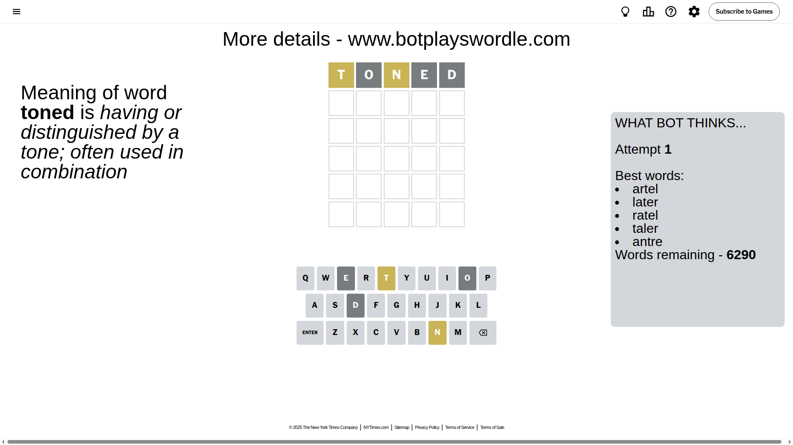
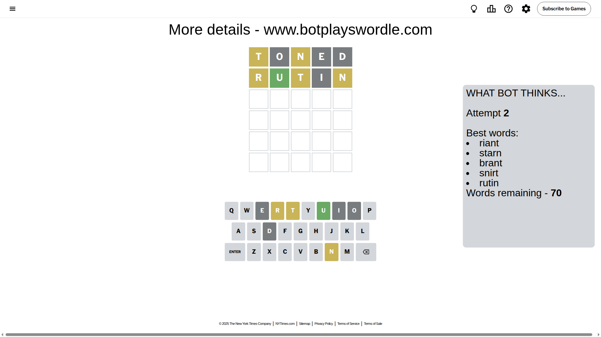
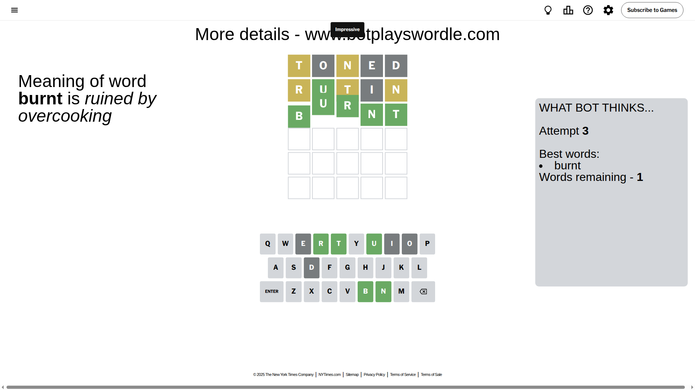

# Wordle for July 22, 2025 - \#1494

## Attempt 1

This is the first attempt and we'll choose a random word to start with.

Let's start with word `toned`

Attempt for `toned` gives us 0 correct letters, 2 present letters and 3 wrong letters.

If we look into details, we can see that:

Letter `t` is on a different spot - this means that it cannot be at position 1

Letter `o` is not present in the word and we will not use it any more

Letter `n` is on a different spot - this means that it cannot be at position 3

Letter `e` is not present in the word and we will not use it any more

Letter `d` is not present in the word and we will not use it any more

Some letters are missing (like `o`, `e`, `d`) but it's also important piece of information

Word should contain letters `[t n]`

That was a great guess that limited number of remaining words

## Attempt 2

Right now we have 70 words to choose from and best of them seem to be `[riant starn brant snirt rutin]`

So far we know that possible letters are:

At position 1: `[a b c f g h i j k l m n p q r s u v w x y z]`

At position 2: `[a b c f g h i j k l m n p q r s t u v w x y z]`

At position 3: `[a b c f g h i j k l m p q r s t u v w x y z]`

At position 4: `[a b c f g h i j k l m n p q r s t u v w x y z]`

At position 5: `[a b c f g h i j k l m n p q r s t u v w x y z]`

Next guess is `rutin`, let's see what it gives us

Attempt for `rutin` gives us 1 correct letters, 3 present letters and 1 wrong letters.

If we look into details, we can see that:

Letter `r` is on a different spot - this means that it cannot be at position 1

Letter `u` should be at position 2

Letter `t` is on a different spot - this means that it cannot be at position 3

Letter `i` is not present in the word and we will not use it any more

Letter `n` is on a different spot - this means that it cannot be at position 5

We got information about the correct letters and it should make next attempt easier

Some letters are missing (like `i`) but it's also important piece of information

Word should contain letters `[t n r u]`

That was a great guess that limited number of remaining words

## Attempt 3

Right now we have 1 words to choose from and best of them seem to be `[burnt]`

So far we know that possible letters are:

At position 1: `[a b c f g h j k l m n p q s u v w x y z]`

At position 2: `[u]`

At position 3: `[a b c f g h j k l m p q r s u v w x y z]`

At position 4: `[a b c f g h j k l m n p q r s t u v w x y z]`

At position 5: `[a b c f g h j k l m p q r s t u v w x y z]`

It must be `burnt`

That's the correct answer! The word is `burnt`!

## Conclusion

Today's word is `burnt` and it took 3 attempts to guess it

