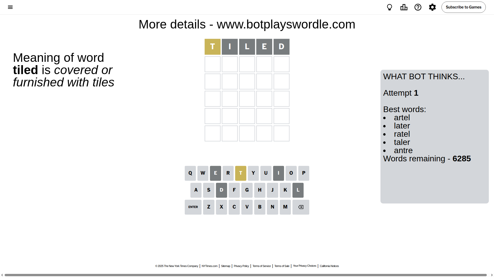
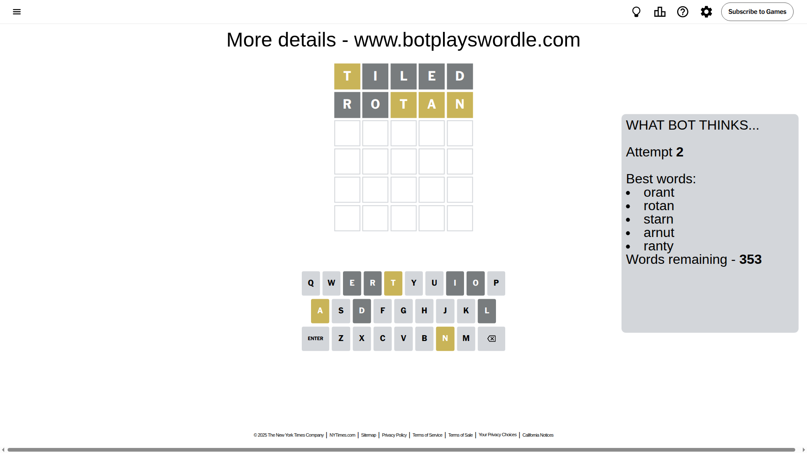
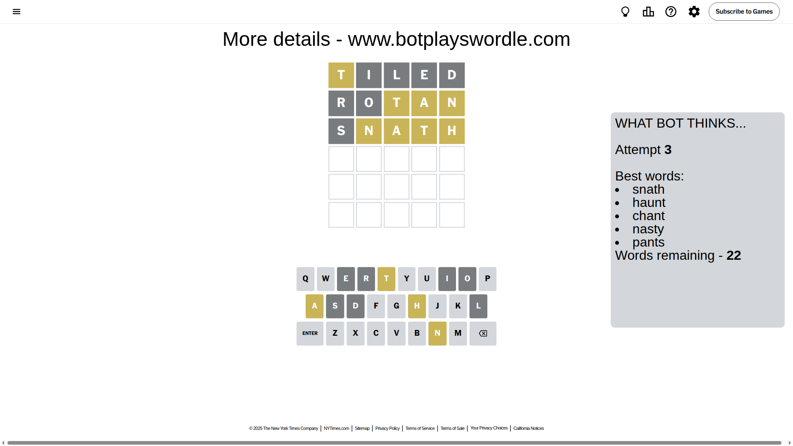
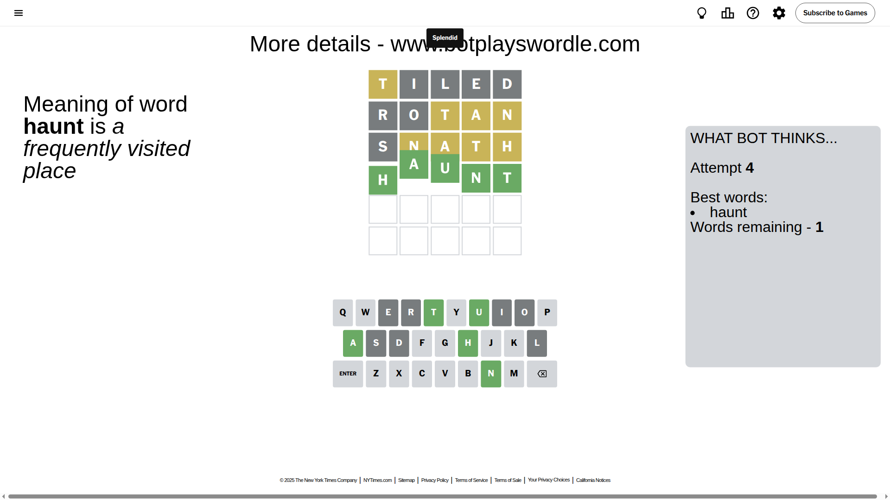

# Wordle for July 26, 2025 - \#1498

## Attempt 1

This is the first attempt and we'll choose a random word to start with.

Let's start with word `tiled`

Attempt for `tiled` gives us 0 correct letters, 1 present letters and 4 wrong letters.

If we look into details, we can see that:

Letter `t` is on a different spot - this means that it cannot be at position 1

Letter `i` is not present in the word and we will not use it any more

Letter `l` is not present in the word and we will not use it any more

Letter `e` is not present in the word and we will not use it any more

Letter `d` is not present in the word and we will not use it any more

Some letters are missing (like `i`, `l`, `e`, `d`) but it's also important piece of information

Word should contain letters `[t]`

That was a great guess that limited number of remaining words

## Attempt 2

Right now we have 353 words to choose from and best of them seem to be `[orant rotan starn arnut ranty]`

So far we know that possible letters are:

At position 1: `[a b c f g h j k m n o p q r s u v w x y z]`

At position 2: `[a b c f g h j k m n o p q r s t u v w x y z]`

At position 3: `[a b c f g h j k m n o p q r s t u v w x y z]`

At position 4: `[a b c f g h j k m n o p q r s t u v w x y z]`

At position 5: `[a b c f g h j k m n o p q r s t u v w x y z]`

Next guess is `rotan`, let's see what it gives us

Attempt for `rotan` gives us 0 correct letters, 3 present letters and 2 wrong letters.

If we look into details, we can see that:

Letter `r` is not present in the word and we will not use it any more

Letter `o` is not present in the word and we will not use it any more

Letter `t` is on a different spot - this means that it cannot be at position 3

Letter `a` is on a different spot - this means that it cannot be at position 4

Letter `n` is on a different spot - this means that it cannot be at position 5

Some letters are missing (like `r`, `o`) but it's also important piece of information

Word should contain letters `[t a n]`

That was a great guess that limited number of remaining words

## Attempt 3

Right now we have 22 words to choose from and best of them seem to be `[snath haunt chant nasty pants]`

So far we know that possible letters are:

At position 1: `[a b c f g h j k m n p q s u v w x y z]`

At position 2: `[a b c f g h j k m n p q s t u v w x y z]`

At position 3: `[a b c f g h j k m n p q s u v w x y z]`

At position 4: `[b c f g h j k m n p q s t u v w x y z]`

At position 5: `[a b c f g h j k m p q s t u v w x y z]`

Next guess is `snath`, let's see what it gives us

Attempt for `snath` gives us 0 correct letters, 4 present letters and 1 wrong letters.

If we look into details, we can see that:

Letter `s` is not present in the word and we will not use it any more

Letter `n` is on a different spot - this means that it cannot be at position 2

Letter `a` is on a different spot - this means that it cannot be at position 3

Letter `t` is on a different spot - this means that it cannot be at position 4

Letter `h` is on a different spot - this means that it cannot be at position 5

Some letters are missing (like `s`) but it's also important piece of information

Word should contain letters `[t a n h]`

That was a great guess that limited number of remaining words

## Attempt 4

Right now we have 1 words to choose from and best of them seem to be `[haunt]`

So far we know that possible letters are:

At position 1: `[a b c f g h j k m n p q u v w x y z]`

At position 2: `[a b c f g h j k m p q t u v w x y z]`

At position 3: `[b c f g h j k m n p q u v w x y z]`

At position 4: `[b c f g h j k m n p q u v w x y z]`

At position 5: `[a b c f g j k m p q t u v w x y z]`

It must be `haunt`

That's the correct answer! The word is `haunt`!

## Conclusion

Today's word is `haunt` and it took 4 attempts to guess it

