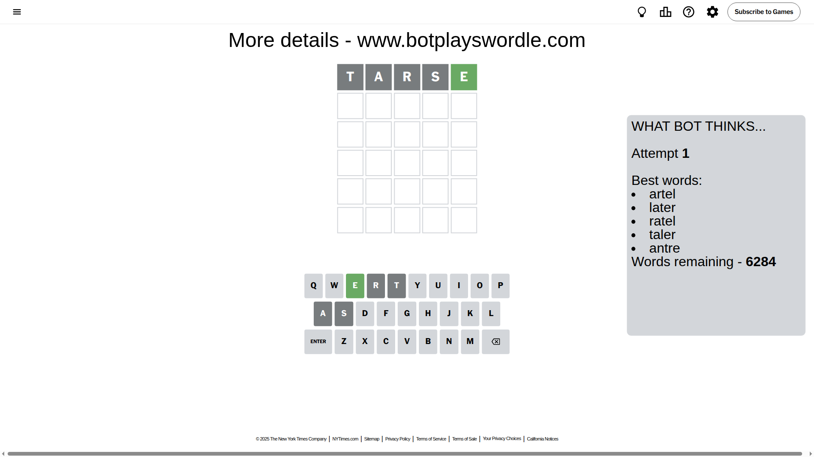
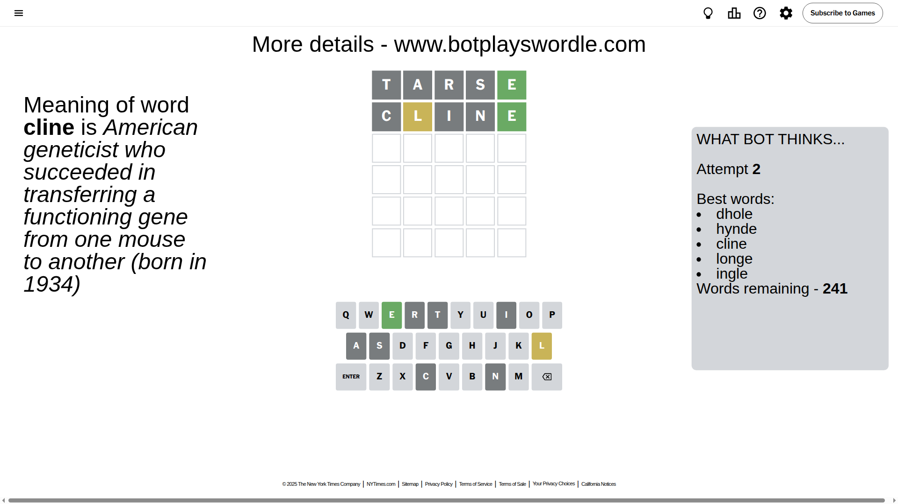
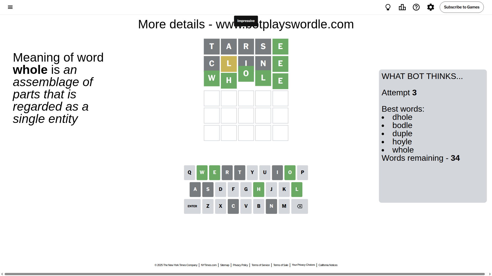

# Wordle for July 27, 2025 - \#1499

## Attempt 1

This is the first attempt and we'll choose a random word to start with.

Let's start with word `tarse`

Attempt for `tarse` gives us 1 correct letters, 0 present letters and 4 wrong letters.

If we look into details, we can see that:

Letter `t` is not present in the word and we will not use it any more

Letter `a` is not present in the word and we will not use it any more

Letter `r` is not present in the word and we will not use it any more

Letter `s` is not present in the word and we will not use it any more

Letter `e` should be at position 5

We got information about the correct letters and it should make next attempt easier

Some letters are missing (like `t`, `a`, `r`, `s`) but it's also important piece of information

Word should contain letters `[e]`

That was a great guess that limited number of remaining words

## Attempt 2

Right now we have 241 words to choose from and best of them seem to be `[dhole hynde cline longe ingle]`

So far we know that possible letters are:

At position 1: `[b c d e f g h i j k l m n o p q u v w x y z]`

At position 2: `[b c d e f g h i j k l m n o p q u v w x y z]`

At position 3: `[b c d e f g h i j k l m n o p q u v w x y z]`

At position 4: `[b c d e f g h i j k l m n o p q u v w x y z]`

At position 5: `[e]`

Next guess is `cline`, let's see what it gives us

Attempt for `cline` gives us 1 correct letters, 1 present letters and 3 wrong letters.

If we look into details, we can see that:

Letter `c` is not present in the word and we will not use it any more

Letter `l` is on a different spot - this means that it cannot be at position 2

Letter `i` is not present in the word and we will not use it any more

Letter `n` is not present in the word and we will not use it any more

Some letters are missing (like `c`, `i`, `n`) but it's also important piece of information

Word should contain letters `[e l]`

Not a bad guess in general

## Attempt 3

Right now we have 34 words to choose from and best of them seem to be `[dhole bodle duple hoyle whole]`

So far we know that possible letters are:

At position 1: `[b d e f g h j k l m o p q u v w x y z]`

At position 2: `[b d e f g h j k m o p q u v w x y z]`

At position 3: `[b d e f g h j k l m o p q u v w x y z]`

At position 4: `[b d e f g h j k l m o p q u v w x y z]`

At position 5: `[e]`

Next guess is `whole`, let's see what it gives us

That's the correct answer! The word is `whole`!

To be honest that was a pretty lucky guess, but it worked out well.

## Conclusion

Today's word is `whole` and it took 3 attempts to guess it

