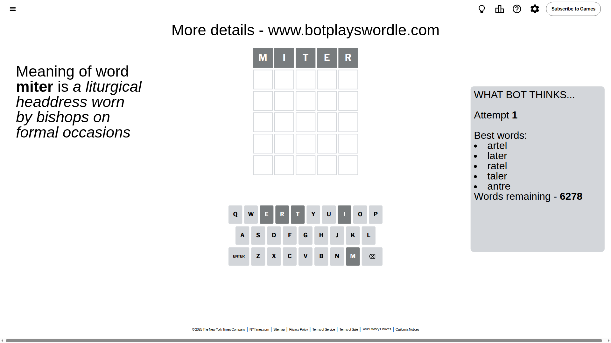
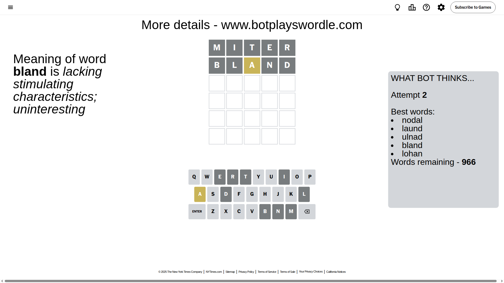
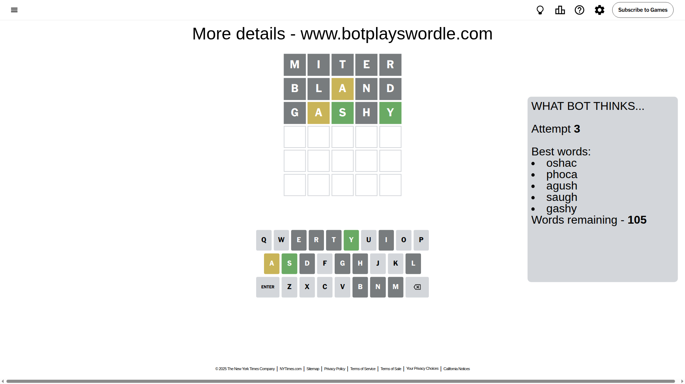
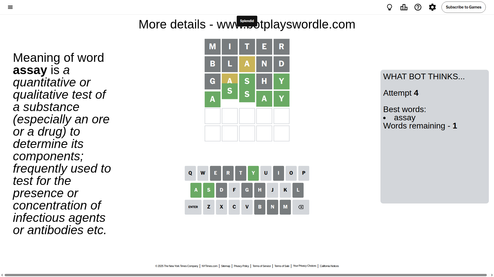

# Wordle for July 30, 2025 - \#1502

## Attempt 1

This is the first attempt and we'll choose a random word to start with.

Let's start with word `miter`

Attempt for `miter` gives us 0 correct letters, 0 present letters and 5 wrong letters.

If we look into details, we can see that:

Letter `m` is not present in the word and we will not use it any more

Letter `i` is not present in the word and we will not use it any more

Letter `t` is not present in the word and we will not use it any more

Letter `e` is not present in the word and we will not use it any more

Letter `r` is not present in the word and we will not use it any more

Some letters are missing (like `m`, `i`, `t`, `e`, `r`) but it's also important piece of information

So far we don't know any of the letters!

Not a bad guess in general

## Attempt 2

Right now we have 966 words to choose from and best of them seem to be `[nodal laund ulnad bland lohan]`

So far we know that possible letters are:

At position 1: `[a b c d f g h j k l n o p q s u v w x y z]`

At position 2: `[a b c d f g h j k l n o p q s u v w x y z]`

At position 3: `[a b c d f g h j k l n o p q s u v w x y z]`

At position 4: `[a b c d f g h j k l n o p q s u v w x y z]`

At position 5: `[a b c d f g h j k l n o p q s u v w x y z]`

Next guess is `bland`, let's see what it gives us

Attempt for `bland` gives us 0 correct letters, 1 present letters and 4 wrong letters.

If we look into details, we can see that:

Letter `b` is not present in the word and we will not use it any more

Letter `l` is not present in the word and we will not use it any more

Letter `a` is on a different spot - this means that it cannot be at position 3

Letter `n` is not present in the word and we will not use it any more

Letter `d` is not present in the word and we will not use it any more

Some letters are missing (like `b`, `l`, `n`, `d`) but it's also important piece of information

Word should contain letters `[a]`

That was a great guess that limited number of remaining words

## Attempt 3

Right now we have 105 words to choose from and best of them seem to be `[oshac phoca agush saugh gashy]`

So far we know that possible letters are:

At position 1: `[a c f g h j k o p q s u v w x y z]`

At position 2: `[a c f g h j k o p q s u v w x y z]`

At position 3: `[c f g h j k o p q s u v w x y z]`

At position 4: `[a c f g h j k o p q s u v w x y z]`

At position 5: `[a c f g h j k o p q s u v w x y z]`

Next guess is `gashy`, let's see what it gives us

Attempt for `gashy` gives us 2 correct letters, 1 present letters and 2 wrong letters.

If we look into details, we can see that:

Letter `g` is not present in the word and we will not use it any more

Letter `a` is on a different spot - this means that it cannot be at position 2

Letter `s` should be at position 3

Letter `h` is not present in the word and we will not use it any more

Letter `y` should be at position 5

We got information about the correct letters and it should make next attempt easier

Some letters are missing (like `g`, `h`) but it's also important piece of information

Word should contain letters `[a s y]`

That was a great guess that limited number of remaining words

## Attempt 4

Right now we have 1 words to choose from and best of them seem to be `[assay]`

So far we know that possible letters are:

At position 1: `[a c f j k o p q s u v w x y z]`

At position 2: `[c f j k o p q s u v w x y z]`

At position 3: `[s]`

At position 4: `[a c f j k o p q s u v w x y z]`

At position 5: `[y]`

It must be `assay`

That's the correct answer! The word is `assay`!

## Conclusion

Today's word is `assay` and it took 4 attempts to guess it

