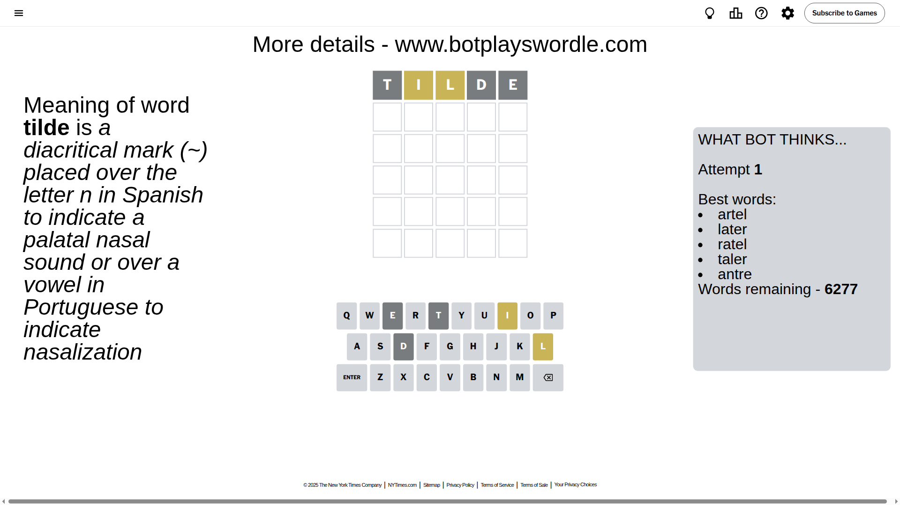
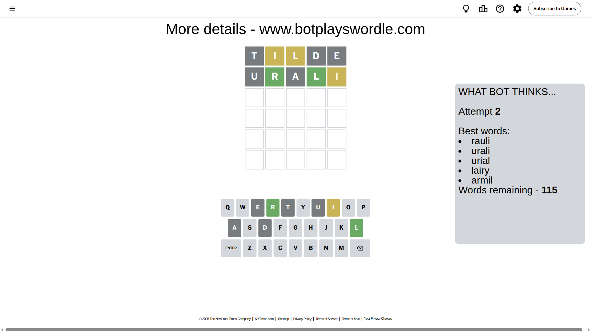
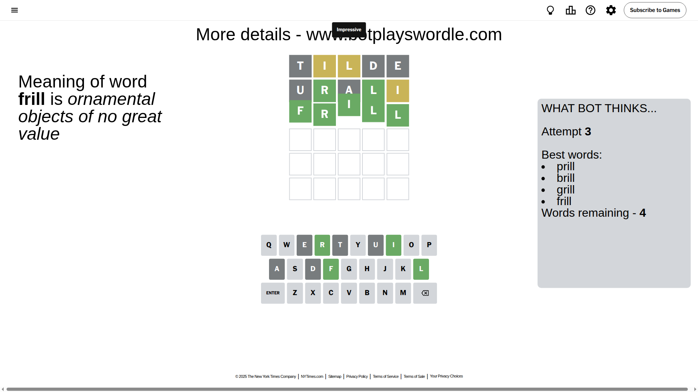

# Wordle for July 31, 2025 - \#1503

## Attempt 1

This is the first attempt and we'll choose a random word to start with.

Let's start with word `tilde`

Attempt for `tilde` gives us 0 correct letters, 2 present letters and 3 wrong letters.

If we look into details, we can see that:

Letter `t` is not present in the word and we will not use it any more

Letter `i` is on a different spot - this means that it cannot be at position 2

Letter `l` is on a different spot - this means that it cannot be at position 3

Letter `d` is not present in the word and we will not use it any more

Letter `e` is not present in the word and we will not use it any more

Some letters are missing (like `t`, `d`, `e`) but it's also important piece of information

Word should contain letters `[i l]`

That was a great guess that limited number of remaining words

## Attempt 2

Right now we have 115 words to choose from and best of them seem to be `[rauli urali urial lairy armil]`

So far we know that possible letters are:

At position 1: `[a b c f g h i j k l m n o p q r s u v w x y z]`

At position 2: `[a b c f g h j k l m n o p q r s u v w x y z]`

At position 3: `[a b c f g h i j k m n o p q r s u v w x y z]`

At position 4: `[a b c f g h i j k l m n o p q r s u v w x y z]`

At position 5: `[a b c f g h i j k l m n o p q r s u v w x y z]`

Next guess is `urali`, let's see what it gives us

Attempt for `urali` gives us 2 correct letters, 1 present letters and 2 wrong letters.

If we look into details, we can see that:

Letter `u` is not present in the word and we will not use it any more

Letter `r` should be at position 2

Letter `a` is not present in the word and we will not use it any more

Letter `l` should be at position 4

Letter `i` is on a different spot - this means that it cannot be at position 5

We got information about the correct letters and it should make next attempt easier

Some letters are missing (like `u`, `a`) but it's also important piece of information

Word should contain letters `[i l r]`

That was a great guess that limited number of remaining words

## Attempt 3

Right now we have 4 words to choose from and best of them seem to be `[prill brill grill frill]`

So far we know that possible letters are:

At position 1: `[b c f g h i j k l m n o p q r s v w x y z]`

At position 2: `[r]`

At position 3: `[b c f g h i j k m n o p q r s v w x y z]`

At position 4: `[l]`

At position 5: `[b c f g h j k l m n o p q r s v w x y z]`

Next guess is `frill`, let's see what it gives us

That's the correct answer! The word is `frill`!

## Conclusion

Today's word is `frill` and it took 3 attempts to guess it

