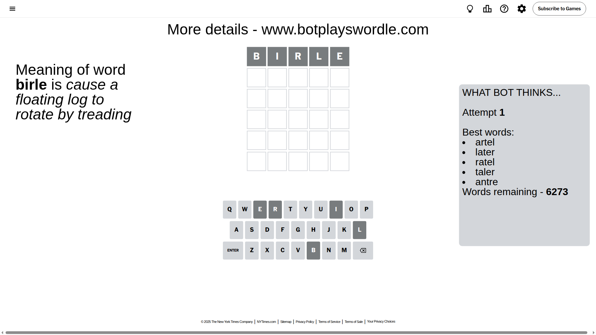
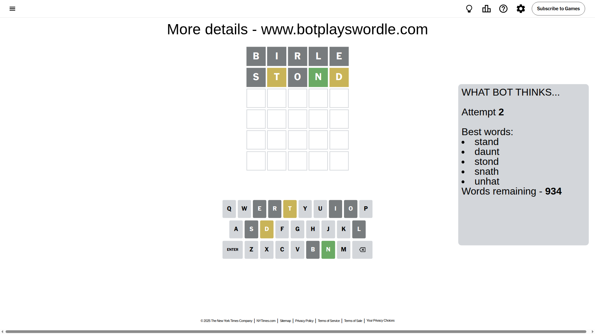
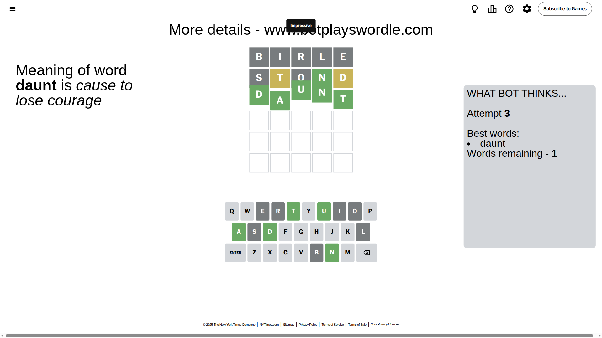

# Wordle for August 2, 2025 - \#1505

## Attempt 1

This is the first attempt and we'll choose a random word to start with.

Let's start with word `birle`

Attempt for `birle` gives us 0 correct letters, 0 present letters and 5 wrong letters.

If we look into details, we can see that:

Letter `b` is not present in the word and we will not use it any more

Letter `i` is not present in the word and we will not use it any more

Letter `r` is not present in the word and we will not use it any more

Letter `l` is not present in the word and we will not use it any more

Letter `e` is not present in the word and we will not use it any more

Some letters are missing (like `b`, `i`, `r`, `l`, `e`) but it's also important piece of information

So far we don't know any of the letters!

Not a bad guess in general

## Attempt 2

Right now we have 934 words to choose from and best of them seem to be `[stand daunt stond snath unhat]`

So far we know that possible letters are:

At position 1: `[a c d f g h j k m n o p q s t u v w x y z]`

At position 2: `[a c d f g h j k m n o p q s t u v w x y z]`

At position 3: `[a c d f g h j k m n o p q s t u v w x y z]`

At position 4: `[a c d f g h j k m n o p q s t u v w x y z]`

At position 5: `[a c d f g h j k m n o p q s t u v w x y z]`

Next guess is `stond`, let's see what it gives us

Attempt for `stond` gives us 1 correct letters, 2 present letters and 2 wrong letters.

If we look into details, we can see that:

Letter `s` is not present in the word and we will not use it any more

Letter `t` is on a different spot - this means that it cannot be at position 2

Letter `o` is not present in the word and we will not use it any more

Letter `n` should be at position 4

Letter `d` is on a different spot - this means that it cannot be at position 5

We got information about the correct letters and it should make next attempt easier

Some letters are missing (like `s`, `o`) but it's also important piece of information

Word should contain letters `[t n d]`

That was a great guess that limited number of remaining words

## Attempt 3

Right now we have 1 words to choose from and best of them seem to be `[daunt]`

So far we know that possible letters are:

At position 1: `[a c d f g h j k m n p q t u v w x y z]`

At position 2: `[a c d f g h j k m n p q u v w x y z]`

At position 3: `[a c d f g h j k m n p q t u v w x y z]`

At position 4: `[n]`

At position 5: `[a c f g h j k m n p q t u v w x y z]`

It must be `daunt`

That's the correct answer! The word is `daunt`!

## Conclusion

Today's word is `daunt` and it took 3 attempts to guess it

