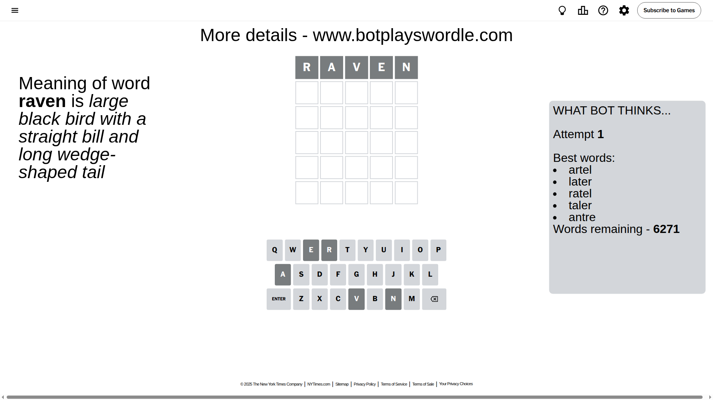
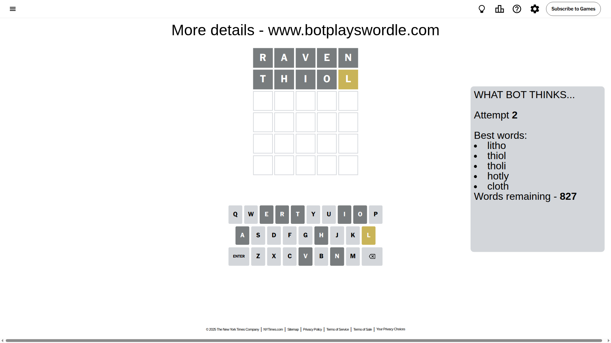
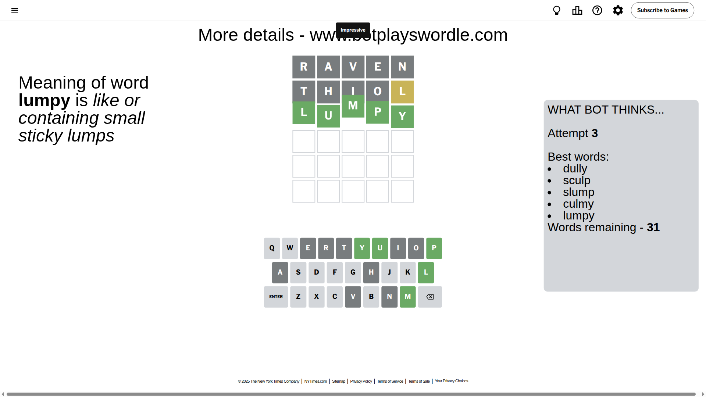

# Wordle for August 3, 2025 - \#1506

## Attempt 1

This is the first attempt and we'll choose a random word to start with.

Let's start with word `raven`

Attempt for `raven` gives us 0 correct letters, 0 present letters and 5 wrong letters.

If we look into details, we can see that:

Letter `r` is not present in the word and we will not use it any more

Letter `a` is not present in the word and we will not use it any more

Letter `v` is not present in the word and we will not use it any more

Letter `e` is not present in the word and we will not use it any more

Letter `n` is not present in the word and we will not use it any more

Some letters are missing (like `r`, `a`, `v`, `e`, `n`) but it's also important piece of information

So far we don't know any of the letters!

Not a bad guess in general

## Attempt 2

Right now we have 827 words to choose from and best of them seem to be `[litho thiol tholi hotly cloth]`

So far we know that possible letters are:

At position 1: `[b c d f g h i j k l m o p q s t u w x y z]`

At position 2: `[b c d f g h i j k l m o p q s t u w x y z]`

At position 3: `[b c d f g h i j k l m o p q s t u w x y z]`

At position 4: `[b c d f g h i j k l m o p q s t u w x y z]`

At position 5: `[b c d f g h i j k l m o p q s t u w x y z]`

Next guess is `thiol`, let's see what it gives us

Attempt for `thiol` gives us 0 correct letters, 1 present letters and 4 wrong letters.

If we look into details, we can see that:

Letter `t` is not present in the word and we will not use it any more

Letter `h` is not present in the word and we will not use it any more

Letter `i` is not present in the word and we will not use it any more

Letter `o` is not present in the word and we will not use it any more

Letter `l` is on a different spot - this means that it cannot be at position 5

Some letters are missing (like `t`, `h`, `i`, `o`) but it's also important piece of information

Word should contain letters `[l]`

That was a great guess that limited number of remaining words

## Attempt 3

Right now we have 31 words to choose from and best of them seem to be `[dully sculp slump culmy lumpy]`

So far we know that possible letters are:

At position 1: `[b c d f g j k l m p q s u w x y z]`

At position 2: `[b c d f g j k l m p q s u w x y z]`

At position 3: `[b c d f g j k l m p q s u w x y z]`

At position 4: `[b c d f g j k l m p q s u w x y z]`

At position 5: `[b c d f g j k m p q s u w x y z]`

Next guess is `lumpy`, let's see what it gives us

That's the correct answer! The word is `lumpy`!

To be honest that was a pretty lucky guess, but it worked out well.

## Conclusion

Today's word is `lumpy` and it took 3 attempts to guess it

