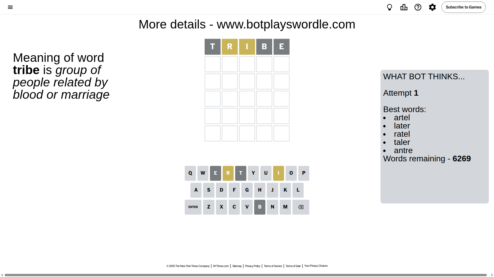
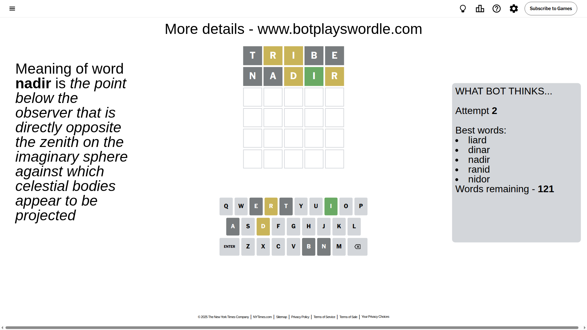
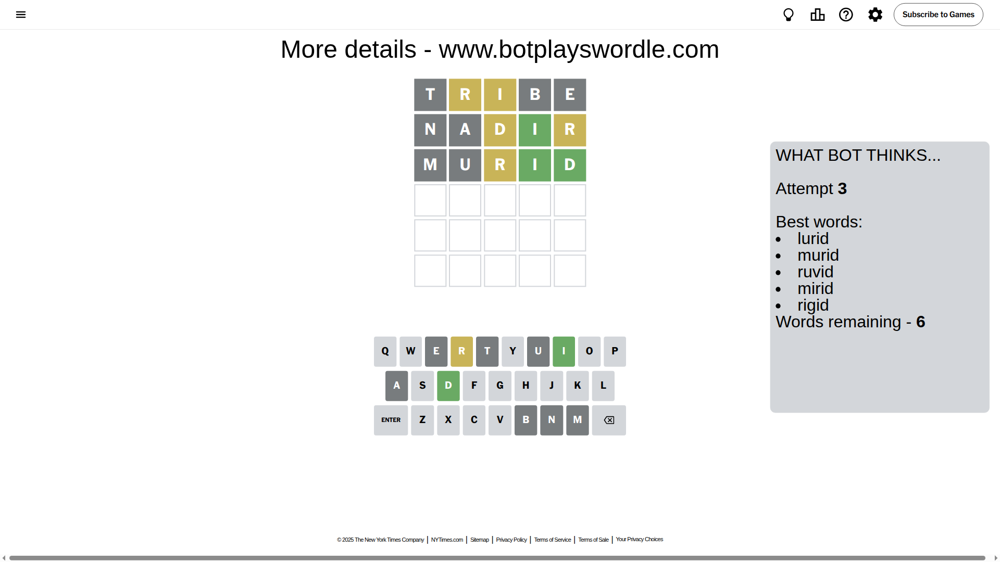
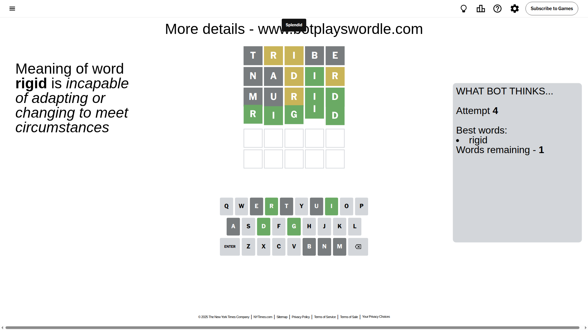

# Wordle for August 4, 2025 - \#1507

## Attempt 1

This is the first attempt and we'll choose a random word to start with.

Let's start with word `tribe`

Attempt for `tribe` gives us 0 correct letters, 2 present letters and 3 wrong letters.

If we look into details, we can see that:

Letter `t` is not present in the word and we will not use it any more

Letter `r` is on a different spot - this means that it cannot be at position 2

Letter `i` is on a different spot - this means that it cannot be at position 3

Letter `b` is not present in the word and we will not use it any more

Letter `e` is not present in the word and we will not use it any more

Some letters are missing (like `t`, `b`, `e`) but it's also important piece of information

Word should contain letters `[r i]`

That was a great guess that limited number of remaining words

## Attempt 2

Right now we have 121 words to choose from and best of them seem to be `[liard dinar nadir ranid nidor]`

So far we know that possible letters are:

At position 1: `[a c d f g h i j k l m n o p q r s u v w x y z]`

At position 2: `[a c d f g h i j k l m n o p q s u v w x y z]`

At position 3: `[a c d f g h j k l m n o p q r s u v w x y z]`

At position 4: `[a c d f g h i j k l m n o p q r s u v w x y z]`

At position 5: `[a c d f g h i j k l m n o p q r s u v w x y z]`

Next guess is `nadir`, let's see what it gives us

Attempt for `nadir` gives us 1 correct letters, 2 present letters and 2 wrong letters.

If we look into details, we can see that:

Letter `n` is not present in the word and we will not use it any more

Letter `a` is not present in the word and we will not use it any more

Letter `d` is on a different spot - this means that it cannot be at position 3

Letter `i` should be at position 4

Letter `r` is on a different spot - this means that it cannot be at position 5

We got information about the correct letters and it should make next attempt easier

Some letters are missing (like `n`, `a`) but it's also important piece of information

Word should contain letters `[r i d]`

That was a great guess that limited number of remaining words

## Attempt 3

Right now we have 6 words to choose from and best of them seem to be `[lurid murid ruvid mirid rigid]`

So far we know that possible letters are:

At position 1: `[c d f g h i j k l m o p q r s u v w x y z]`

At position 2: `[c d f g h i j k l m o p q s u v w x y z]`

At position 3: `[c f g h j k l m o p q r s u v w x y z]`

At position 4: `[i]`

At position 5: `[c d f g h i j k l m o p q s u v w x y z]`

Next guess is `murid`, let's see what it gives us

Attempt for `murid` gives us 2 correct letters, 1 present letters and 2 wrong letters.

If we look into details, we can see that:

Letter `m` is not present in the word and we will not use it any more

Letter `u` is not present in the word and we will not use it any more

Letter `r` is on a different spot - this means that it cannot be at position 3

Letter `d` should be at position 5

We got information about the correct letters and it should make next attempt easier

Some letters are missing (like `m`, `u`) but it's also important piece of information

Word should contain letters `[r i d]`

Not a bad guess in general

## Attempt 4

Right now we have 1 words to choose from and best of them seem to be `[rigid]`

So far we know that possible letters are:

At position 1: `[c d f g h i j k l o p q r s v w x y z]`

At position 2: `[c d f g h i j k l o p q s v w x y z]`

At position 3: `[c f g h j k l o p q s v w x y z]`

At position 4: `[i]`

At position 5: `[d]`

It must be `rigid`

That's the correct answer! The word is `rigid`!

## Conclusion

Today's word is `rigid` and it took 4 attempts to guess it

