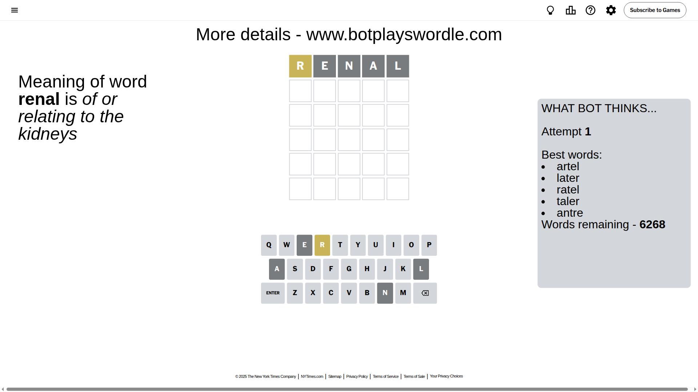
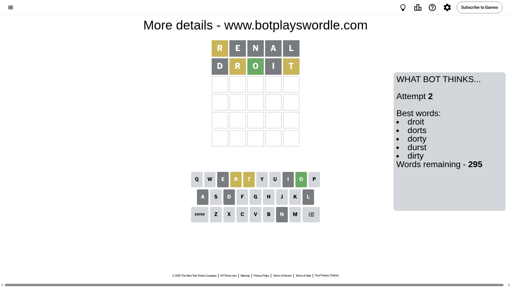
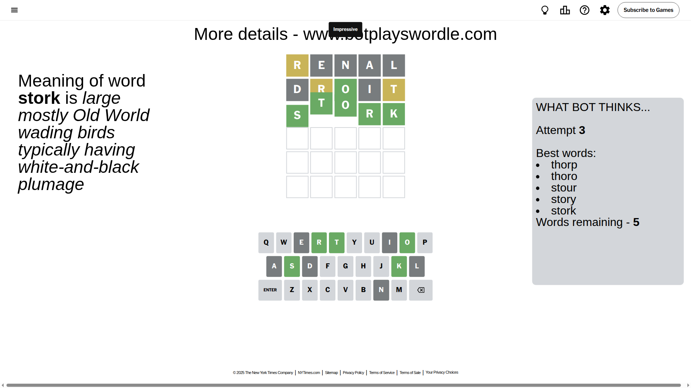

# Wordle for August 5, 2025 - \#1508

## Attempt 1

This is the first attempt and we'll choose a random word to start with.

Let's start with word `renal`

Attempt for `renal` gives us 0 correct letters, 1 present letters and 4 wrong letters.

If we look into details, we can see that:

Letter `r` is on a different spot - this means that it cannot be at position 1

Letter `e` is not present in the word and we will not use it any more

Letter `n` is not present in the word and we will not use it any more

Letter `a` is not present in the word and we will not use it any more

Letter `l` is not present in the word and we will not use it any more

Some letters are missing (like `e`, `n`, `a`, `l`) but it's also important piece of information

Word should contain letters `[r]`

That was a great guess that limited number of remaining words

## Attempt 2

Right now we have 295 words to choose from and best of them seem to be `[droit dorts dorty durst dirty]`

So far we know that possible letters are:

At position 1: `[b c d f g h i j k m o p q s t u v w x y z]`

At position 2: `[b c d f g h i j k m o p q r s t u v w x y z]`

At position 3: `[b c d f g h i j k m o p q r s t u v w x y z]`

At position 4: `[b c d f g h i j k m o p q r s t u v w x y z]`

At position 5: `[b c d f g h i j k m o p q r s t u v w x y z]`

Next guess is `droit`, let's see what it gives us

Attempt for `droit` gives us 1 correct letters, 2 present letters and 2 wrong letters.

If we look into details, we can see that:

Letter `d` is not present in the word and we will not use it any more

Letter `r` is on a different spot - this means that it cannot be at position 2

Letter `o` should be at position 3

Letter `i` is not present in the word and we will not use it any more

Letter `t` is on a different spot - this means that it cannot be at position 5

We got information about the correct letters and it should make next attempt easier

Some letters are missing (like `d`, `i`) but it's also important piece of information

Word should contain letters `[r o t]`

That was a great guess that limited number of remaining words

## Attempt 3

Right now we have 5 words to choose from and best of them seem to be `[thorp thoro stour story stork]`

So far we know that possible letters are:

At position 1: `[b c f g h j k m o p q s t u v w x y z]`

At position 2: `[b c f g h j k m o p q s t u v w x y z]`

At position 3: `[o]`

At position 4: `[b c f g h j k m o p q r s t u v w x y z]`

At position 5: `[b c f g h j k m o p q r s u v w x y z]`

Next guess is `stork`, let's see what it gives us

That's the correct answer! The word is `stork`!

## Conclusion

Today's word is `stork` and it took 3 attempts to guess it

