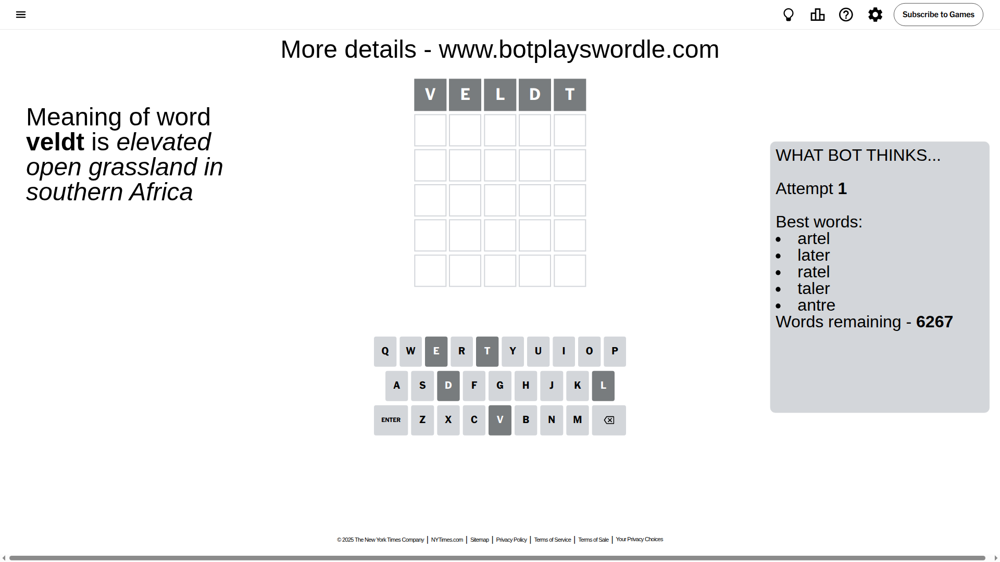
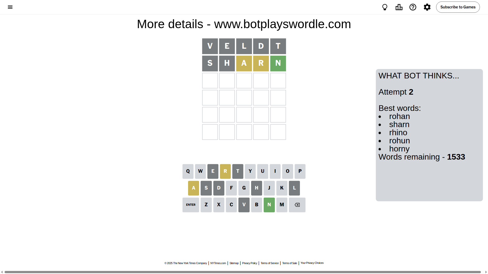
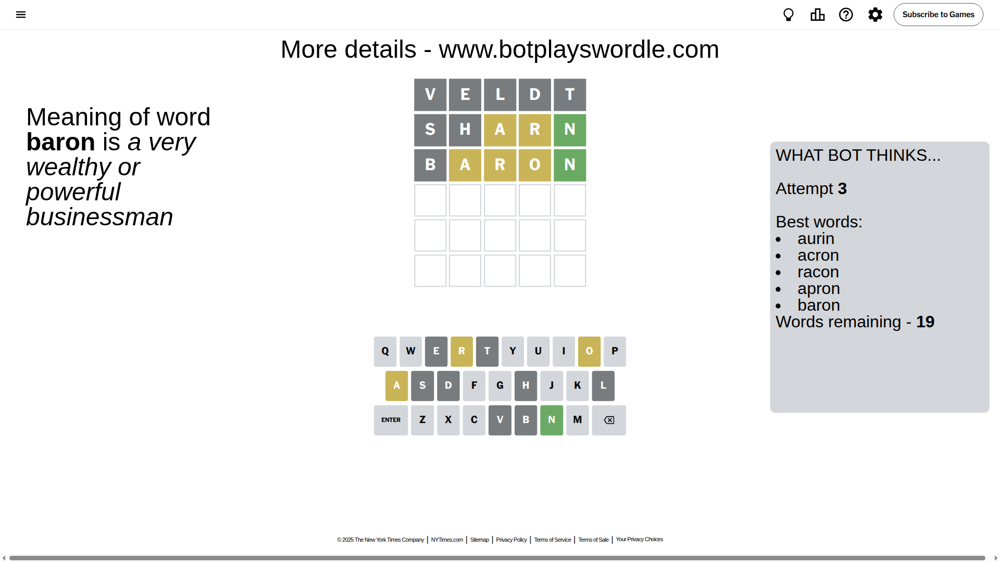
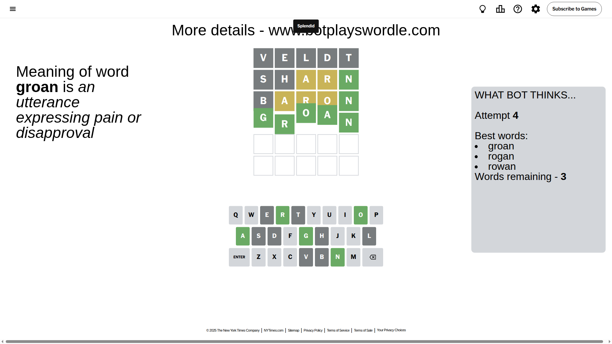

# Wordle for August 6, 2025 - \#1509

## Attempt 1

This is the first attempt and we'll choose a random word to start with.

Let's start with word `veldt`

Attempt for `veldt` gives us 0 correct letters, 0 present letters and 5 wrong letters.

If we look into details, we can see that:

Letter `v` is not present in the word and we will not use it any more

Letter `e` is not present in the word and we will not use it any more

Letter `l` is not present in the word and we will not use it any more

Letter `d` is not present in the word and we will not use it any more

Letter `t` is not present in the word and we will not use it any more

Some letters are missing (like `v`, `e`, `l`, `d`, `t`) but it's also important piece of information

So far we don't know any of the letters!

Not a bad guess in general

## Attempt 2

Right now we have 1533 words to choose from and best of them seem to be `[rohan sharn rhino rohun horny]`

So far we know that possible letters are:

At position 1: `[a b c f g h i j k m n o p q r s u w x y z]`

At position 2: `[a b c f g h i j k m n o p q r s u w x y z]`

At position 3: `[a b c f g h i j k m n o p q r s u w x y z]`

At position 4: `[a b c f g h i j k m n o p q r s u w x y z]`

At position 5: `[a b c f g h i j k m n o p q r s u w x y z]`

Next guess is `sharn`, let's see what it gives us

Attempt for `sharn` gives us 1 correct letters, 2 present letters and 2 wrong letters.

If we look into details, we can see that:

Letter `s` is not present in the word and we will not use it any more

Letter `h` is not present in the word and we will not use it any more

Letter `a` is on a different spot - this means that it cannot be at position 3

Letter `r` is on a different spot - this means that it cannot be at position 4

Letter `n` should be at position 5

We got information about the correct letters and it should make next attempt easier

Some letters are missing (like `s`, `h`) but it's also important piece of information

Word should contain letters `[a r n]`

That was a great guess that limited number of remaining words

## Attempt 3

Right now we have 19 words to choose from and best of them seem to be `[aurin acron racon apron baron]`

So far we know that possible letters are:

At position 1: `[a b c f g i j k m n o p q r u w x y z]`

At position 2: `[a b c f g i j k m n o p q r u w x y z]`

At position 3: `[b c f g i j k m n o p q r u w x y z]`

At position 4: `[a b c f g i j k m n o p q u w x y z]`

At position 5: `[n]`

Next guess is `baron`, let's see what it gives us

Attempt for `baron` gives us 1 correct letters, 3 present letters and 1 wrong letters.

If we look into details, we can see that:

Letter `b` is not present in the word and we will not use it any more

Letter `a` is on a different spot - this means that it cannot be at position 2

Letter `r` is on a different spot - this means that it cannot be at position 3

Letter `o` is on a different spot - this means that it cannot be at position 4

Some letters are missing (like `b`) but it's also important piece of information

Word should contain letters `[a r n o]`

Not a bad guess in general

## Attempt 4

Right now we have 3 words to choose from and best of them seem to be `[groan rogan rowan]`

So far we know that possible letters are:

At position 1: `[a c f g i j k m n o p q r u w x y z]`

At position 2: `[c f g i j k m n o p q r u w x y z]`

At position 3: `[c f g i j k m n o p q u w x y z]`

At position 4: `[a c f g i j k m n p q u w x y z]`

At position 5: `[n]`

Next guess is `groan`, let's see what it gives us

That's the correct answer! The word is `groan`!

## Conclusion

Today's word is `groan` and it took 4 attempts to guess it

