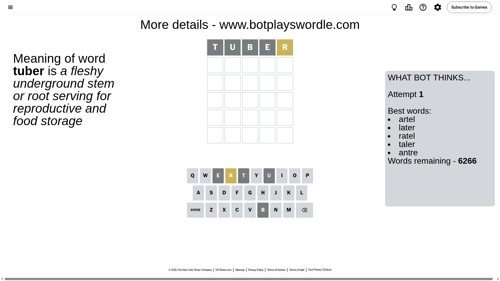

# Wordle for August 7, 2025 - \#1510

## Attempt 1

This is the first attempt and we'll choose a random word to start with.

Let's start with word `tuber`

Attempt for `tuber` gives us 0 correct letters, 1 present letters and 4 wrong letters.

If we look into details, we can see that:

Letter `t` is not present in the word and we will not use it any more

Letter `u` is not present in the word and we will not use it any more

Letter `b` is not present in the word and we will not use it any more

Letter `e` is not present in the word and we will not use it any more

Letter `r` is on a different spot - this means that it cannot be at position 5

Some letters are missing (like `t`, `u`, `b`, `e`) but it's also important piece of information

Word should contain letters `[r]`

That was a great guess that limited number of remaining words

## Attempt 2

Right now we have 438 words to choose from and best of them seem to be `[loran gnarl drail laird liard]`

So far we know that possible letters are:

At position 1: `[a c d f g h i j k l m n o p q r s v w x y z]`

At position 2: `[a c d f g h i j k l m n o p q r s v w x y z]`

At position 3: `[a c d f g h i j k l m n o p q r s v w x y z]`

At position 4: `[a c d f g h i j k l m n o p q r s v w x y z]`

At position 5: `[a c d f g h i j k l m n o p q s v w x y z]`

Next guess is `gnarl`, let's see what it gives us

Attempt for `gnarl` gives us 1 correct letters, 2 present letters and 2 wrong letters.

If we look into details, we can see that:

Letter `g` is not present in the word and we will not use it any more

Letter `n` is not present in the word and we will not use it any more

Letter `a` is on a different spot - this means that it cannot be at position 3

Letter `r` is on a different spot - this means that it cannot be at position 4

Letter `l` should be at position 5

We got information about the correct letters and it should make next attempt easier

Some letters are missing (like `g`, `n`) but it's also important piece of information

Word should contain letters `[r a l]`

That was a great guess that limited number of remaining words

## Attempt 3

Right now we have 21 words to choose from and best of them seem to be `[horal rosal soral royal coral]`

So far we know that possible letters are:

At position 1: `[a c d f h i j k l m o p q r s v w x y z]`

At position 2: `[a c d f h i j k l m o p q r s v w x y z]`

At position 3: `[c d f h i j k l m o p q r s v w x y z]`

At position 4: `[a c d f h i j k l m o p q s v w x y z]`

At position 5: `[l]`

Next guess is `horal`, let's see what it gives us

Attempt for `horal` gives us 4 correct letters, 0 present letters and 1 wrong letters.

If we look into details, we can see that:

Letter `h` is not present in the word and we will not use it any more

Letter `o` should be at position 2

Letter `r` should be at position 3

Letter `a` should be at position 4

We got information about the correct letters and it should make next attempt easier

Some letters are missing (like `h`) but it's also important piece of information

Word should contain letters `[r a l o]`

Not a bad guess in general

## Attempt 4

Right now we have 5 words to choose from and best of them seem to be `[soral coral poral loral roral]`

So far we know that possible letters are:

At position 1: `[a c d f i j k l m o p q r s v w x y z]`

At position 2: `[o]`

At position 3: `[r]`

At position 4: `[a]`

At position 5: `[l]`

Next guess is `coral`, let's see what it gives us

That's the correct answer! The word is `coral`!

## Conclusion

Today's word is `coral` and it took 4 attempts to guess it

