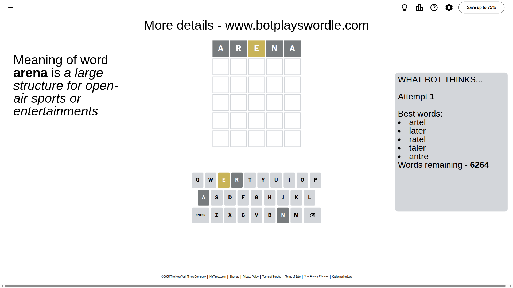
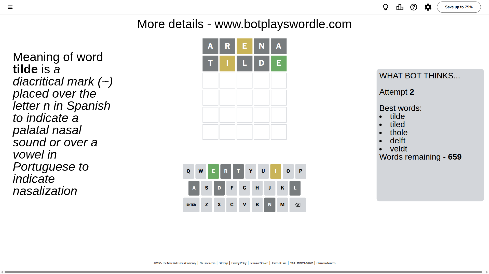
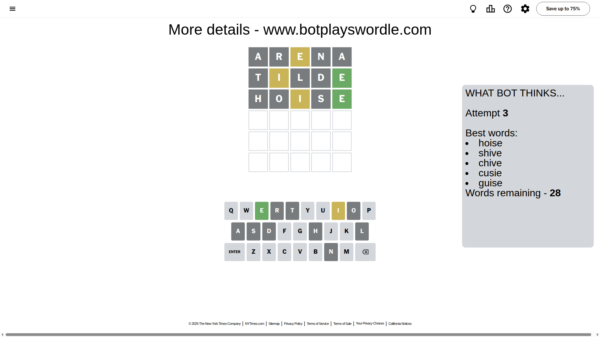
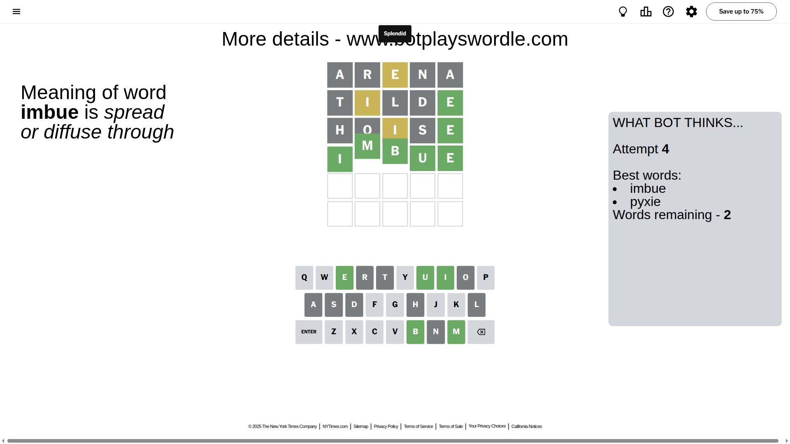

# Wordle for August 8, 2025 - \#1511

## Attempt 1

This is the first attempt and we'll choose a random word to start with.

Let's start with word `arena`

Attempt for `arena` gives us 0 correct letters, 1 present letters and 4 wrong letters.

If we look into details, we can see that:

Letter `a` is not present in the word and we will not use it any more

Letter `r` is not present in the word and we will not use it any more

Letter `e` is on a different spot - this means that it cannot be at position 3

Letter `n` is not present in the word and we will not use it any more

Letter `a` is not present in the word and we will not use it any more

Some letters are missing (like `a`, `r`, `n`) but it's also important piece of information

Word should contain letters `[e]`

That was a great guess that limited number of remaining words

## Attempt 2

Right now we have 659 words to choose from and best of them seem to be `[tilde tiled thole delft veldt]`

So far we know that possible letters are:

At position 1: `[b c d e f g h i j k l m o p q s t u v w x y z]`

At position 2: `[b c d e f g h i j k l m o p q s t u v w x y z]`

At position 3: `[b c d f g h i j k l m o p q s t u v w x y z]`

At position 4: `[b c d e f g h i j k l m o p q s t u v w x y z]`

At position 5: `[b c d e f g h i j k l m o p q s t u v w x y z]`

Next guess is `tilde`, let's see what it gives us

Attempt for `tilde` gives us 1 correct letters, 1 present letters and 3 wrong letters.

If we look into details, we can see that:

Letter `t` is not present in the word and we will not use it any more

Letter `i` is on a different spot - this means that it cannot be at position 2

Letter `l` is not present in the word and we will not use it any more

Letter `d` is not present in the word and we will not use it any more

Letter `e` should be at position 5

We got information about the correct letters and it should make next attempt easier

Some letters are missing (like `t`, `l`, `d`) but it's also important piece of information

Word should contain letters `[e i]`

That was a great guess that limited number of remaining words

## Attempt 3

Right now we have 28 words to choose from and best of them seem to be `[hoise shive chive cusie guise]`

So far we know that possible letters are:

At position 1: `[b c e f g h i j k m o p q s u v w x y z]`

At position 2: `[b c e f g h j k m o p q s u v w x y z]`

At position 3: `[b c f g h i j k m o p q s u v w x y z]`

At position 4: `[b c e f g h i j k m o p q s u v w x y z]`

At position 5: `[e]`

Next guess is `hoise`, let's see what it gives us

Attempt for `hoise` gives us 1 correct letters, 1 present letters and 3 wrong letters.

If we look into details, we can see that:

Letter `h` is not present in the word and we will not use it any more

Letter `o` is not present in the word and we will not use it any more

Letter `i` is on a different spot - this means that it cannot be at position 3

Letter `s` is not present in the word and we will not use it any more

Some letters are missing (like `h`, `o`, `s`) but it's also important piece of information

Word should contain letters `[e i]`

That was a great guess that limited number of remaining words

## Attempt 4

Right now we have 2 words to choose from and best of them seem to be `[imbue pyxie]`

So far we know that possible letters are:

At position 1: `[b c e f g i j k m p q u v w x y z]`

At position 2: `[b c e f g j k m p q u v w x y z]`

At position 3: `[b c f g j k m p q u v w x y z]`

At position 4: `[b c e f g i j k m p q u v w x y z]`

At position 5: `[e]`

Next guess is `imbue`, let's see what it gives us

That's the correct answer! The word is `imbue`!

## Conclusion

Today's word is `imbue` and it took 4 attempts to guess it

