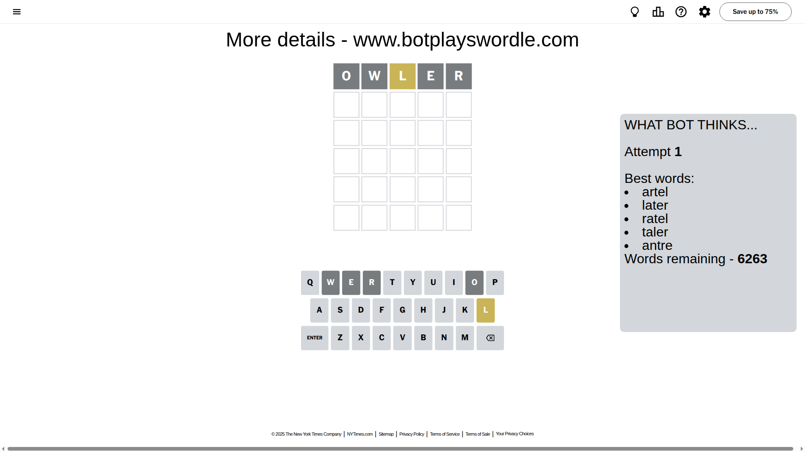
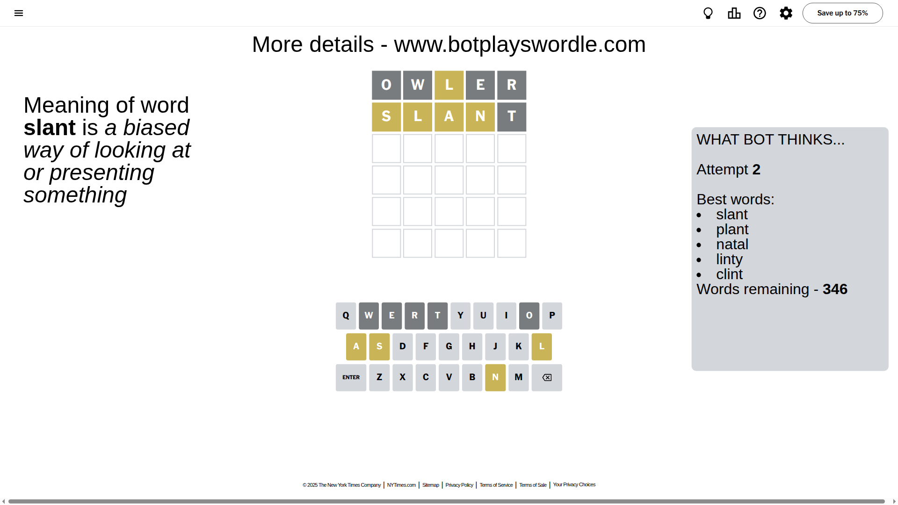
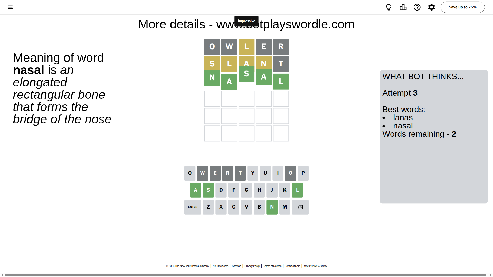

# Wordle for August 9, 2025 - \#1512

## Attempt 1

This is the first attempt and we'll choose a random word to start with.

Let's start with word `owler`

Attempt for `owler` gives us 0 correct letters, 1 present letters and 4 wrong letters.

If we look into details, we can see that:

Letter `o` is not present in the word and we will not use it any more

Letter `w` is not present in the word and we will not use it any more

Letter `l` is on a different spot - this means that it cannot be at position 3

Letter `e` is not present in the word and we will not use it any more

Letter `r` is not present in the word and we will not use it any more

Some letters are missing (like `o`, `w`, `e`, `r`) but it's also important piece of information

Word should contain letters `[l]`

That was a great guess that limited number of remaining words

## Attempt 2

Right now we have 346 words to choose from and best of them seem to be `[slant plant natal linty clint]`

So far we know that possible letters are:

At position 1: `[a b c d f g h i j k l m n p q s t u v x y z]`

At position 2: `[a b c d f g h i j k l m n p q s t u v x y z]`

At position 3: `[a b c d f g h i j k m n p q s t u v x y z]`

At position 4: `[a b c d f g h i j k l m n p q s t u v x y z]`

At position 5: `[a b c d f g h i j k l m n p q s t u v x y z]`

Next guess is `slant`, let's see what it gives us

Attempt for `slant` gives us 0 correct letters, 4 present letters and 1 wrong letters.

If we look into details, we can see that:

Letter `s` is on a different spot - this means that it cannot be at position 1

Letter `l` is on a different spot - this means that it cannot be at position 2

Letter `a` is on a different spot - this means that it cannot be at position 3

Letter `n` is on a different spot - this means that it cannot be at position 4

Letter `t` is not present in the word and we will not use it any more

Some letters are missing (like `t`) but it's also important piece of information

Word should contain letters `[l s a n]`

That was a great guess that limited number of remaining words

## Attempt 3

Right now we have 2 words to choose from and best of them seem to be `[lanas nasal]`

So far we know that possible letters are:

At position 1: `[a b c d f g h i j k l m n p q u v x y z]`

At position 2: `[a b c d f g h i j k m n p q s u v x y z]`

At position 3: `[b c d f g h i j k m n p q s u v x y z]`

At position 4: `[a b c d f g h i j k l m p q s u v x y z]`

At position 5: `[a b c d f g h i j k l m n p q s u v x y z]`

Next guess is `nasal`, let's see what it gives us

That's the correct answer! The word is `nasal`!

## Conclusion

Today's word is `nasal` and it took 3 attempts to guess it

