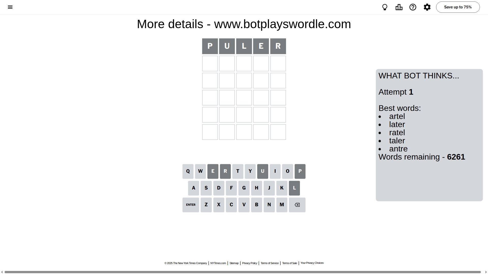
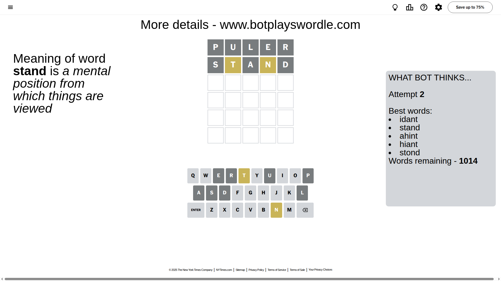
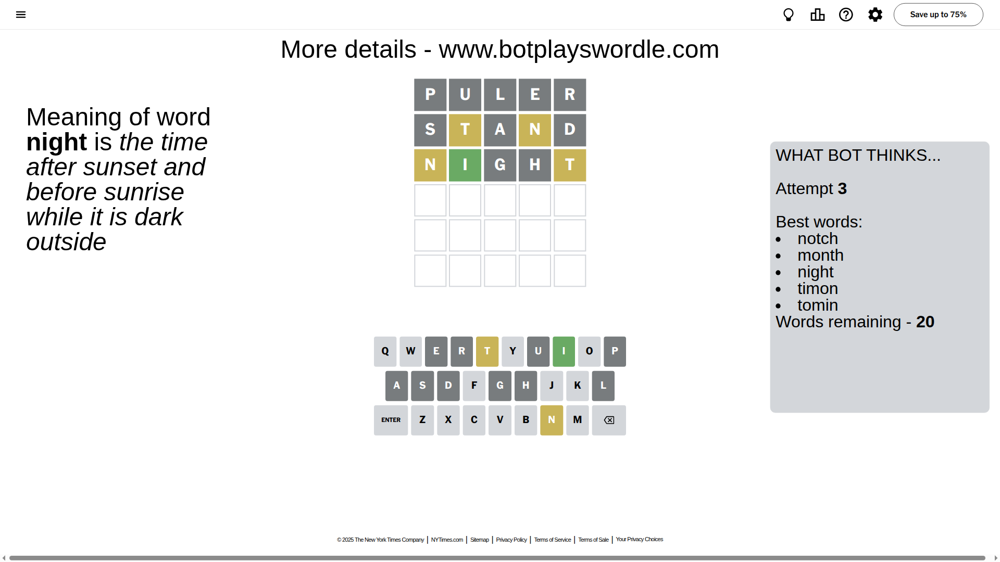
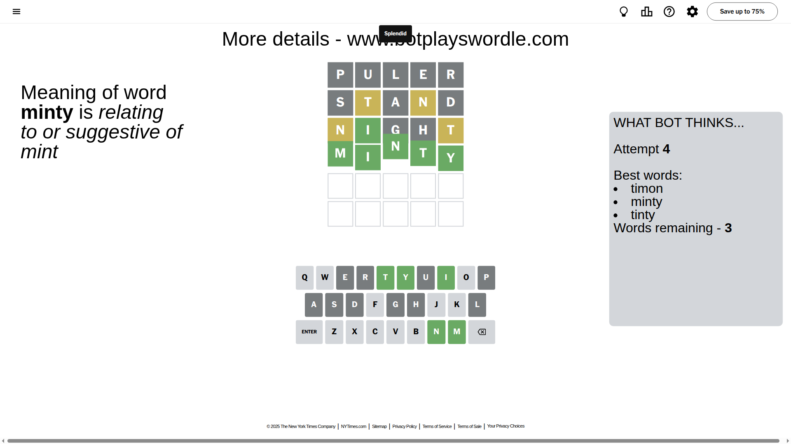

# Wordle for August 10, 2025 - \#1513

## Attempt 1

This is the first attempt and we'll choose a random word to start with.

Let's start with word `puler`

Attempt for `puler` gives us 0 correct letters, 0 present letters and 5 wrong letters.

If we look into details, we can see that:

Letter `p` is not present in the word and we will not use it any more

Letter `u` is not present in the word and we will not use it any more

Letter `l` is not present in the word and we will not use it any more

Letter `e` is not present in the word and we will not use it any more

Letter `r` is not present in the word and we will not use it any more

Some letters are missing (like `p`, `u`, `l`, `e`, `r`) but it's also important piece of information

So far we don't know any of the letters!

Not a bad guess in general

## Attempt 2

Right now we have 1014 words to choose from and best of them seem to be `[idant stand ahint hiant stond]`

So far we know that possible letters are:

At position 1: `[a b c d f g h i j k m n o q s t v w x y z]`

At position 2: `[a b c d f g h i j k m n o q s t v w x y z]`

At position 3: `[a b c d f g h i j k m n o q s t v w x y z]`

At position 4: `[a b c d f g h i j k m n o q s t v w x y z]`

At position 5: `[a b c d f g h i j k m n o q s t v w x y z]`

Next guess is `stand`, let's see what it gives us

Attempt for `stand` gives us 0 correct letters, 2 present letters and 3 wrong letters.

If we look into details, we can see that:

Letter `s` is not present in the word and we will not use it any more

Letter `t` is on a different spot - this means that it cannot be at position 2

Letter `a` is not present in the word and we will not use it any more

Letter `n` is on a different spot - this means that it cannot be at position 4

Letter `d` is not present in the word and we will not use it any more

Some letters are missing (like `s`, `a`, `d`) but it's also important piece of information

Word should contain letters `[t n]`

That was a great guess that limited number of remaining words

## Attempt 3

Right now we have 20 words to choose from and best of them seem to be `[notch month night timon tomin]`

So far we know that possible letters are:

At position 1: `[b c f g h i j k m n o q t v w x y z]`

At position 2: `[b c f g h i j k m n o q v w x y z]`

At position 3: `[b c f g h i j k m n o q t v w x y z]`

At position 4: `[b c f g h i j k m o q t v w x y z]`

At position 5: `[b c f g h i j k m n o q t v w x y z]`

Next guess is `night`, let's see what it gives us

Attempt for `night` gives us 1 correct letters, 2 present letters and 2 wrong letters.

If we look into details, we can see that:

Letter `n` is on a different spot - this means that it cannot be at position 1

Letter `i` should be at position 2

Letter `g` is not present in the word and we will not use it any more

Letter `h` is not present in the word and we will not use it any more

Letter `t` is on a different spot - this means that it cannot be at position 5

We got information about the correct letters and it should make next attempt easier

Some letters are missing (like `g`, `h`) but it's also important piece of information

Word should contain letters `[t n i]`

Not a bad guess in general

## Attempt 4

Right now we have 3 words to choose from and best of them seem to be `[timon minty tinty]`

So far we know that possible letters are:

At position 1: `[b c f i j k m o q t v w x y z]`

At position 2: `[i]`

At position 3: `[b c f i j k m n o q t v w x y z]`

At position 4: `[b c f i j k m o q t v w x y z]`

At position 5: `[b c f i j k m n o q v w x y z]`

Next guess is `minty`, let's see what it gives us

That's the correct answer! The word is `minty`!

## Conclusion

Today's word is `minty` and it took 4 attempts to guess it

