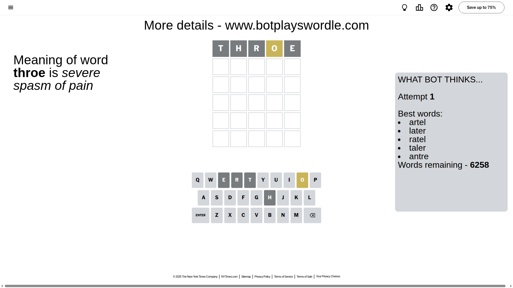
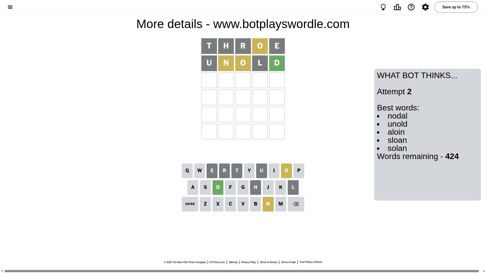
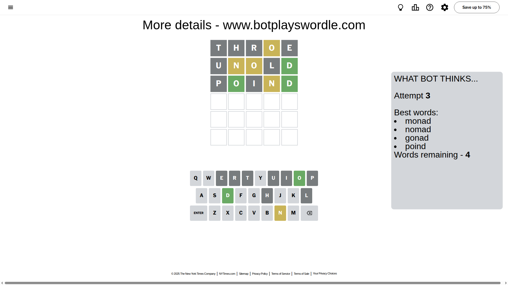
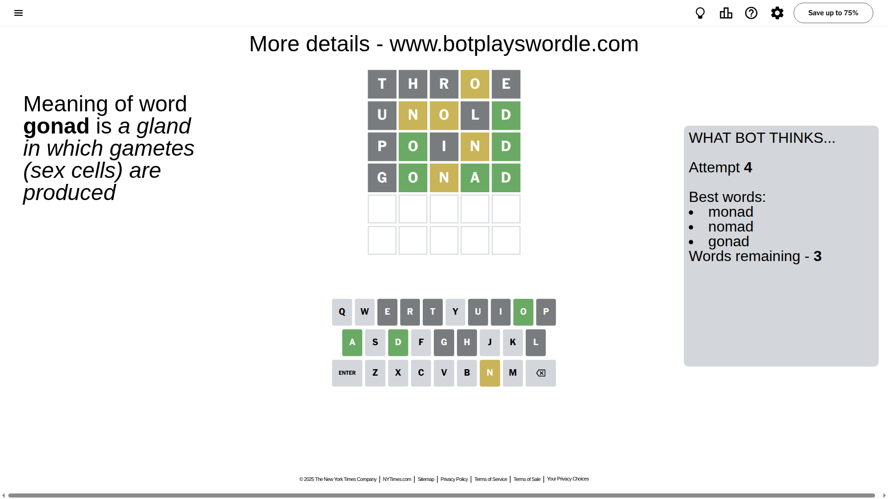
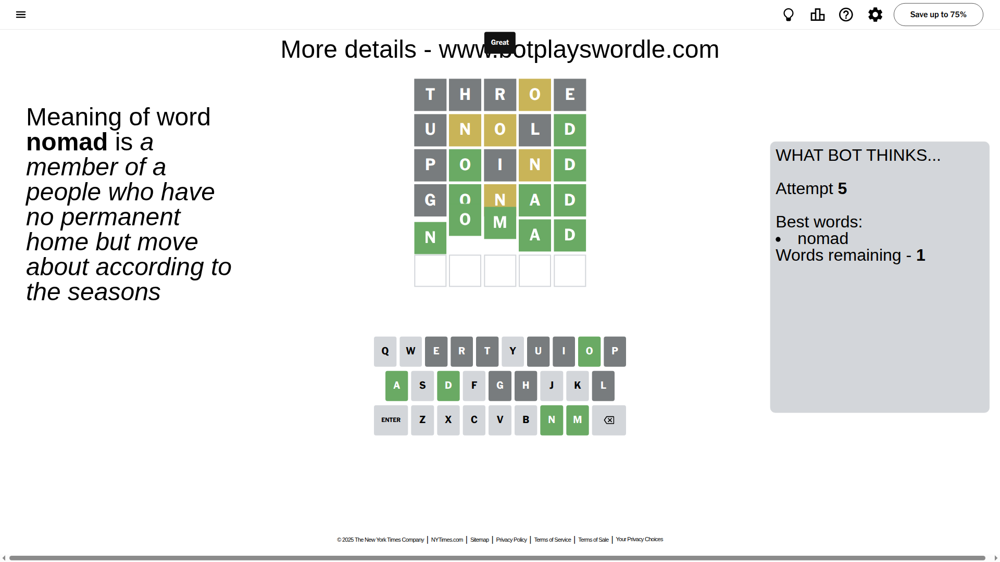

# Wordle for August 12, 2025 - \#1515

## Attempt 1

This is the first attempt and we'll choose a random word to start with.

Let's start with word `throe`

Attempt for `throe` gives us 0 correct letters, 1 present letters and 4 wrong letters.

If we look into details, we can see that:

Letter `t` is not present in the word and we will not use it any more

Letter `h` is not present in the word and we will not use it any more

Letter `r` is not present in the word and we will not use it any more

Letter `o` is on a different spot - this means that it cannot be at position 4

Letter `e` is not present in the word and we will not use it any more

Some letters are missing (like `t`, `h`, `r`, `e`) but it's also important piece of information

Word should contain letters `[o]`

That was a great guess that limited number of remaining words

## Attempt 2

Right now we have 424 words to choose from and best of them seem to be `[nodal unold aloin sloan solan]`

So far we know that possible letters are:

At position 1: `[a b c d f g i j k l m n o p q s u v w x y z]`

At position 2: `[a b c d f g i j k l m n o p q s u v w x y z]`

At position 3: `[a b c d f g i j k l m n o p q s u v w x y z]`

At position 4: `[a b c d f g i j k l m n p q s u v w x y z]`

At position 5: `[a b c d f g i j k l m n o p q s u v w x y z]`

Next guess is `unold`, let's see what it gives us

Attempt for `unold` gives us 1 correct letters, 2 present letters and 2 wrong letters.

If we look into details, we can see that:

Letter `u` is not present in the word and we will not use it any more

Letter `n` is on a different spot - this means that it cannot be at position 2

Letter `o` is on a different spot - this means that it cannot be at position 3

Letter `l` is not present in the word and we will not use it any more

Letter `d` should be at position 5

We got information about the correct letters and it should make next attempt easier

Some letters are missing (like `u`, `l`) but it's also important piece of information

Word should contain letters `[o n d]`

That was a great guess that limited number of remaining words

## Attempt 3

Right now we have 4 words to choose from and best of them seem to be `[monad nomad gonad poind]`

So far we know that possible letters are:

At position 1: `[a b c d f g i j k m n o p q s v w x y z]`

At position 2: `[a b c d f g i j k m o p q s v w x y z]`

At position 3: `[a b c d f g i j k m n p q s v w x y z]`

At position 4: `[a b c d f g i j k m n p q s v w x y z]`

At position 5: `[d]`

Next guess is `poind`, let's see what it gives us

Attempt for `poind` gives us 2 correct letters, 1 present letters and 2 wrong letters.

If we look into details, we can see that:

Letter `p` is not present in the word and we will not use it any more

Letter `o` should be at position 2

Letter `i` is not present in the word and we will not use it any more

Letter `n` is on a different spot - this means that it cannot be at position 4

We got information about the correct letters and it should make next attempt easier

Some letters are missing (like `p`, `i`) but it's also important piece of information

Word should contain letters `[o n d]`

This was a waste, almost no valuable information...

## Attempt 4

Right now we have 3 words to choose from and best of them seem to be `[monad nomad gonad]`

So far we know that possible letters are:

At position 1: `[a b c d f g j k m n o q s v w x y z]`

At position 2: `[o]`

At position 3: `[a b c d f g j k m n q s v w x y z]`

At position 4: `[a b c d f g j k m q s v w x y z]`

At position 5: `[d]`

Next guess is `gonad`, let's see what it gives us

Attempt for `gonad` gives us 3 correct letters, 1 present letters and 1 wrong letters.

If we look into details, we can see that:

Letter `g` is not present in the word and we will not use it any more

Letter `n` is on a different spot - this means that it cannot be at position 3

Letter `a` should be at position 4

We got information about the correct letters and it should make next attempt easier

Some letters are missing (like `g`) but it's also important piece of information

Word should contain letters `[o n d a]`

Could be a better guess

## Attempt 5

Right now we have 1 words to choose from and best of them seem to be `[nomad]`

So far we know that possible letters are:

At position 1: `[a b c d f j k m n o q s v w x y z]`

At position 2: `[o]`

At position 3: `[a b c d f j k m q s v w x y z]`

At position 4: `[a]`

At position 5: `[d]`

It must be `nomad`

That's the correct answer! The word is `nomad`!

## Conclusion

Today's word is `nomad` and it took 5 attempts to guess it

