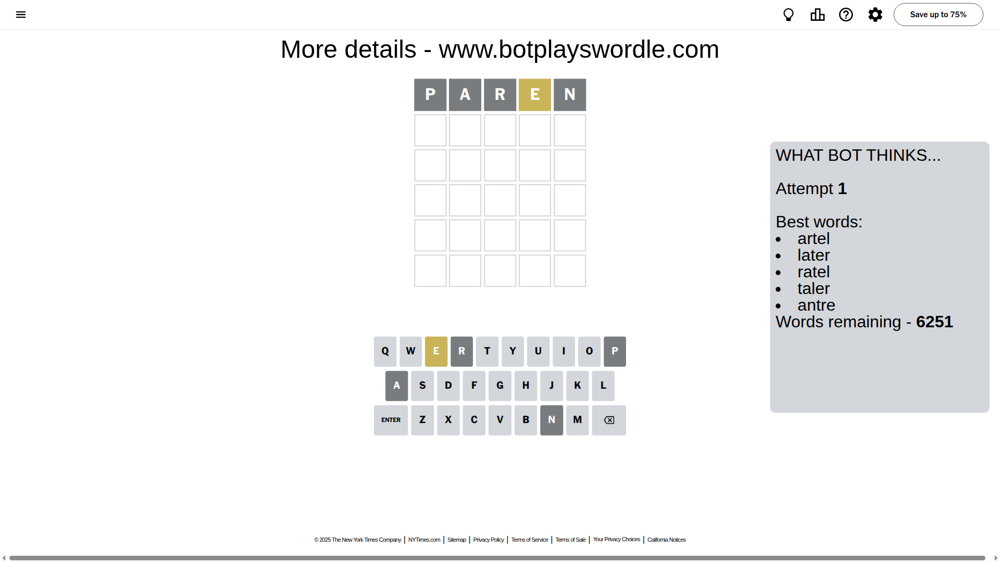
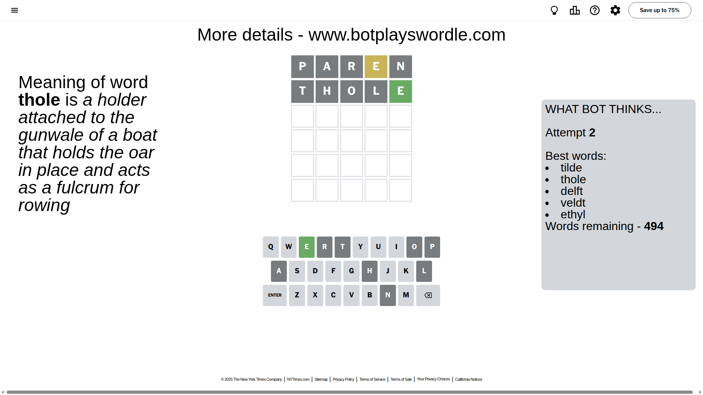
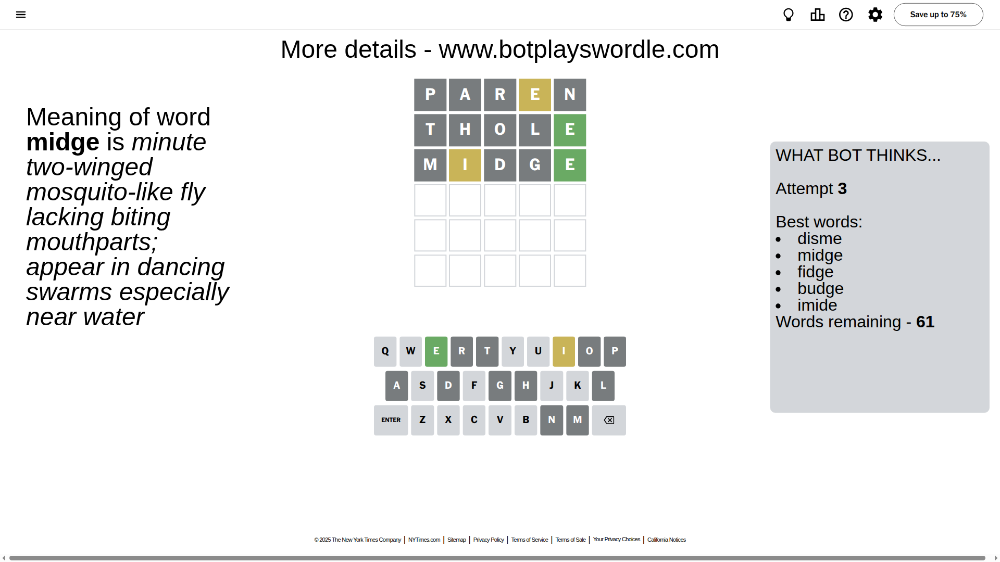
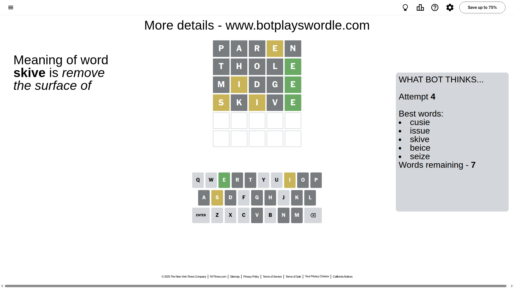
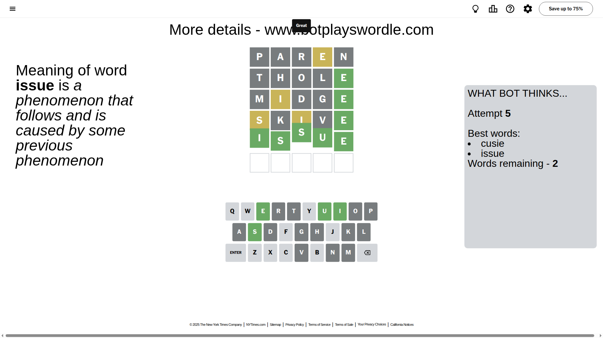

# Wordle for August 18, 2025 - \#1521

## Attempt 1

This is the first attempt and we'll choose a random word to start with.

Let's start with word `paren`

Attempt for `paren` gives us 0 correct letters, 1 present letters and 4 wrong letters.

If we look into details, we can see that:

Letter `p` is not present in the word and we will not use it any more

Letter `a` is not present in the word and we will not use it any more

Letter `r` is not present in the word and we will not use it any more

Letter `e` is on a different spot - this means that it cannot be at position 4

Letter `n` is not present in the word and we will not use it any more

Some letters are missing (like `p`, `a`, `r`, `n`) but it's also important piece of information

Word should contain letters `[e]`

That was a great guess that limited number of remaining words

## Attempt 2

Right now we have 494 words to choose from and best of them seem to be `[tilde thole delft veldt ethyl]`

So far we know that possible letters are:

At position 1: `[b c d e f g h i j k l m o q s t u v w x y z]`

At position 2: `[b c d e f g h i j k l m o q s t u v w x y z]`

At position 3: `[b c d e f g h i j k l m o q s t u v w x y z]`

At position 4: `[b c d f g h i j k l m o q s t u v w x y z]`

At position 5: `[b c d e f g h i j k l m o q s t u v w x y z]`

Next guess is `thole`, let's see what it gives us

Attempt for `thole` gives us 1 correct letters, 0 present letters and 4 wrong letters.

If we look into details, we can see that:

Letter `t` is not present in the word and we will not use it any more

Letter `h` is not present in the word and we will not use it any more

Letter `o` is not present in the word and we will not use it any more

Letter `l` is not present in the word and we will not use it any more

Letter `e` should be at position 5

We got information about the correct letters and it should make next attempt easier

Some letters are missing (like `t`, `h`, `o`, `l`) but it's also important piece of information

Word should contain letters `[e]`

That was a great guess that limited number of remaining words

## Attempt 3

Right now we have 61 words to choose from and best of them seem to be `[disme midge fidge budge imide]`

So far we know that possible letters are:

At position 1: `[b c d e f g i j k m q s u v w x y z]`

At position 2: `[b c d e f g i j k m q s u v w x y z]`

At position 3: `[b c d e f g i j k m q s u v w x y z]`

At position 4: `[b c d f g i j k m q s u v w x y z]`

At position 5: `[e]`

Next guess is `midge`, let's see what it gives us

Attempt for `midge` gives us 1 correct letters, 1 present letters and 3 wrong letters.

If we look into details, we can see that:

Letter `m` is not present in the word and we will not use it any more

Letter `i` is on a different spot - this means that it cannot be at position 2

Letter `d` is not present in the word and we will not use it any more

Letter `g` is not present in the word and we will not use it any more

Some letters are missing (like `m`, `d`, `g`) but it's also important piece of information

Word should contain letters `[e i]`

That was a great guess that limited number of remaining words

## Attempt 4

Right now we have 7 words to choose from and best of them seem to be `[cusie issue skive beice seize]`

So far we know that possible letters are:

At position 1: `[b c e f i j k q s u v w x y z]`

At position 2: `[b c e f j k q s u v w x y z]`

At position 3: `[b c e f i j k q s u v w x y z]`

At position 4: `[b c f i j k q s u v w x y z]`

At position 5: `[e]`

Next guess is `skive`, let's see what it gives us

Attempt for `skive` gives us 1 correct letters, 2 present letters and 2 wrong letters.

If we look into details, we can see that:

Letter `s` is on a different spot - this means that it cannot be at position 1

Letter `k` is not present in the word and we will not use it any more

Letter `i` is on a different spot - this means that it cannot be at position 3

Letter `v` is not present in the word and we will not use it any more

Some letters are missing (like `k`, `v`) but it's also important piece of information

Word should contain letters `[e i s]`

Could be a better guess

## Attempt 5

Right now we have 2 words to choose from and best of them seem to be `[cusie issue]`

So far we know that possible letters are:

At position 1: `[b c e f i j q u w x y z]`

At position 2: `[b c e f j q s u w x y z]`

At position 3: `[b c e f j q s u w x y z]`

At position 4: `[b c f i j q s u w x y z]`

At position 5: `[e]`

Next guess is `issue`, let's see what it gives us

That's the correct answer! The word is `issue`!

## Conclusion

Today's word is `issue` and it took 5 attempts to guess it

