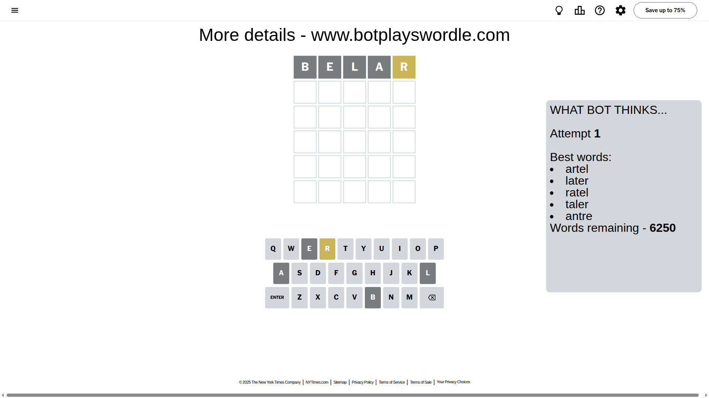
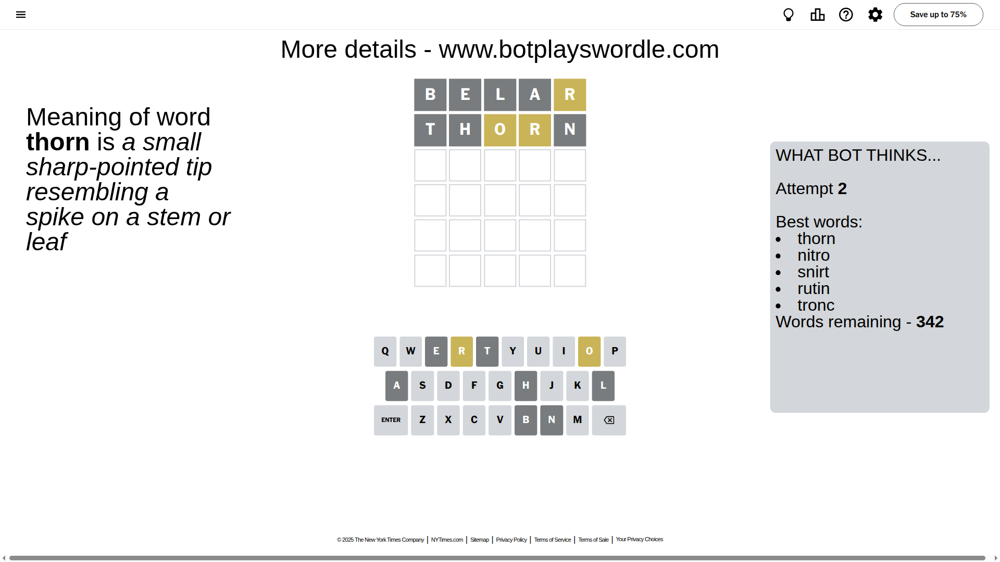
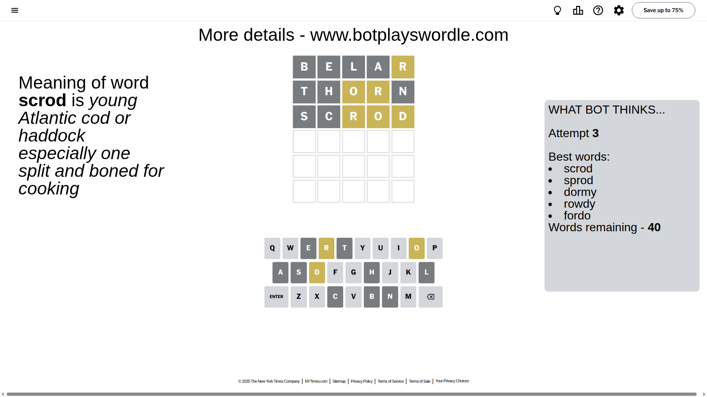
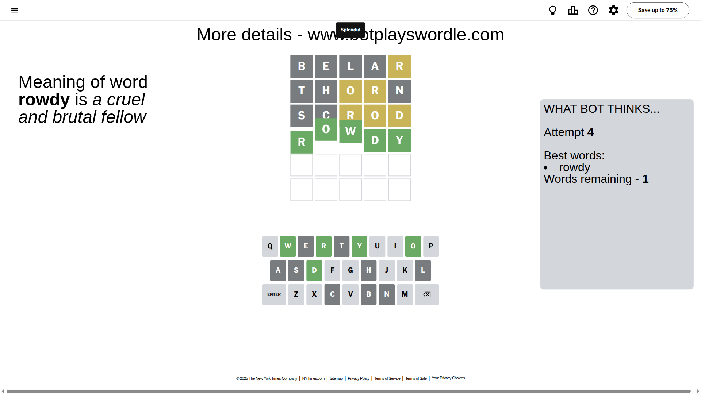

# Wordle for August 19, 2025 - \#1522

## Attempt 1

This is the first attempt and we'll choose a random word to start with.

Let's start with word `belar`

Attempt for `belar` gives us 0 correct letters, 1 present letters and 4 wrong letters.

If we look into details, we can see that:

Letter `b` is not present in the word and we will not use it any more

Letter `e` is not present in the word and we will not use it any more

Letter `l` is not present in the word and we will not use it any more

Letter `a` is not present in the word and we will not use it any more

Letter `r` is on a different spot - this means that it cannot be at position 5

Some letters are missing (like `b`, `e`, `l`, `a`) but it's also important piece of information

Word should contain letters `[r]`

That was a great guess that limited number of remaining words

## Attempt 2

Right now we have 342 words to choose from and best of them seem to be `[thorn nitro snirt rutin tronc]`

So far we know that possible letters are:

At position 1: `[c d f g h i j k m n o p q r s t u v w x y z]`

At position 2: `[c d f g h i j k m n o p q r s t u v w x y z]`

At position 3: `[c d f g h i j k m n o p q r s t u v w x y z]`

At position 4: `[c d f g h i j k m n o p q r s t u v w x y z]`

At position 5: `[c d f g h i j k m n o p q s t u v w x y z]`

Next guess is `thorn`, let's see what it gives us

Attempt for `thorn` gives us 0 correct letters, 2 present letters and 3 wrong letters.

If we look into details, we can see that:

Letter `t` is not present in the word and we will not use it any more

Letter `h` is not present in the word and we will not use it any more

Letter `o` is on a different spot - this means that it cannot be at position 3

Letter `r` is on a different spot - this means that it cannot be at position 4

Letter `n` is not present in the word and we will not use it any more

Some letters are missing (like `t`, `h`, `n`) but it's also important piece of information

Word should contain letters `[r o]`

That was a great guess that limited number of remaining words

## Attempt 3

Right now we have 40 words to choose from and best of them seem to be `[scrod sprod dormy rowdy fordo]`

So far we know that possible letters are:

At position 1: `[c d f g i j k m o p q r s u v w x y z]`

At position 2: `[c d f g i j k m o p q r s u v w x y z]`

At position 3: `[c d f g i j k m p q r s u v w x y z]`

At position 4: `[c d f g i j k m o p q s u v w x y z]`

At position 5: `[c d f g i j k m o p q s u v w x y z]`

Next guess is `scrod`, let's see what it gives us

Attempt for `scrod` gives us 0 correct letters, 3 present letters and 2 wrong letters.

If we look into details, we can see that:

Letter `s` is not present in the word and we will not use it any more

Letter `c` is not present in the word and we will not use it any more

Letter `r` is on a different spot - this means that it cannot be at position 3

Letter `o` is on a different spot - this means that it cannot be at position 4

Letter `d` is on a different spot - this means that it cannot be at position 5

Some letters are missing (like `s`, `c`) but it's also important piece of information

Word should contain letters `[r o d]`

That was a great guess that limited number of remaining words

## Attempt 4

Right now we have 1 words to choose from and best of them seem to be `[rowdy]`

So far we know that possible letters are:

At position 1: `[d f g i j k m o p q r u v w x y z]`

At position 2: `[d f g i j k m o p q r u v w x y z]`

At position 3: `[d f g i j k m p q u v w x y z]`

At position 4: `[d f g i j k m p q u v w x y z]`

At position 5: `[f g i j k m o p q u v w x y z]`

It must be `rowdy`

That's the correct answer! The word is `rowdy`!

## Conclusion

Today's word is `rowdy` and it took 4 attempts to guess it

