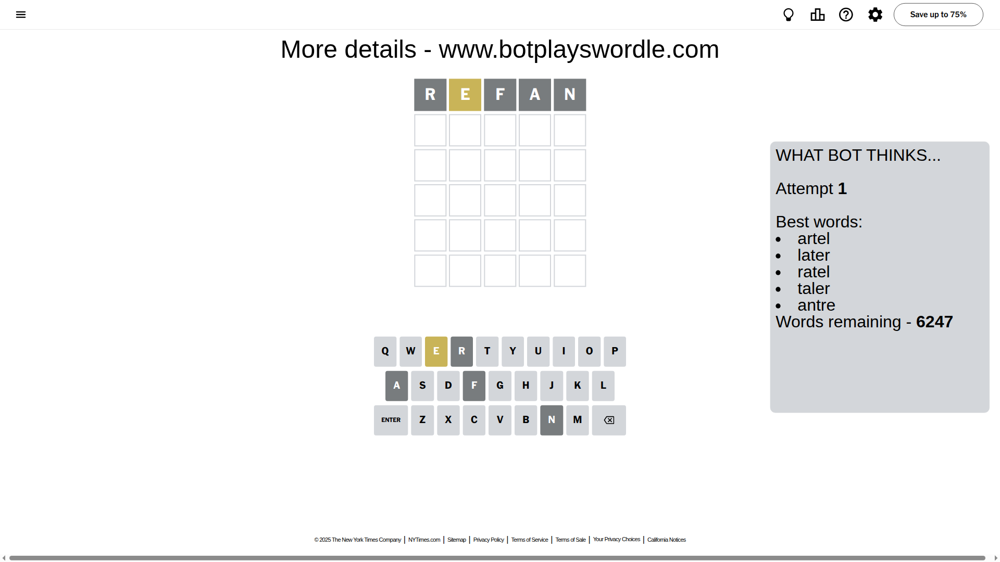
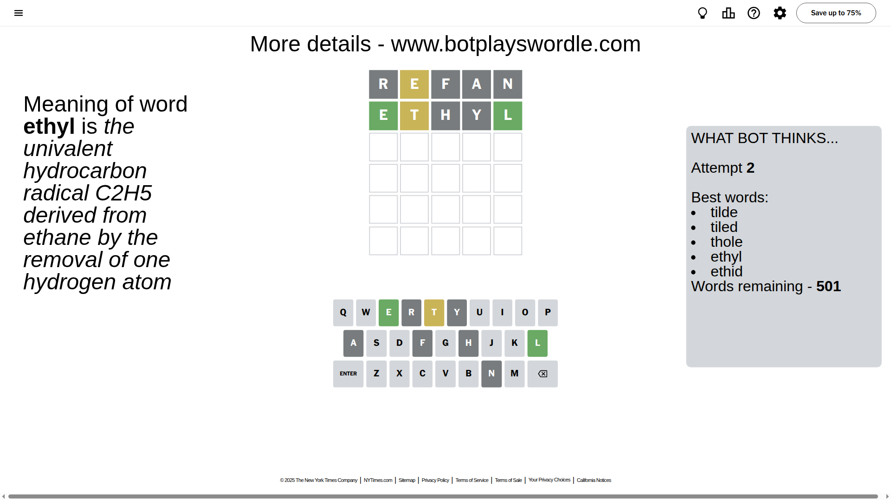
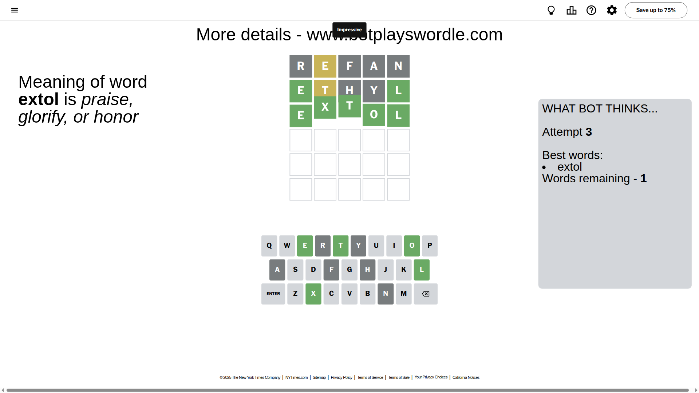

# Wordle for August 21, 2025 - \#1524

## Attempt 1

This is the first attempt and we'll choose a random word to start with.

Let's start with word `refan`

Attempt for `refan` gives us 0 correct letters, 1 present letters and 4 wrong letters.

If we look into details, we can see that:

Letter `r` is not present in the word and we will not use it any more

Letter `e` is on a different spot - this means that it cannot be at position 2

Letter `f` is not present in the word and we will not use it any more

Letter `a` is not present in the word and we will not use it any more

Letter `n` is not present in the word and we will not use it any more

Some letters are missing (like `r`, `f`, `a`, `n`) but it's also important piece of information

Word should contain letters `[e]`

That was a great guess that limited number of remaining words

## Attempt 2

Right now we have 501 words to choose from and best of them seem to be `[tilde tiled thole ethyl ethid]`

So far we know that possible letters are:

At position 1: `[b c d e g h i j k l m o p q s t u v w x y z]`

At position 2: `[b c d g h i j k l m o p q s t u v w x y z]`

At position 3: `[b c d e g h i j k l m o p q s t u v w x y z]`

At position 4: `[b c d e g h i j k l m o p q s t u v w x y z]`

At position 5: `[b c d e g h i j k l m o p q s t u v w x y z]`

Next guess is `ethyl`, let's see what it gives us

Attempt for `ethyl` gives us 2 correct letters, 1 present letters and 2 wrong letters.

If we look into details, we can see that:

Letter `e` should be at position 1

Letter `t` is on a different spot - this means that it cannot be at position 2

Letter `h` is not present in the word and we will not use it any more

Letter `y` is not present in the word and we will not use it any more

Letter `l` should be at position 5

We got information about the correct letters and it should make next attempt easier

Some letters are missing (like `h`, `y`) but it's also important piece of information

Word should contain letters `[e t l]`

That was a great guess that limited number of remaining words

## Attempt 3

Right now we have 1 words to choose from and best of them seem to be `[extol]`

So far we know that possible letters are:

At position 1: `[e]`

At position 2: `[b c d g i j k l m o p q s u v w x z]`

At position 3: `[b c d e g i j k l m o p q s t u v w x z]`

At position 4: `[b c d e g i j k l m o p q s t u v w x z]`

At position 5: `[l]`

It must be `extol`

That's the correct answer! The word is `extol`!

## Conclusion

Today's word is `extol` and it took 3 attempts to guess it

