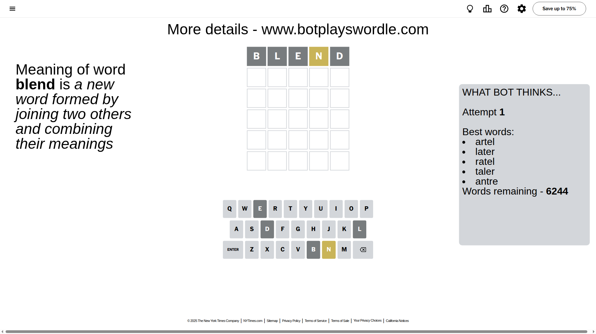
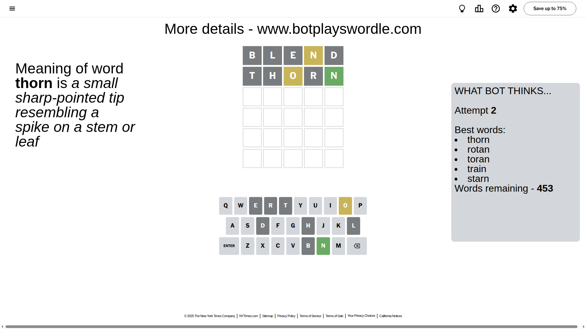
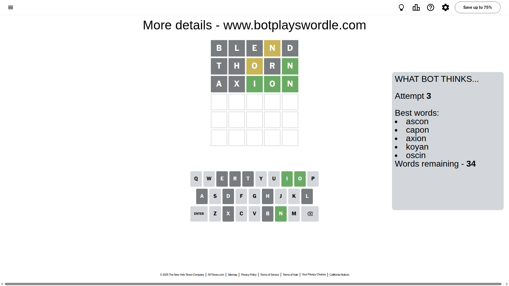
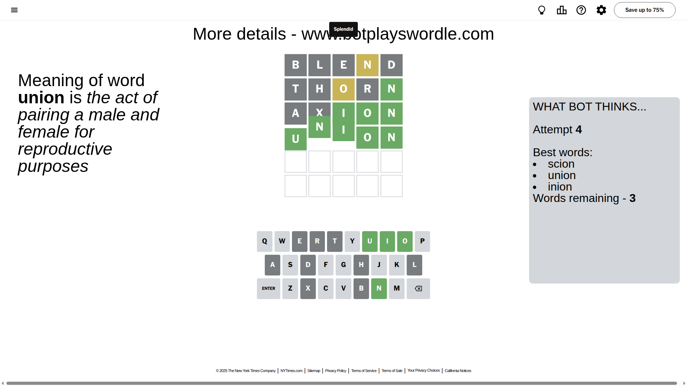

# Wordle for August 23, 2025 - \#1526

## Attempt 1

This is the first attempt and we'll choose a random word to start with.

Let's start with word `blend`

Attempt for `blend` gives us 0 correct letters, 1 present letters and 4 wrong letters.

If we look into details, we can see that:

Letter `b` is not present in the word and we will not use it any more

Letter `l` is not present in the word and we will not use it any more

Letter `e` is not present in the word and we will not use it any more

Letter `n` is on a different spot - this means that it cannot be at position 4

Letter `d` is not present in the word and we will not use it any more

Some letters are missing (like `b`, `l`, `e`, `d`) but it's also important piece of information

Word should contain letters `[n]`

That was a great guess that limited number of remaining words

## Attempt 2

Right now we have 453 words to choose from and best of them seem to be `[thorn rotan toran train starn]`

So far we know that possible letters are:

At position 1: `[a c f g h i j k m n o p q r s t u v w x y z]`

At position 2: `[a c f g h i j k m n o p q r s t u v w x y z]`

At position 3: `[a c f g h i j k m n o p q r s t u v w x y z]`

At position 4: `[a c f g h i j k m o p q r s t u v w x y z]`

At position 5: `[a c f g h i j k m n o p q r s t u v w x y z]`

Next guess is `thorn`, let's see what it gives us

Attempt for `thorn` gives us 1 correct letters, 1 present letters and 3 wrong letters.

If we look into details, we can see that:

Letter `t` is not present in the word and we will not use it any more

Letter `h` is not present in the word and we will not use it any more

Letter `o` is on a different spot - this means that it cannot be at position 3

Letter `r` is not present in the word and we will not use it any more

Letter `n` should be at position 5

We got information about the correct letters and it should make next attempt easier

Some letters are missing (like `t`, `h`, `r`) but it's also important piece of information

Word should contain letters `[n o]`

That was a great guess that limited number of remaining words

## Attempt 3

Right now we have 34 words to choose from and best of them seem to be `[ascon capon axion koyan oscin]`

So far we know that possible letters are:

At position 1: `[a c f g i j k m n o p q s u v w x y z]`

At position 2: `[a c f g i j k m n o p q s u v w x y z]`

At position 3: `[a c f g i j k m n p q s u v w x y z]`

At position 4: `[a c f g i j k m o p q s u v w x y z]`

At position 5: `[n]`

Next guess is `axion`, let's see what it gives us

Attempt for `axion` gives us 3 correct letters, 0 present letters and 2 wrong letters.

If we look into details, we can see that:

Letter `a` is not present in the word and we will not use it any more

Letter `x` is not present in the word and we will not use it any more

Letter `i` should be at position 3

Letter `o` should be at position 4

We got information about the correct letters and it should make next attempt easier

Some letters are missing (like `a`, `x`) but it's also important piece of information

Word should contain letters `[n o i]`

That was a great guess that limited number of remaining words

## Attempt 4

Right now we have 3 words to choose from and best of them seem to be `[scion union inion]`

So far we know that possible letters are:

At position 1: `[c f g i j k m n o p q s u v w y z]`

At position 2: `[c f g i j k m n o p q s u v w y z]`

At position 3: `[i]`

At position 4: `[o]`

At position 5: `[n]`

Next guess is `union`, let's see what it gives us

That's the correct answer! The word is `union`!

## Conclusion

Today's word is `union` and it took 4 attempts to guess it

