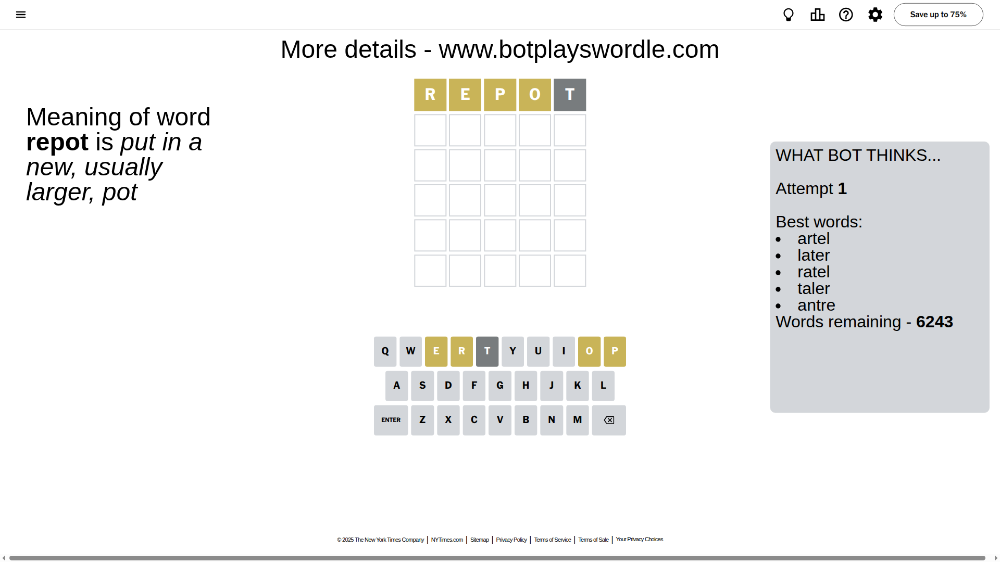
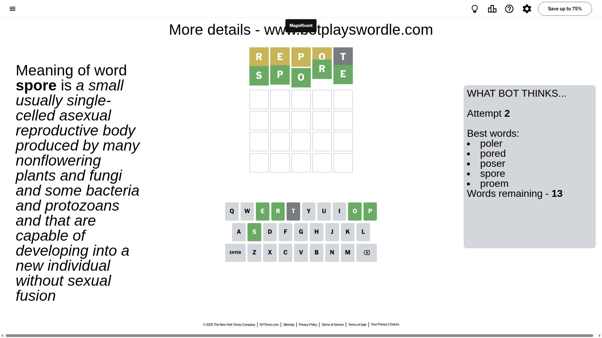

# Wordle for August 24, 2025 - \#1527

## Attempt 1

This is the first attempt and we'll choose a random word to start with.

Let's start with word `repot`

Attempt for `repot` gives us 0 correct letters, 4 present letters and 1 wrong letters.

If we look into details, we can see that:

Letter `r` is on a different spot - this means that it cannot be at position 1

Letter `e` is on a different spot - this means that it cannot be at position 2

Letter `p` is on a different spot - this means that it cannot be at position 3

Letter `o` is on a different spot - this means that it cannot be at position 4

Letter `t` is not present in the word and we will not use it any more

Some letters are missing (like `t`) but it's also important piece of information

Word should contain letters `[r e p o]`

That was a great guess that limited number of remaining words

## Attempt 2

Right now we have 13 words to choose from and best of them seem to be `[poler pored poser spore proem]`

So far we know that possible letters are:

At position 1: `[a b c d e f g h i j k l m n o p q s u v w x y z]`

At position 2: `[a b c d f g h i j k l m n o p q r s u v w x y z]`

At position 3: `[a b c d e f g h i j k l m n o q r s u v w x y z]`

At position 4: `[a b c d e f g h i j k l m n p q r s u v w x y z]`

At position 5: `[a b c d e f g h i j k l m n o p q r s u v w x y z]`

Next guess is `spore`, let's see what it gives us

That's the correct answer! The word is `spore`!

To be honest that was a pretty lucky guess, but it worked out well.

## Conclusion

Today's word is `spore` and it took 2 attempts to guess it

