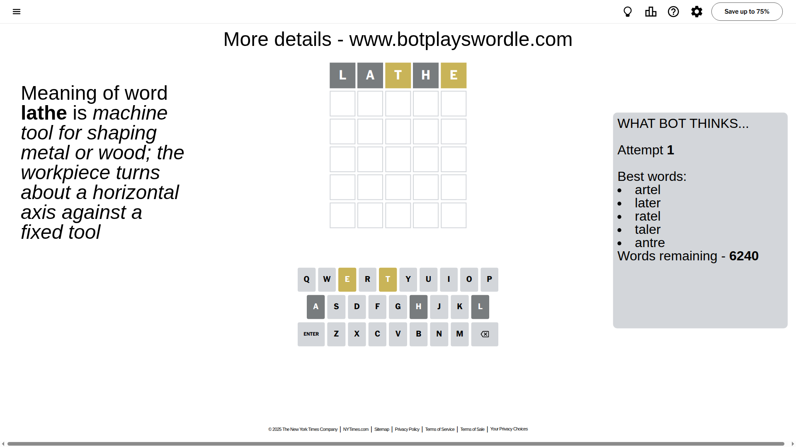
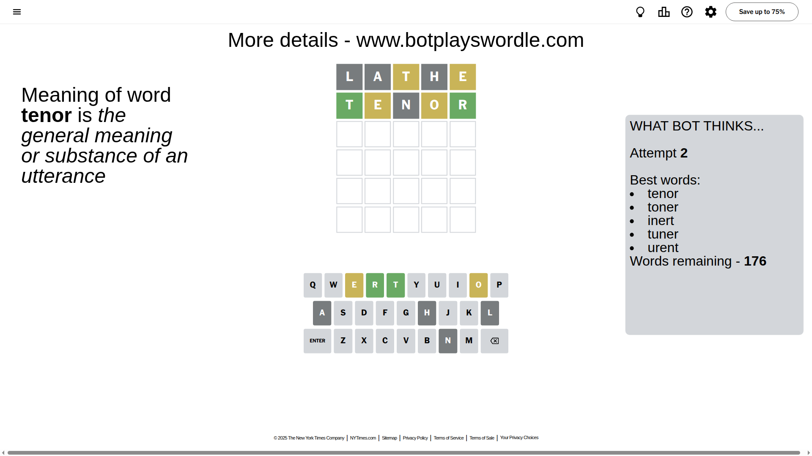
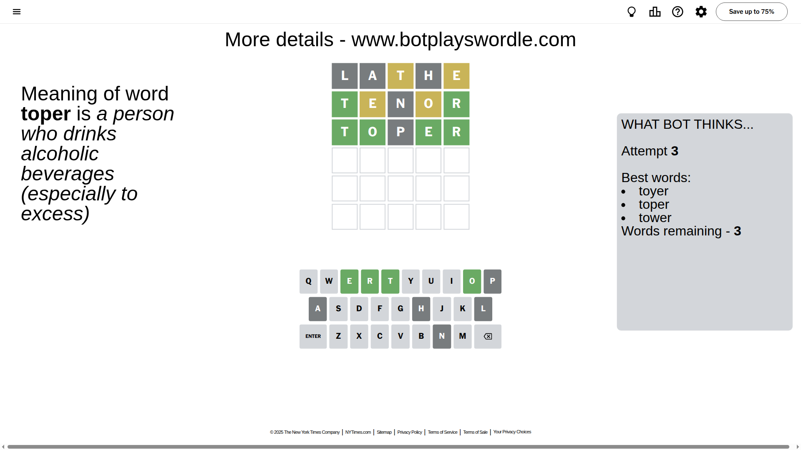
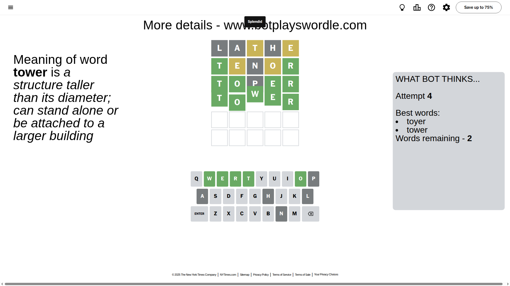

# Wordle for August 27, 2025 - \#1530

## Attempt 1

This is the first attempt and we'll choose a random word to start with.

Let's start with word `lathe`

Attempt for `lathe` gives us 0 correct letters, 2 present letters and 3 wrong letters.

If we look into details, we can see that:

Letter `l` is not present in the word and we will not use it any more

Letter `a` is not present in the word and we will not use it any more

Letter `t` is on a different spot - this means that it cannot be at position 3

Letter `h` is not present in the word and we will not use it any more

Letter `e` is on a different spot - this means that it cannot be at position 5

Some letters are missing (like `l`, `a`, `h`) but it's also important piece of information

Word should contain letters `[t e]`

That was a great guess that limited number of remaining words

## Attempt 2

Right now we have 176 words to choose from and best of them seem to be `[tenor toner inert tuner urent]`

So far we know that possible letters are:

At position 1: `[b c d e f g i j k m n o p q r s t u v w x y z]`

At position 2: `[b c d e f g i j k m n o p q r s t u v w x y z]`

At position 3: `[b c d e f g i j k m n o p q r s u v w x y z]`

At position 4: `[b c d e f g i j k m n o p q r s t u v w x y z]`

At position 5: `[b c d f g i j k m n o p q r s t u v w x y z]`

Next guess is `tenor`, let's see what it gives us

Attempt for `tenor` gives us 2 correct letters, 2 present letters and 1 wrong letters.

If we look into details, we can see that:

Letter `t` should be at position 1

Letter `e` is on a different spot - this means that it cannot be at position 2

Letter `n` is not present in the word and we will not use it any more

Letter `o` is on a different spot - this means that it cannot be at position 4

Letter `r` should be at position 5

We got information about the correct letters and it should make next attempt easier

Some letters are missing (like `n`) but it's also important piece of information

Word should contain letters `[t e o r]`

That was a great guess that limited number of remaining words

## Attempt 3

Right now we have 3 words to choose from and best of them seem to be `[toyer toper tower]`

So far we know that possible letters are:

At position 1: `[t]`

At position 2: `[b c d f g i j k m o p q r s t u v w x y z]`

At position 3: `[b c d e f g i j k m o p q r s u v w x y z]`

At position 4: `[b c d e f g i j k m p q r s t u v w x y z]`

At position 5: `[r]`

Next guess is `toper`, let's see what it gives us

Attempt for `toper` gives us 4 correct letters, 0 present letters and 1 wrong letters.

If we look into details, we can see that:

Letter `o` should be at position 2

Letter `p` is not present in the word and we will not use it any more

Letter `e` should be at position 4

We got information about the correct letters and it should make next attempt easier

Some letters are missing (like `p`) but it's also important piece of information

Word should contain letters `[t e o r]`

This was a waste, almost no valuable information...

## Attempt 4

Right now we have 2 words to choose from and best of them seem to be `[toyer tower]`

So far we know that possible letters are:

At position 1: `[t]`

At position 2: `[o]`

At position 3: `[b c d e f g i j k m o q r s u v w x y z]`

At position 4: `[e]`

At position 5: `[r]`

Next guess is `tower`, let's see what it gives us

That's the correct answer! The word is `tower`!

## Conclusion

Today's word is `tower` and it took 4 attempts to guess it

