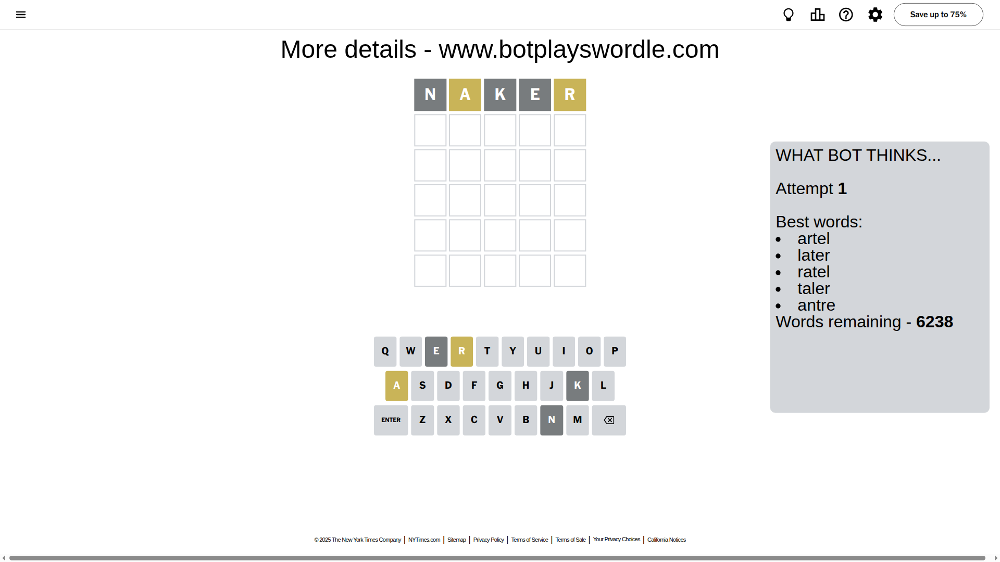
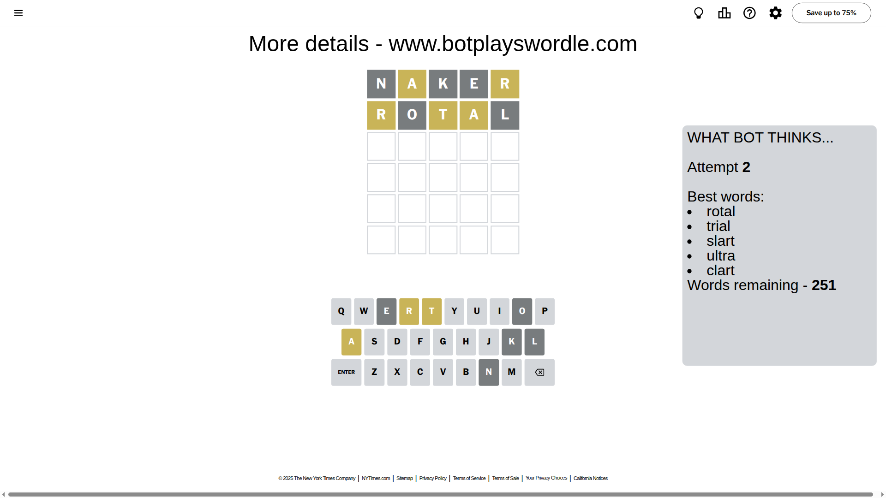
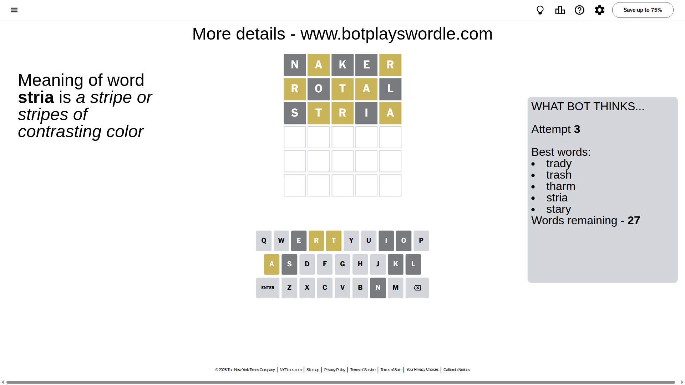
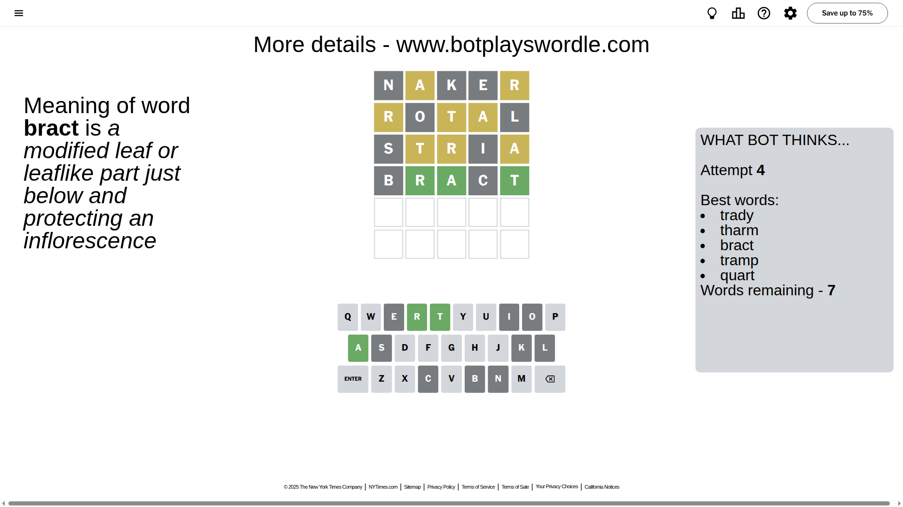
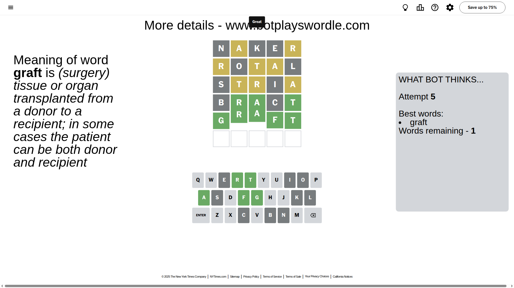

# Wordle for August 29, 2025 - \#1532

## Attempt 1

This is the first attempt and we'll choose a random word to start with.

Let's start with word `naker`

Attempt for `naker` gives us 0 correct letters, 2 present letters and 3 wrong letters.

If we look into details, we can see that:

Letter `n` is not present in the word and we will not use it any more

Letter `a` is on a different spot - this means that it cannot be at position 2

Letter `k` is not present in the word and we will not use it any more

Letter `e` is not present in the word and we will not use it any more

Letter `r` is on a different spot - this means that it cannot be at position 5

Some letters are missing (like `n`, `k`, `e`) but it's also important piece of information

Word should contain letters `[a r]`

That was a great guess that limited number of remaining words

## Attempt 2

Right now we have 251 words to choose from and best of them seem to be `[rotal trial slart ultra clart]`

So far we know that possible letters are:

At position 1: `[a b c d f g h i j l m o p q r s t u v w x y z]`

At position 2: `[b c d f g h i j l m o p q r s t u v w x y z]`

At position 3: `[a b c d f g h i j l m o p q r s t u v w x y z]`

At position 4: `[a b c d f g h i j l m o p q r s t u v w x y z]`

At position 5: `[a b c d f g h i j l m o p q s t u v w x y z]`

Next guess is `rotal`, let's see what it gives us

Attempt for `rotal` gives us 0 correct letters, 3 present letters and 2 wrong letters.

If we look into details, we can see that:

Letter `r` is on a different spot - this means that it cannot be at position 1

Letter `o` is not present in the word and we will not use it any more

Letter `t` is on a different spot - this means that it cannot be at position 3

Letter `a` is on a different spot - this means that it cannot be at position 4

Letter `l` is not present in the word and we will not use it any more

Some letters are missing (like `o`, `l`) but it's also important piece of information

Word should contain letters `[a r t]`

That was a great guess that limited number of remaining words

## Attempt 3

Right now we have 27 words to choose from and best of them seem to be `[trady trash tharm stria stary]`

So far we know that possible letters are:

At position 1: `[a b c d f g h i j m p q s t u v w x y z]`

At position 2: `[b c d f g h i j m p q r s t u v w x y z]`

At position 3: `[a b c d f g h i j m p q r s u v w x y z]`

At position 4: `[b c d f g h i j m p q r s t u v w x y z]`

At position 5: `[a b c d f g h i j m p q s t u v w x y z]`

Next guess is `stria`, let's see what it gives us

Attempt for `stria` gives us 0 correct letters, 3 present letters and 2 wrong letters.

If we look into details, we can see that:

Letter `s` is not present in the word and we will not use it any more

Letter `t` is on a different spot - this means that it cannot be at position 2

Letter `r` is on a different spot - this means that it cannot be at position 3

Letter `i` is not present in the word and we will not use it any more

Letter `a` is on a different spot - this means that it cannot be at position 5

Some letters are missing (like `s`, `i`) but it's also important piece of information

Word should contain letters `[a r t]`

Could be a better guess

## Attempt 4

Right now we have 7 words to choose from and best of them seem to be `[trady tharm bract tramp quart]`

So far we know that possible letters are:

At position 1: `[a b c d f g h j m p q t u v w x y z]`

At position 2: `[b c d f g h j m p q r u v w x y z]`

At position 3: `[a b c d f g h j m p q u v w x y z]`

At position 4: `[b c d f g h j m p q r t u v w x y z]`

At position 5: `[b c d f g h j m p q t u v w x y z]`

Next guess is `bract`, let's see what it gives us

Attempt for `bract` gives us 3 correct letters, 0 present letters and 2 wrong letters.

If we look into details, we can see that:

Letter `b` is not present in the word and we will not use it any more

Letter `r` should be at position 2

Letter `a` should be at position 3

Letter `c` is not present in the word and we will not use it any more

Letter `t` should be at position 5

We got information about the correct letters and it should make next attempt easier

Some letters are missing (like `b`, `c`) but it's also important piece of information

Word should contain letters `[a r t]`

Not a bad guess in general

## Attempt 5

Right now we have 1 words to choose from and best of them seem to be `[graft]`

So far we know that possible letters are:

At position 1: `[a d f g h j m p q t u v w x y z]`

At position 2: `[r]`

At position 3: `[a]`

At position 4: `[d f g h j m p q r t u v w x y z]`

At position 5: `[t]`

It must be `graft`

That's the correct answer! The word is `graft`!

## Conclusion

Today's word is `graft` and it took 5 attempts to guess it

