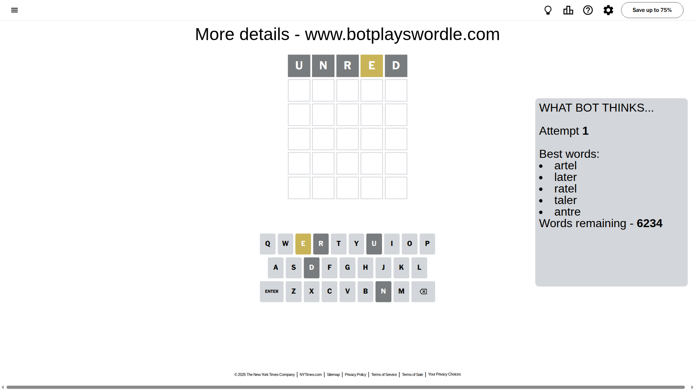
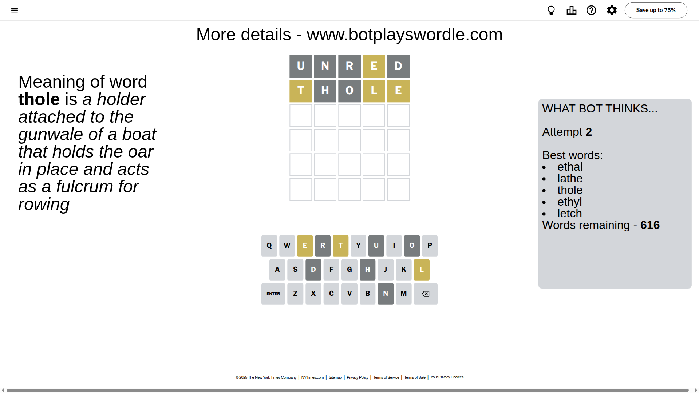
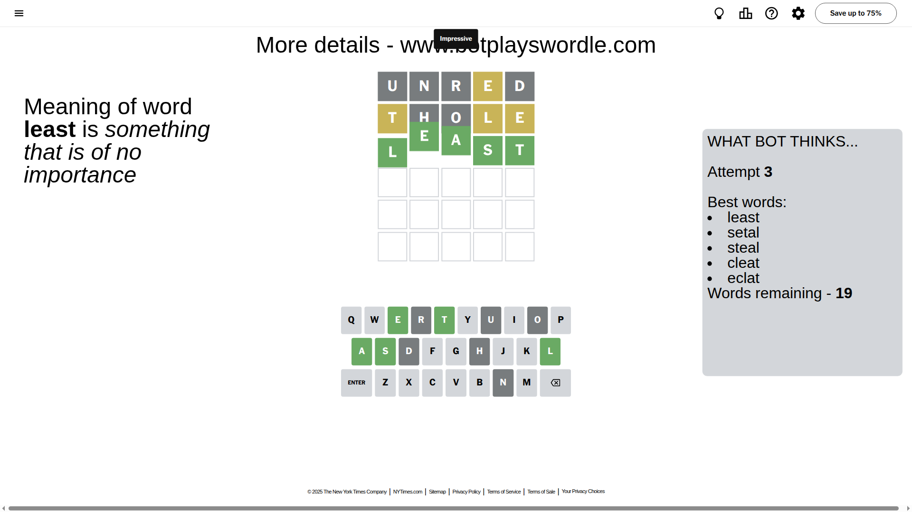

# Wordle for September 1, 2025 - \#1535

## Attempt 1

This is the first attempt and we'll choose a random word to start with.

Let's start with word `unred`

Attempt for `unred` gives us 0 correct letters, 1 present letters and 4 wrong letters.

If we look into details, we can see that:

Letter `u` is not present in the word and we will not use it any more

Letter `n` is not present in the word and we will not use it any more

Letter `r` is not present in the word and we will not use it any more

Letter `e` is on a different spot - this means that it cannot be at position 4

Letter `d` is not present in the word and we will not use it any more

Some letters are missing (like `u`, `n`, `r`, `d`) but it's also important piece of information

Word should contain letters `[e]`

That was a great guess that limited number of remaining words

## Attempt 2

Right now we have 616 words to choose from and best of them seem to be `[ethal lathe thole ethyl letch]`

So far we know that possible letters are:

At position 1: `[a b c e f g h i j k l m o p q s t v w x y z]`

At position 2: `[a b c e f g h i j k l m o p q s t v w x y z]`

At position 3: `[a b c e f g h i j k l m o p q s t v w x y z]`

At position 4: `[a b c f g h i j k l m o p q s t v w x y z]`

At position 5: `[a b c e f g h i j k l m o p q s t v w x y z]`

Next guess is `thole`, let's see what it gives us

Attempt for `thole` gives us 0 correct letters, 3 present letters and 2 wrong letters.

If we look into details, we can see that:

Letter `t` is on a different spot - this means that it cannot be at position 1

Letter `h` is not present in the word and we will not use it any more

Letter `o` is not present in the word and we will not use it any more

Letter `l` is on a different spot - this means that it cannot be at position 4

Letter `e` is on a different spot - this means that it cannot be at position 5

Some letters are missing (like `h`, `o`) but it's also important piece of information

Word should contain letters `[e t l]`

That was a great guess that limited number of remaining words

## Attempt 3

Right now we have 19 words to choose from and best of them seem to be `[least setal steal cleat eclat]`

So far we know that possible letters are:

At position 1: `[a b c e f g i j k l m p q s v w x y z]`

At position 2: `[a b c e f g i j k l m p q s t v w x y z]`

At position 3: `[a b c e f g i j k l m p q s t v w x y z]`

At position 4: `[a b c f g i j k m p q s t v w x y z]`

At position 5: `[a b c f g i j k l m p q s t v w x y z]`

Next guess is `least`, let's see what it gives us

That's the correct answer! The word is `least`!

To be honest that was a pretty lucky guess, but it worked out well.

## Conclusion

Today's word is `least` and it took 3 attempts to guess it

