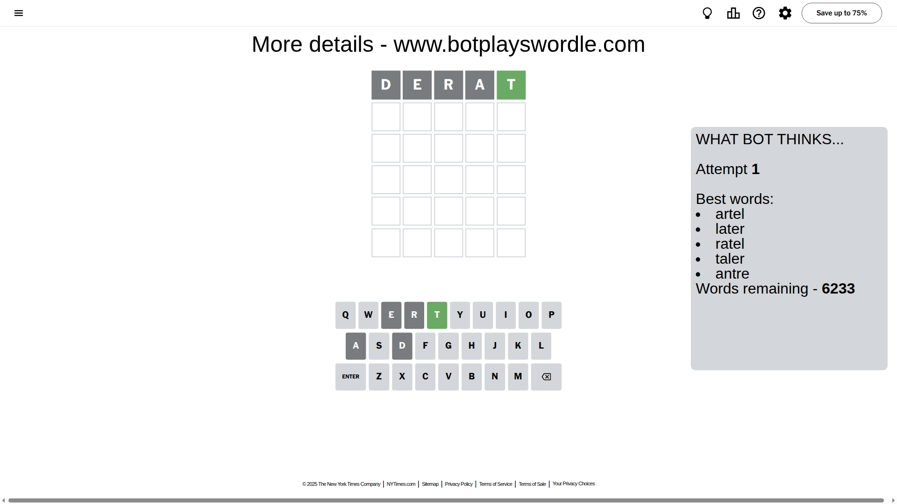
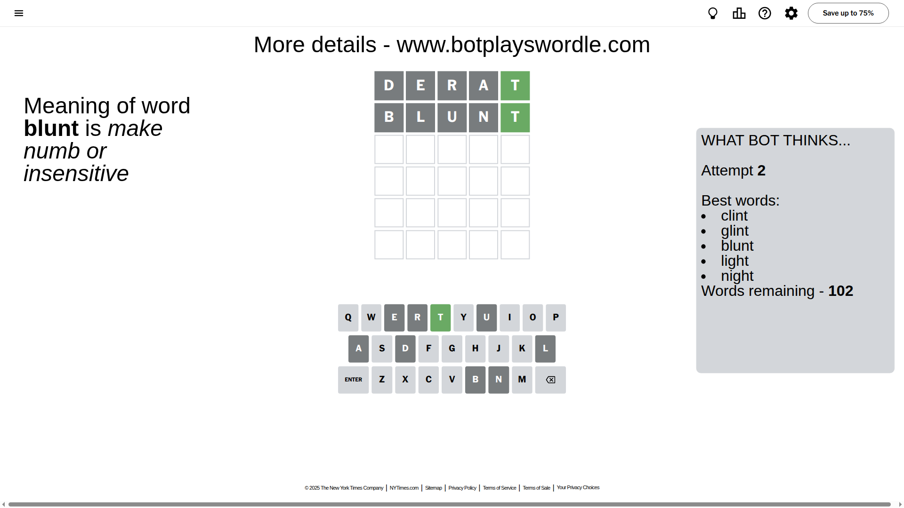
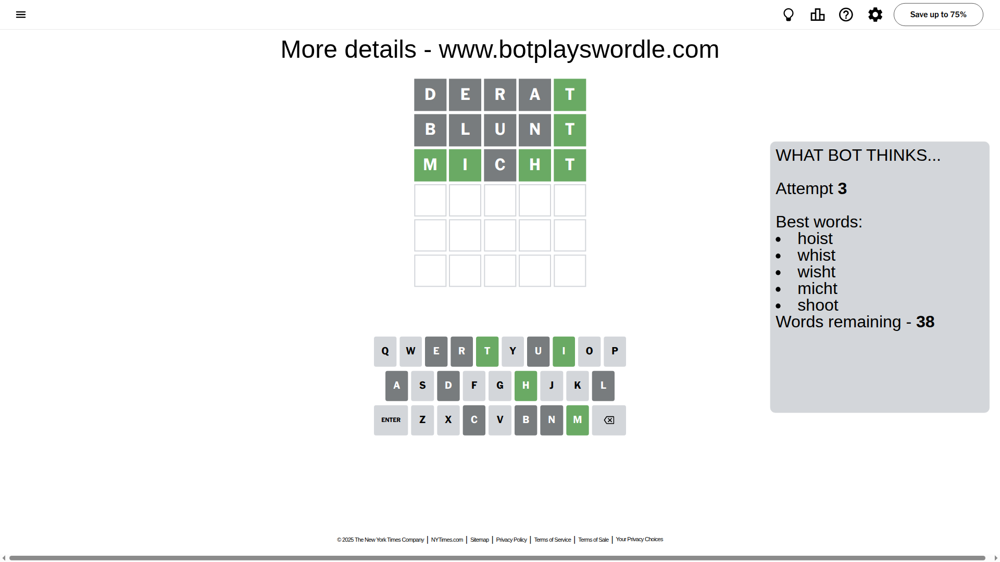
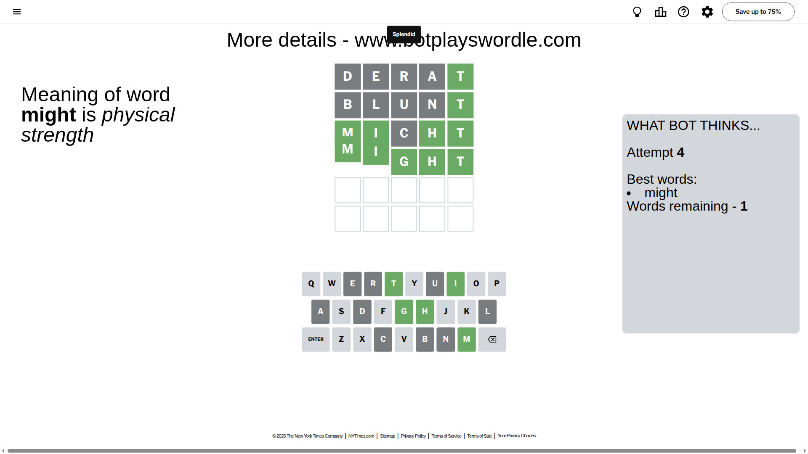

# Wordle for September 2, 2025 - \#1536

## Attempt 1

This is the first attempt and we'll choose a random word to start with.

Let's start with word `derat`

Attempt for `derat` gives us 1 correct letters, 0 present letters and 4 wrong letters.

If we look into details, we can see that:

Letter `d` is not present in the word and we will not use it any more

Letter `e` is not present in the word and we will not use it any more

Letter `r` is not present in the word and we will not use it any more

Letter `a` is not present in the word and we will not use it any more

Letter `t` should be at position 5

We got information about the correct letters and it should make next attempt easier

Some letters are missing (like `d`, `e`, `r`, `a`) but it's also important piece of information

Word should contain letters `[t]`

That was a great guess that limited number of remaining words

## Attempt 2

Right now we have 102 words to choose from and best of them seem to be `[clint glint blunt light night]`

So far we know that possible letters are:

At position 1: `[b c f g h i j k l m n o p q s t u v w x y z]`

At position 2: `[b c f g h i j k l m n o p q s t u v w x y z]`

At position 3: `[b c f g h i j k l m n o p q s t u v w x y z]`

At position 4: `[b c f g h i j k l m n o p q s t u v w x y z]`

At position 5: `[t]`

Next guess is `blunt`, let's see what it gives us

Attempt for `blunt` gives us 1 correct letters, 0 present letters and 4 wrong letters.

If we look into details, we can see that:

Letter `b` is not present in the word and we will not use it any more

Letter `l` is not present in the word and we will not use it any more

Letter `u` is not present in the word and we will not use it any more

Letter `n` is not present in the word and we will not use it any more

Some letters are missing (like `b`, `l`, `u`, `n`) but it's also important piece of information

Word should contain letters `[t]`

Could be a better guess

## Attempt 3

Right now we have 38 words to choose from and best of them seem to be `[hoist whist wisht micht shoot]`

So far we know that possible letters are:

At position 1: `[c f g h i j k m o p q s t v w x y z]`

At position 2: `[c f g h i j k m o p q s t v w x y z]`

At position 3: `[c f g h i j k m o p q s t v w x y z]`

At position 4: `[c f g h i j k m o p q s t v w x y z]`

At position 5: `[t]`

Next guess is `micht`, let's see what it gives us

Attempt for `micht` gives us 4 correct letters, 0 present letters and 1 wrong letters.

If we look into details, we can see that:

Letter `m` should be at position 1

Letter `i` should be at position 2

Letter `c` is not present in the word and we will not use it any more

Letter `h` should be at position 4

We got information about the correct letters and it should make next attempt easier

Some letters are missing (like `c`) but it's also important piece of information

Word should contain letters `[t m i h]`

That was a great guess that limited number of remaining words

## Attempt 4

Right now we have 1 words to choose from and best of them seem to be `[might]`

So far we know that possible letters are:

At position 1: `[m]`

At position 2: `[i]`

At position 3: `[f g h i j k m o p q s t v w x y z]`

At position 4: `[h]`

At position 5: `[t]`

It must be `might`

That's the correct answer! The word is `might`!

## Conclusion

Today's word is `might` and it took 4 attempts to guess it

