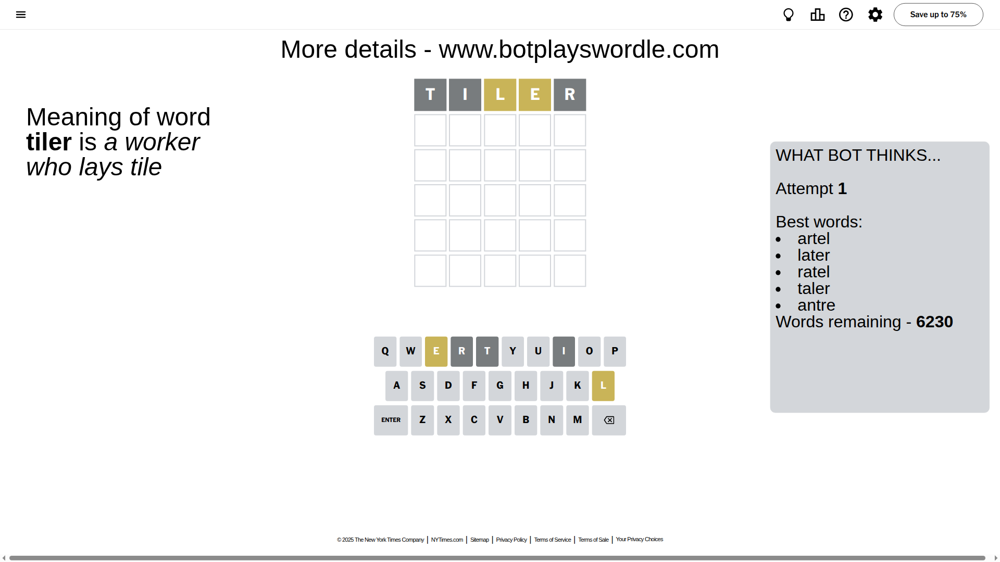
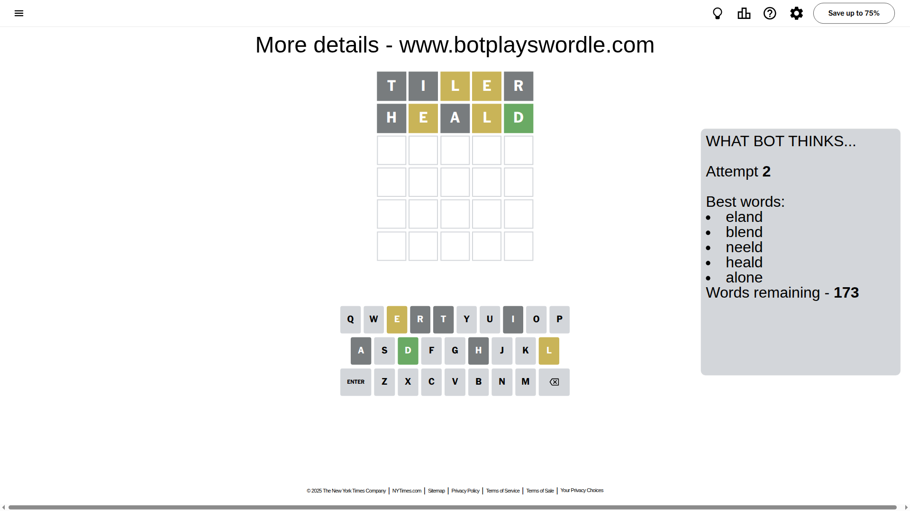
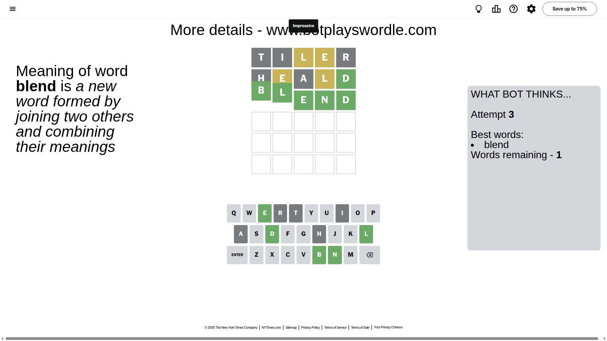

# Wordle for September 4, 2025 - \#1538

## Attempt 1

This is the first attempt and we'll choose a random word to start with.

Let's start with word `tiler`

Attempt for `tiler` gives us 0 correct letters, 2 present letters and 3 wrong letters.

If we look into details, we can see that:

Letter `t` is not present in the word and we will not use it any more

Letter `i` is not present in the word and we will not use it any more

Letter `l` is on a different spot - this means that it cannot be at position 3

Letter `e` is on a different spot - this means that it cannot be at position 4

Letter `r` is not present in the word and we will not use it any more

Some letters are missing (like `t`, `i`, `r`) but it's also important piece of information

Word should contain letters `[l e]`

That was a great guess that limited number of remaining words

## Attempt 2

Right now we have 173 words to choose from and best of them seem to be `[eland blend neeld heald alone]`

So far we know that possible letters are:

At position 1: `[a b c d e f g h j k l m n o p q s u v w x y z]`

At position 2: `[a b c d e f g h j k l m n o p q s u v w x y z]`

At position 3: `[a b c d e f g h j k m n o p q s u v w x y z]`

At position 4: `[a b c d f g h j k l m n o p q s u v w x y z]`

At position 5: `[a b c d e f g h j k l m n o p q s u v w x y z]`

Next guess is `heald`, let's see what it gives us

Attempt for `heald` gives us 1 correct letters, 2 present letters and 2 wrong letters.

If we look into details, we can see that:

Letter `h` is not present in the word and we will not use it any more

Letter `e` is on a different spot - this means that it cannot be at position 2

Letter `a` is not present in the word and we will not use it any more

Letter `l` is on a different spot - this means that it cannot be at position 4

Letter `d` should be at position 5

We got information about the correct letters and it should make next attempt easier

Some letters are missing (like `h`, `a`) but it's also important piece of information

Word should contain letters `[l e d]`

That was a great guess that limited number of remaining words

## Attempt 3

Right now we have 1 words to choose from and best of them seem to be `[blend]`

So far we know that possible letters are:

At position 1: `[b c d e f g j k l m n o p q s u v w x y z]`

At position 2: `[b c d f g j k l m n o p q s u v w x y z]`

At position 3: `[b c d e f g j k m n o p q s u v w x y z]`

At position 4: `[b c d f g j k m n o p q s u v w x y z]`

At position 5: `[d]`

It must be `blend`

That's the correct answer! The word is `blend`!

## Conclusion

Today's word is `blend` and it took 3 attempts to guess it

