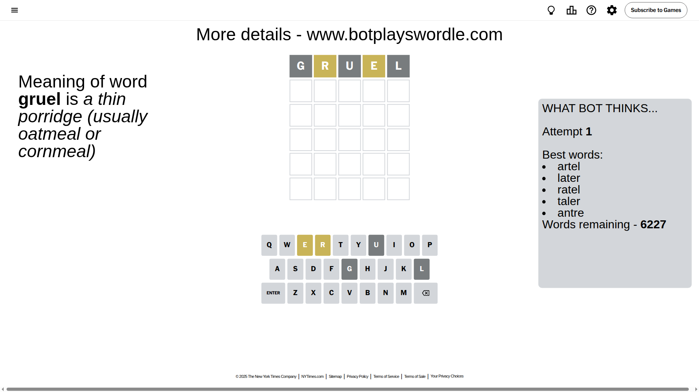
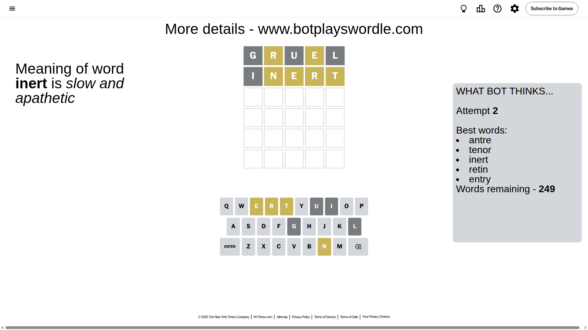
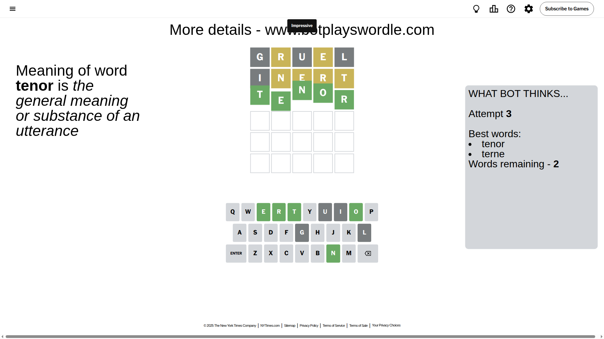

# Wordle for September 7, 2025 - \#1541

## Attempt 1

This is the first attempt and we'll choose a random word to start with.

Let's start with word `gruel`

Attempt for `gruel` gives us 0 correct letters, 2 present letters and 3 wrong letters.

If we look into details, we can see that:

Letter `g` is not present in the word and we will not use it any more

Letter `r` is on a different spot - this means that it cannot be at position 2

Letter `u` is not present in the word and we will not use it any more

Letter `e` is on a different spot - this means that it cannot be at position 4

Letter `l` is not present in the word and we will not use it any more

Some letters are missing (like `g`, `u`, `l`) but it's also important piece of information

Word should contain letters `[r e]`

That was a great guess that limited number of remaining words

## Attempt 2

Right now we have 249 words to choose from and best of them seem to be `[antre tenor inert retin entry]`

So far we know that possible letters are:

At position 1: `[a b c d e f h i j k m n o p q r s t v w x y z]`

At position 2: `[a b c d e f h i j k m n o p q s t v w x y z]`

At position 3: `[a b c d e f h i j k m n o p q r s t v w x y z]`

At position 4: `[a b c d f h i j k m n o p q r s t v w x y z]`

At position 5: `[a b c d e f h i j k m n o p q r s t v w x y z]`

Next guess is `inert`, let's see what it gives us

Attempt for `inert` gives us 0 correct letters, 4 present letters and 1 wrong letters.

If we look into details, we can see that:

Letter `i` is not present in the word and we will not use it any more

Letter `n` is on a different spot - this means that it cannot be at position 2

Letter `e` is on a different spot - this means that it cannot be at position 3

Letter `r` is on a different spot - this means that it cannot be at position 4

Letter `t` is on a different spot - this means that it cannot be at position 5

Some letters are missing (like `i`) but it's also important piece of information

Word should contain letters `[r e n t]`

That was a great guess that limited number of remaining words

## Attempt 3

Right now we have 2 words to choose from and best of them seem to be `[tenor terne]`

So far we know that possible letters are:

At position 1: `[a b c d e f h j k m n o p q r s t v w x y z]`

At position 2: `[a b c d e f h j k m o p q s t v w x y z]`

At position 3: `[a b c d f h j k m n o p q r s t v w x y z]`

At position 4: `[a b c d f h j k m n o p q s t v w x y z]`

At position 5: `[a b c d e f h j k m n o p q r s v w x y z]`

Next guess is `tenor`, let's see what it gives us

That's the correct answer! The word is `tenor`!

## Conclusion

Today's word is `tenor` and it took 3 attempts to guess it

