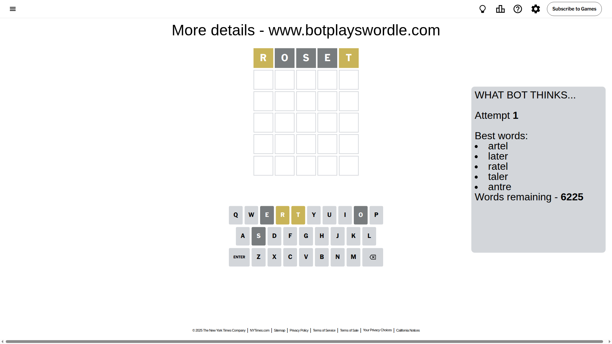
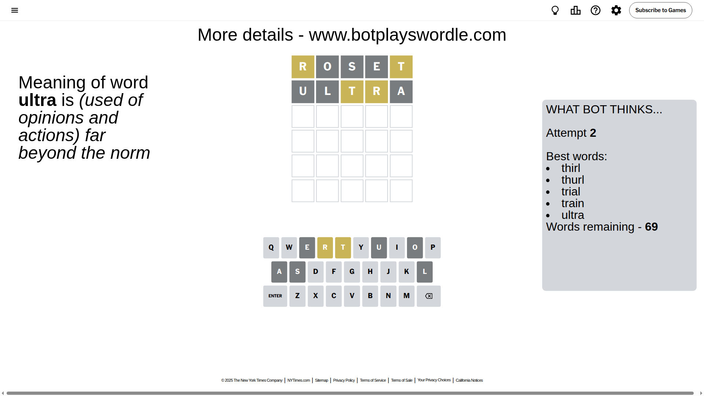
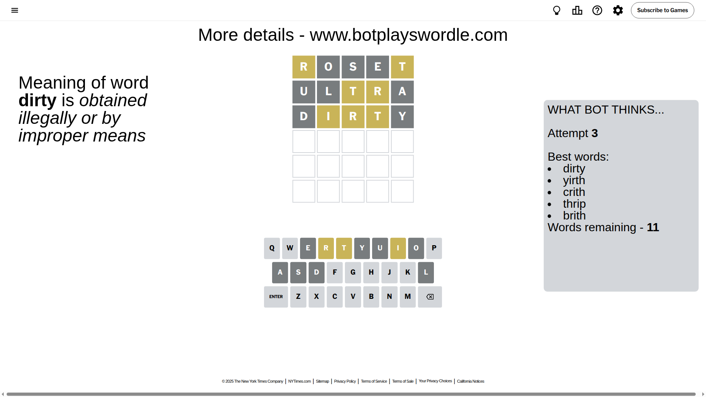
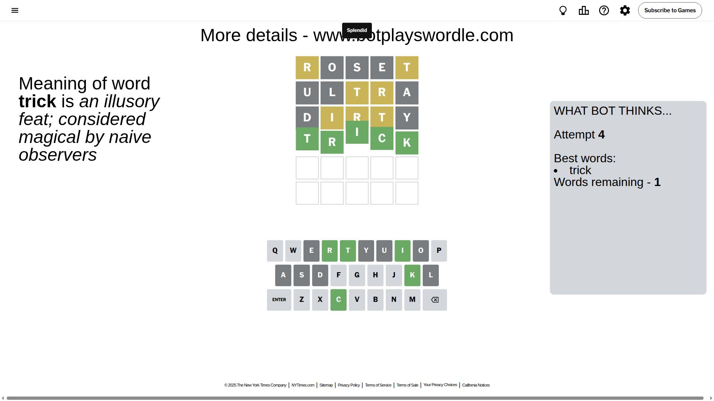

# Wordle for September 9, 2025 - \#1543

## Attempt 1

This is the first attempt and we'll choose a random word to start with.

Let's start with word `roset`

Attempt for `roset` gives us 0 correct letters, 2 present letters and 3 wrong letters.

If we look into details, we can see that:

Letter `r` is on a different spot - this means that it cannot be at position 1

Letter `o` is not present in the word and we will not use it any more

Letter `s` is not present in the word and we will not use it any more

Letter `e` is not present in the word and we will not use it any more

Letter `t` is on a different spot - this means that it cannot be at position 5

Some letters are missing (like `o`, `s`, `e`) but it's also important piece of information

Word should contain letters `[r t]`

That was a great guess that limited number of remaining words

## Attempt 2

Right now we have 69 words to choose from and best of them seem to be `[thirl thurl trial train ultra]`

So far we know that possible letters are:

At position 1: `[a b c d f g h i j k l m n p q t u v w x y z]`

At position 2: `[a b c d f g h i j k l m n p q r t u v w x y z]`

At position 3: `[a b c d f g h i j k l m n p q r t u v w x y z]`

At position 4: `[a b c d f g h i j k l m n p q r t u v w x y z]`

At position 5: `[a b c d f g h i j k l m n p q r u v w x y z]`

Next guess is `ultra`, let's see what it gives us

Attempt for `ultra` gives us 0 correct letters, 2 present letters and 3 wrong letters.

If we look into details, we can see that:

Letter `u` is not present in the word and we will not use it any more

Letter `l` is not present in the word and we will not use it any more

Letter `t` is on a different spot - this means that it cannot be at position 3

Letter `r` is on a different spot - this means that it cannot be at position 4

Letter `a` is not present in the word and we will not use it any more

Some letters are missing (like `u`, `l`, `a`) but it's also important piece of information

Word should contain letters `[r t]`

Not a bad guess in general

## Attempt 3

Right now we have 11 words to choose from and best of them seem to be `[dirty yirth crith thrip brith]`

So far we know that possible letters are:

At position 1: `[b c d f g h i j k m n p q t v w x y z]`

At position 2: `[b c d f g h i j k m n p q r t v w x y z]`

At position 3: `[b c d f g h i j k m n p q r v w x y z]`

At position 4: `[b c d f g h i j k m n p q t v w x y z]`

At position 5: `[b c d f g h i j k m n p q r v w x y z]`

Next guess is `dirty`, let's see what it gives us

Attempt for `dirty` gives us 0 correct letters, 3 present letters and 2 wrong letters.

If we look into details, we can see that:

Letter `d` is not present in the word and we will not use it any more

Letter `i` is on a different spot - this means that it cannot be at position 2

Letter `r` is on a different spot - this means that it cannot be at position 3

Letter `t` is on a different spot - this means that it cannot be at position 4

Letter `y` is not present in the word and we will not use it any more

Some letters are missing (like `d`, `y`) but it's also important piece of information

Word should contain letters `[r t i]`

That was a great guess that limited number of remaining words

## Attempt 4

Right now we have 1 words to choose from and best of them seem to be `[trick]`

So far we know that possible letters are:

At position 1: `[b c f g h i j k m n p q t v w x z]`

At position 2: `[b c f g h j k m n p q r t v w x z]`

At position 3: `[b c f g h i j k m n p q v w x z]`

At position 4: `[b c f g h i j k m n p q v w x z]`

At position 5: `[b c f g h i j k m n p q r v w x z]`

It must be `trick`

That's the correct answer! The word is `trick`!

## Conclusion

Today's word is `trick` and it took 4 attempts to guess it

