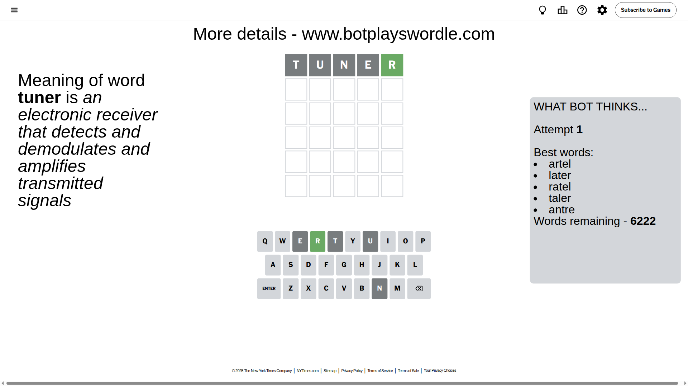
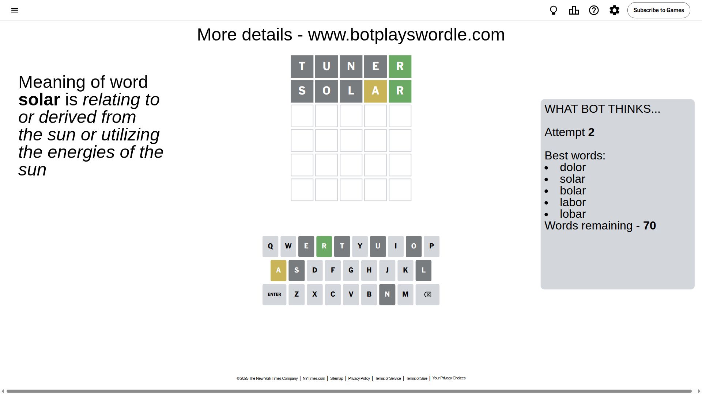
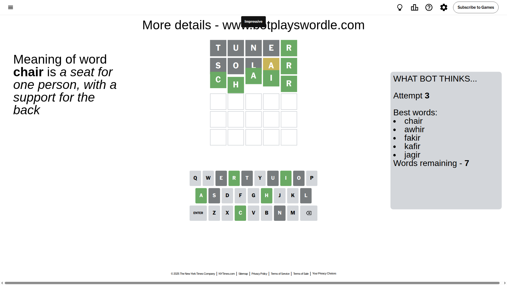

# Wordle for September 11, 2025 - \#1545

## Attempt 1

This is the first attempt and we'll choose a random word to start with.

Let's start with word `tuner`

Attempt for `tuner` gives us 1 correct letters, 0 present letters and 4 wrong letters.

If we look into details, we can see that:

Letter `t` is not present in the word and we will not use it any more

Letter `u` is not present in the word and we will not use it any more

Letter `n` is not present in the word and we will not use it any more

Letter `e` is not present in the word and we will not use it any more

Letter `r` should be at position 5

We got information about the correct letters and it should make next attempt easier

Some letters are missing (like `t`, `u`, `n`, `e`) but it's also important piece of information

Word should contain letters `[r]`

That was a great guess that limited number of remaining words

## Attempt 2

Right now we have 70 words to choose from and best of them seem to be `[dolor solar bolar labor lobar]`

So far we know that possible letters are:

At position 1: `[a b c d f g h i j k l m o p q r s v w x y z]`

At position 2: `[a b c d f g h i j k l m o p q r s v w x y z]`

At position 3: `[a b c d f g h i j k l m o p q r s v w x y z]`

At position 4: `[a b c d f g h i j k l m o p q r s v w x y z]`

At position 5: `[r]`

Next guess is `solar`, let's see what it gives us

Attempt for `solar` gives us 1 correct letters, 1 present letters and 3 wrong letters.

If we look into details, we can see that:

Letter `s` is not present in the word and we will not use it any more

Letter `o` is not present in the word and we will not use it any more

Letter `l` is not present in the word and we will not use it any more

Letter `a` is on a different spot - this means that it cannot be at position 4

Some letters are missing (like `s`, `o`, `l`) but it's also important piece of information

Word should contain letters `[r a]`

That was a great guess that limited number of remaining words

## Attempt 3

Right now we have 7 words to choose from and best of them seem to be `[chair awhir fakir kafir jagir]`

So far we know that possible letters are:

At position 1: `[a b c d f g h i j k m p q r v w x y z]`

At position 2: `[a b c d f g h i j k m p q r v w x y z]`

At position 3: `[a b c d f g h i j k m p q r v w x y z]`

At position 4: `[b c d f g h i j k m p q r v w x y z]`

At position 5: `[r]`

Next guess is `chair`, let's see what it gives us

That's the correct answer! The word is `chair`!

## Conclusion

Today's word is `chair` and it took 3 attempts to guess it

