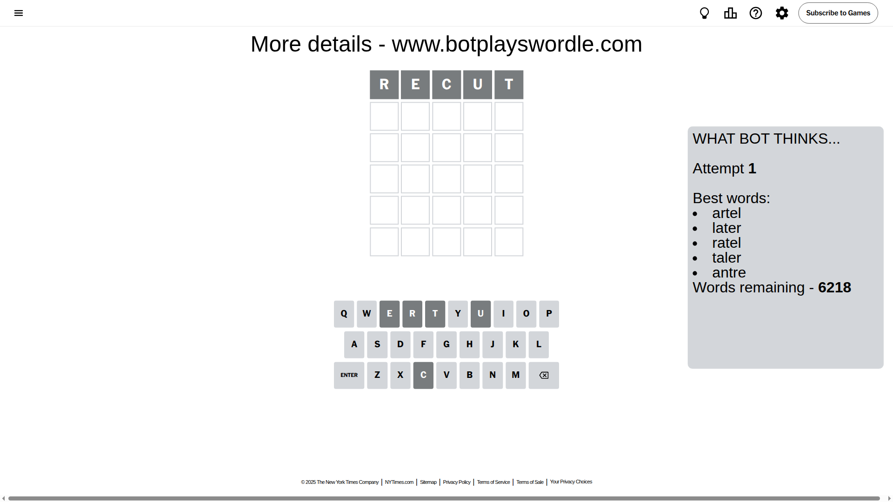
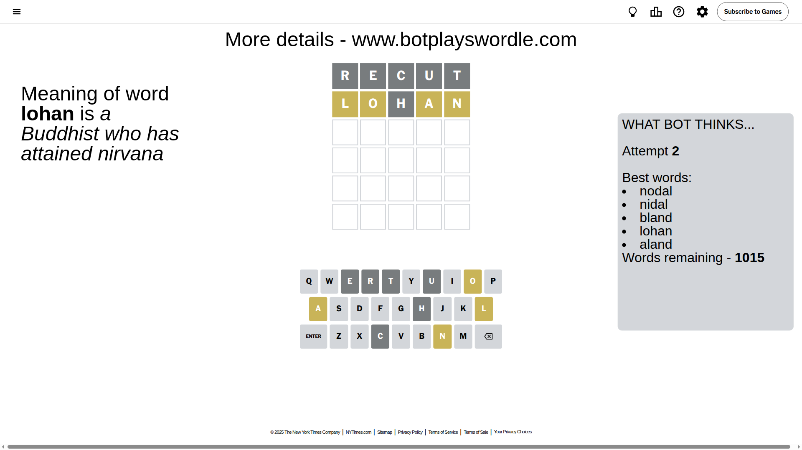
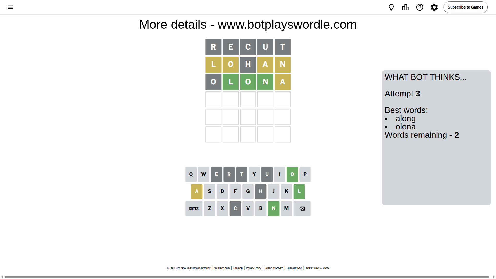
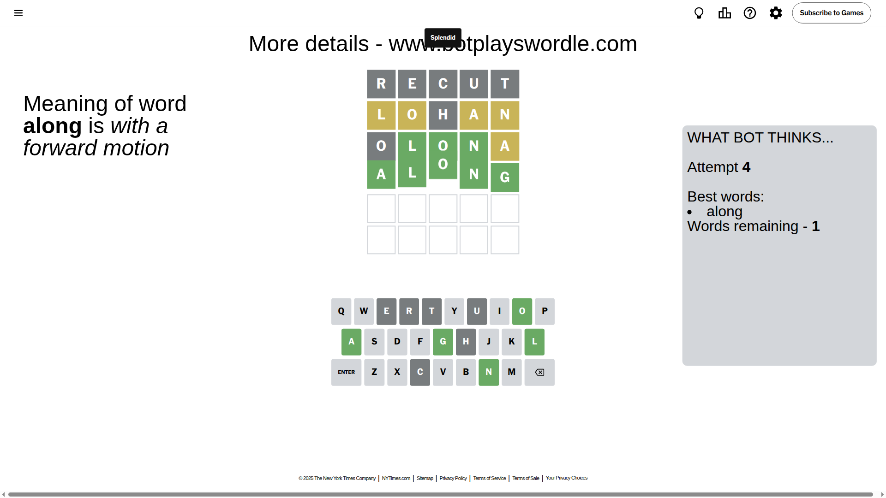

# Wordle for September 15, 2025 - \#1549

## Attempt 1

This is the first attempt and we'll choose a random word to start with.

Let's start with word `recut`

Attempt for `recut` gives us 0 correct letters, 0 present letters and 5 wrong letters.

If we look into details, we can see that:

Letter `r` is not present in the word and we will not use it any more

Letter `e` is not present in the word and we will not use it any more

Letter `c` is not present in the word and we will not use it any more

Letter `u` is not present in the word and we will not use it any more

Letter `t` is not present in the word and we will not use it any more

Some letters are missing (like `r`, `e`, `c`, `u`, `t`) but it's also important piece of information

So far we don't know any of the letters!

Not a bad guess in general

## Attempt 2

Right now we have 1015 words to choose from and best of them seem to be `[nodal nidal bland lohan aland]`

So far we know that possible letters are:

At position 1: `[a b d f g h i j k l m n o p q s v w x y z]`

At position 2: `[a b d f g h i j k l m n o p q s v w x y z]`

At position 3: `[a b d f g h i j k l m n o p q s v w x y z]`

At position 4: `[a b d f g h i j k l m n o p q s v w x y z]`

At position 5: `[a b d f g h i j k l m n o p q s v w x y z]`

Next guess is `lohan`, let's see what it gives us

Attempt for `lohan` gives us 0 correct letters, 4 present letters and 1 wrong letters.

If we look into details, we can see that:

Letter `l` is on a different spot - this means that it cannot be at position 1

Letter `o` is on a different spot - this means that it cannot be at position 2

Letter `h` is not present in the word and we will not use it any more

Letter `a` is on a different spot - this means that it cannot be at position 4

Letter `n` is on a different spot - this means that it cannot be at position 5

Some letters are missing (like `h`) but it's also important piece of information

Word should contain letters `[l o a n]`

That was a great guess that limited number of remaining words

## Attempt 3

Right now we have 2 words to choose from and best of them seem to be `[along olona]`

So far we know that possible letters are:

At position 1: `[a b d f g i j k m n o p q s v w x y z]`

At position 2: `[a b d f g i j k l m n p q s v w x y z]`

At position 3: `[a b d f g i j k l m n o p q s v w x y z]`

At position 4: `[b d f g i j k l m n o p q s v w x y z]`

At position 5: `[a b d f g i j k l m o p q s v w x y z]`

Next guess is `olona`, let's see what it gives us

Attempt for `olona` gives us 3 correct letters, 1 present letters and 1 wrong letters.

If we look into details, we can see that:

Letter `o` is not present in the word and we will not use it any more

Letter `l` should be at position 2

Letter `o` should be at position 3

Letter `n` should be at position 4

Letter `a` is on a different spot - this means that it cannot be at position 5

We got information about the correct letters and it should make next attempt easier

Some letters are missing (like `o`) but it's also important piece of information

Word should contain letters `[l o a n]`

This was a waste, almost no valuable information...

## Attempt 4

Right now we have 1 words to choose from and best of them seem to be `[along]`

So far we know that possible letters are:

At position 1: `[a b d f g i j k m n p q s v w x y z]`

At position 2: `[l]`

At position 3: `[o]`

At position 4: `[n]`

At position 5: `[b d f g i j k l m p q s v w x y z]`

It must be `along`

That's the correct answer! The word is `along`!

## Conclusion

Today's word is `along` and it took 4 attempts to guess it

