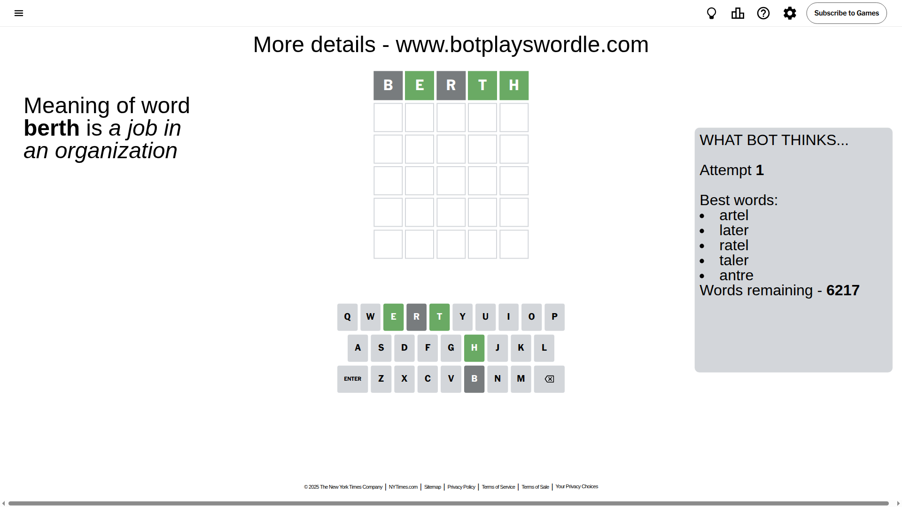
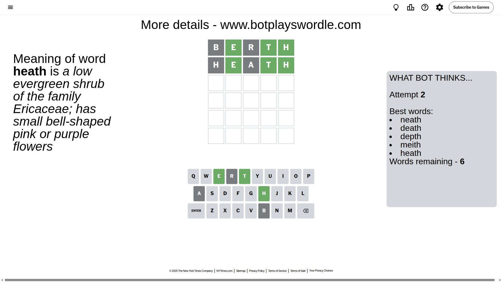
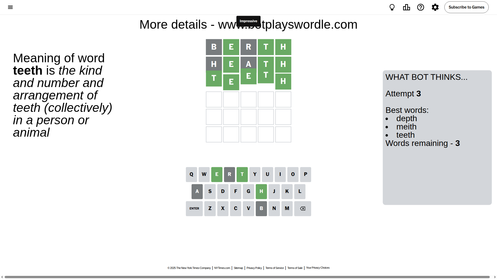

# Wordle for September 17, 2025 - \#1551

## Attempt 1

This is the first attempt and we'll choose a random word to start with.

Let's start with word `berth`

Attempt for `berth` gives us 3 correct letters, 0 present letters and 2 wrong letters.

If we look into details, we can see that:

Letter `b` is not present in the word and we will not use it any more

Letter `e` should be at position 2

Letter `r` is not present in the word and we will not use it any more

Letter `t` should be at position 4

Letter `h` should be at position 5

We got information about the correct letters and it should make next attempt easier

Some letters are missing (like `b`, `r`) but it's also important piece of information

Word should contain letters `[e t h]`

That was a great guess that limited number of remaining words

## Attempt 2

Right now we have 6 words to choose from and best of them seem to be `[neath death depth meith heath]`

So far we know that possible letters are:

At position 1: `[a c d e f g h i j k l m n o p q s t u v w x y z]`

At position 2: `[e]`

At position 3: `[a c d e f g h i j k l m n o p q s t u v w x y z]`

At position 4: `[t]`

At position 5: `[h]`

Next guess is `heath`, let's see what it gives us

Attempt for `heath` gives us 3 correct letters, 0 present letters and 2 wrong letters.

If we look into details, we can see that:

Letter `h` is not present in the word and we will not use it any more

Letter `a` is not present in the word and we will not use it any more

Some letters are missing (like `h`, `a`) but it's also important piece of information

Word should contain letters `[e t h]`

This was a waste, almost no valuable information...

## Attempt 3

Right now we have 3 words to choose from and best of them seem to be `[depth meith teeth]`

So far we know that possible letters are:

At position 1: `[c d e f g i j k l m n o p q s t u v w x y z]`

At position 2: `[e]`

At position 3: `[c d e f g i j k l m n o p q s t u v w x y z]`

At position 4: `[t]`

At position 5: `[h]`

Next guess is `teeth`, let's see what it gives us

That's the correct answer! The word is `teeth`!

## Conclusion

Today's word is `teeth` and it took 3 attempts to guess it

