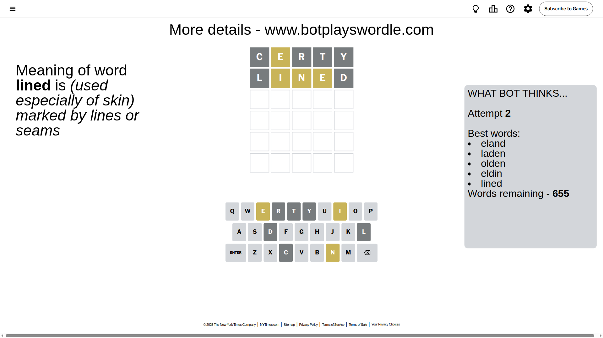

# Wordle for September 18, 2025 - \#1552

## Attempt 1

This is the first attempt and we'll choose a random word to start with.

Let's start with word `certy`

Attempt for `certy` gives us 0 correct letters, 1 present letters and 4 wrong letters.

If we look into details, we can see that:

Letter `c` is not present in the word and we will not use it any more

Letter `e` is on a different spot - this means that it cannot be at position 2

Letter `r` is not present in the word and we will not use it any more

Letter `t` is not present in the word and we will not use it any more

Letter `y` is not present in the word and we will not use it any more

Some letters are missing (like `c`, `r`, `t`, `y`) but it's also important piece of information

Word should contain letters `[e]`

That was a great guess that limited number of remaining words

## Attempt 2

Right now we have 655 words to choose from and best of them seem to be `[eland laden olden eldin lined]`

So far we know that possible letters are:

At position 1: `[a b d e f g h i j k l m n o p q s u v w x z]`

At position 2: `[a b d f g h i j k l m n o p q s u v w x z]`

At position 3: `[a b d e f g h i j k l m n o p q s u v w x z]`

At position 4: `[a b d e f g h i j k l m n o p q s u v w x z]`

At position 5: `[a b d e f g h i j k l m n o p q s u v w x z]`

Next guess is `lined`, let's see what it gives us

Attempt for `lined` gives us 0 correct letters, 3 present letters and 2 wrong letters.

If we look into details, we can see that:

Letter `l` is not present in the word and we will not use it any more

Letter `i` is on a different spot - this means that it cannot be at position 2

Letter `n` is on a different spot - this means that it cannot be at position 3

Letter `e` is on a different spot - this means that it cannot be at position 4

Letter `d` is not present in the word and we will not use it any more

Some letters are missing (like `l`, `d`) but it's also important piece of information

Word should contain letters `[e i n]`

That was a great guess that limited number of remaining words

## Attempt 3

Right now we have 19 words to choose from and best of them seem to be `[eshin shine anise amine anime]`

So far we know that possible letters are:

At position 1: `[a b e f g h i j k m n o p q s u v w x z]`

At position 2: `[a b f g h j k m n o p q s u v w x z]`

At position 3: `[a b e f g h i j k m o p q s u v w x z]`

At position 4: `[a b f g h i j k m n o p q s u v w x z]`

At position 5: `[a b e f g h i j k m n o p q s u v w x z]`

Next guess is `anime`, let's see what it gives us

Attempt for `anime` gives us 3 correct letters, 0 present letters and 2 wrong letters.

If we look into details, we can see that:

Letter `a` is not present in the word and we will not use it any more

Letter `n` should be at position 2

Letter `i` should be at position 3

Letter `m` is not present in the word and we will not use it any more

Letter `e` should be at position 5

We got information about the correct letters and it should make next attempt easier

Some letters are missing (like `a`, `m`) but it's also important piece of information

Word should contain letters `[e i n]`

That was a great guess that limited number of remaining words

## Attempt 4

Right now we have 2 words to choose from and best of them seem to be `[snipe knife]`

So far we know that possible letters are:

At position 1: `[b e f g h i j k n o p q s u v w x z]`

At position 2: `[n]`

At position 3: `[i]`

At position 4: `[b f g h i j k n o p q s u v w x z]`

At position 5: `[e]`

Next guess is `snipe`, let's see what it gives us

Attempt for `snipe` gives us 3 correct letters, 0 present letters and 2 wrong letters.

If we look into details, we can see that:

Letter `s` is not present in the word and we will not use it any more

Letter `p` is not present in the word and we will not use it any more

Some letters are missing (like `s`, `p`) but it's also important piece of information

Word should contain letters `[e i n]`

This was a waste, almost no valuable information...

## Attempt 5

Right now we have 1 words to choose from and best of them seem to be `[knife]`

So far we know that possible letters are:

At position 1: `[b e f g h i j k n o q u v w x z]`

At position 2: `[n]`

At position 3: `[i]`

At position 4: `[b f g h i j k n o q u v w x z]`

At position 5: `[e]`

It must be `knife`

That's the correct answer! The word is `knife`!

## Conclusion

Today's word is `knife` and it took 5 attempts to guess it

