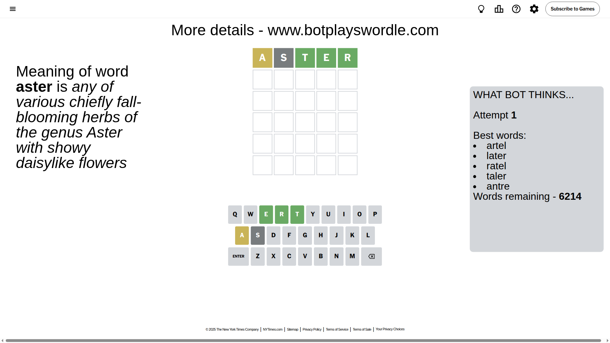
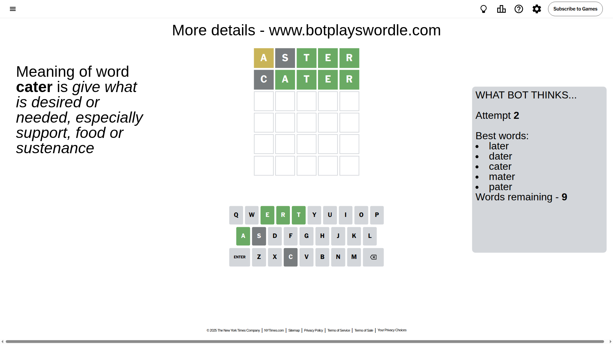
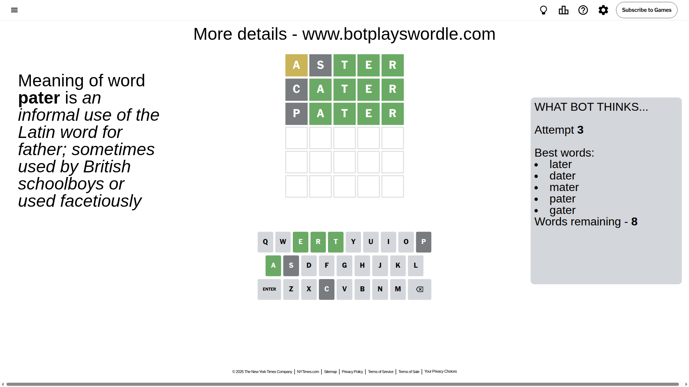
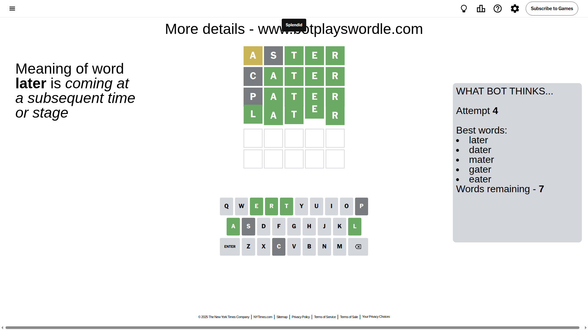

# Wordle for September 19, 2025 - \#1553

## Attempt 1

This is the first attempt and we'll choose a random word to start with.

Let's start with word `aster`

Attempt for `aster` gives us 3 correct letters, 1 present letters and 1 wrong letters.

If we look into details, we can see that:

Letter `a` is on a different spot - this means that it cannot be at position 1

Letter `s` is not present in the word and we will not use it any more

Letter `t` should be at position 3

Letter `e` should be at position 4

Letter `r` should be at position 5

We got information about the correct letters and it should make next attempt easier

Some letters are missing (like `s`) but it's also important piece of information

Word should contain letters `[a t e r]`

That was a great guess that limited number of remaining words

## Attempt 2

Right now we have 9 words to choose from and best of them seem to be `[later dater cater mater pater]`

So far we know that possible letters are:

At position 1: `[b c d e f g h i j k l m n o p q r t u v w x y z]`

At position 2: `[a b c d e f g h i j k l m n o p q r t u v w x y z]`

At position 3: `[t]`

At position 4: `[e]`

At position 5: `[r]`

Next guess is `cater`, let's see what it gives us

Attempt for `cater` gives us 4 correct letters, 0 present letters and 1 wrong letters.

If we look into details, we can see that:

Letter `c` is not present in the word and we will not use it any more

Letter `a` should be at position 2

We got information about the correct letters and it should make next attempt easier

Some letters are missing (like `c`) but it's also important piece of information

Word should contain letters `[a t e r]`

This was a waste, almost no valuable information...

## Attempt 3

Right now we have 8 words to choose from and best of them seem to be `[later dater mater pater gater]`

So far we know that possible letters are:

At position 1: `[b d e f g h i j k l m n o p q r t u v w x y z]`

At position 2: `[a]`

At position 3: `[t]`

At position 4: `[e]`

At position 5: `[r]`

Next guess is `pater`, let's see what it gives us

Attempt for `pater` gives us 4 correct letters, 0 present letters and 1 wrong letters.

If we look into details, we can see that:

Letter `p` is not present in the word and we will not use it any more

Some letters are missing (like `p`) but it's also important piece of information

Word should contain letters `[a t e r]`

This was a waste, almost no valuable information...

## Attempt 4

Right now we have 7 words to choose from and best of them seem to be `[later dater mater gater eater]`

So far we know that possible letters are:

At position 1: `[b d e f g h i j k l m n o q r t u v w x y z]`

At position 2: `[a]`

At position 3: `[t]`

At position 4: `[e]`

At position 5: `[r]`

Next guess is `later`, let's see what it gives us

That's the correct answer! The word is `later`!

## Conclusion

Today's word is `later` and it took 4 attempts to guess it

