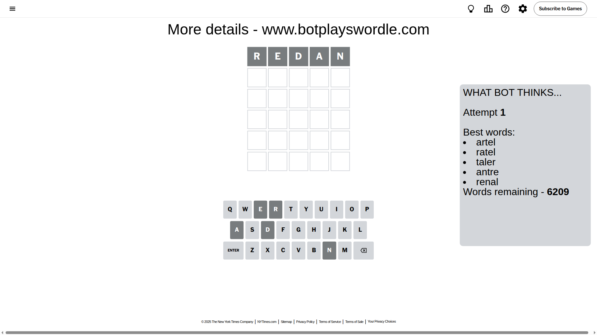
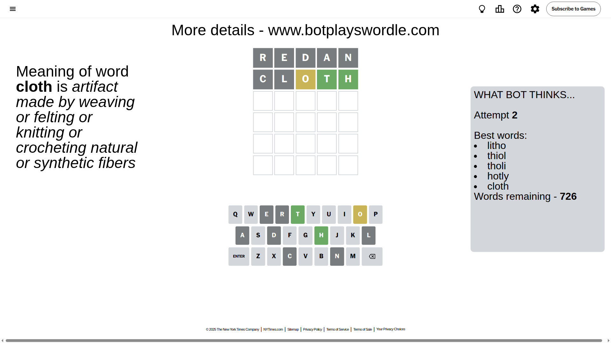
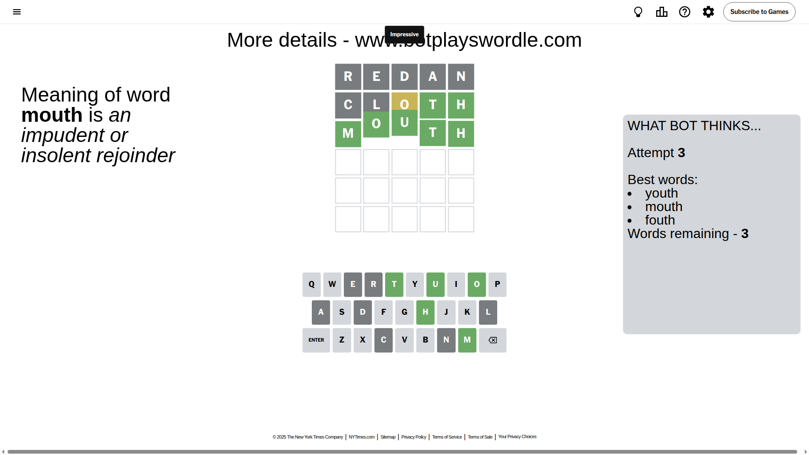

# Wordle for September 23, 2025 - \#1557

## Attempt 1

This is the first attempt and we'll choose a random word to start with.

Let's start with word `redan`

Attempt for `redan` gives us 0 correct letters, 0 present letters and 5 wrong letters.

If we look into details, we can see that:

Letter `r` is not present in the word and we will not use it any more

Letter `e` is not present in the word and we will not use it any more

Letter `d` is not present in the word and we will not use it any more

Letter `a` is not present in the word and we will not use it any more

Letter `n` is not present in the word and we will not use it any more

Some letters are missing (like `r`, `e`, `d`, `a`, `n`) but it's also important piece of information

So far we don't know any of the letters!

That was a great guess that limited number of remaining words

## Attempt 2

Right now we have 726 words to choose from and best of them seem to be `[litho thiol tholi hotly cloth]`

So far we know that possible letters are:

At position 1: `[b c f g h i j k l m o p q s t u v w x y z]`

At position 2: `[b c f g h i j k l m o p q s t u v w x y z]`

At position 3: `[b c f g h i j k l m o p q s t u v w x y z]`

At position 4: `[b c f g h i j k l m o p q s t u v w x y z]`

At position 5: `[b c f g h i j k l m o p q s t u v w x y z]`

Next guess is `cloth`, let's see what it gives us

Attempt for `cloth` gives us 2 correct letters, 1 present letters and 2 wrong letters.

If we look into details, we can see that:

Letter `c` is not present in the word and we will not use it any more

Letter `l` is not present in the word and we will not use it any more

Letter `o` is on a different spot - this means that it cannot be at position 3

Letter `t` should be at position 4

Letter `h` should be at position 5

We got information about the correct letters and it should make next attempt easier

Some letters are missing (like `c`, `l`) but it's also important piece of information

Word should contain letters `[o t h]`

That was a great guess that limited number of remaining words

## Attempt 3

Right now we have 3 words to choose from and best of them seem to be `[youth mouth fouth]`

So far we know that possible letters are:

At position 1: `[b f g h i j k m o p q s t u v w x y z]`

At position 2: `[b f g h i j k m o p q s t u v w x y z]`

At position 3: `[b f g h i j k m p q s t u v w x y z]`

At position 4: `[t]`

At position 5: `[h]`

Next guess is `mouth`, let's see what it gives us

That's the correct answer! The word is `mouth`!

## Conclusion

Today's word is `mouth` and it took 3 attempts to guess it

