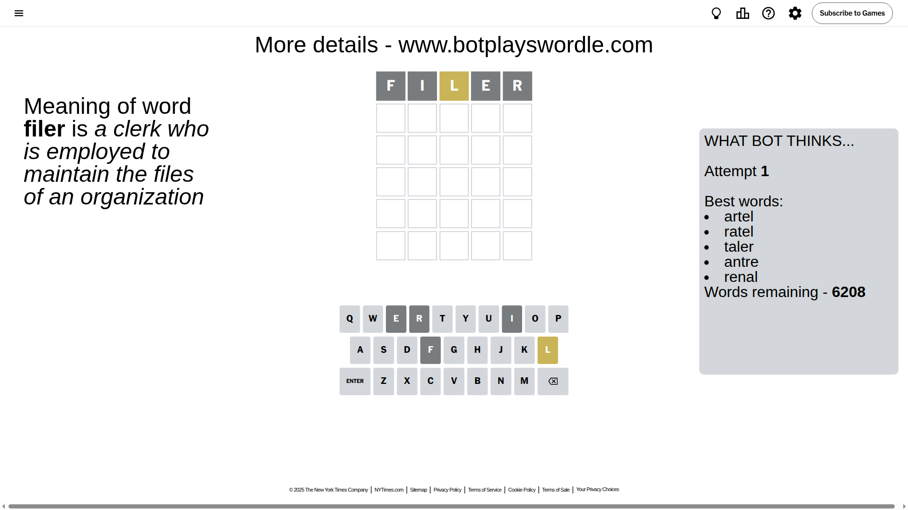
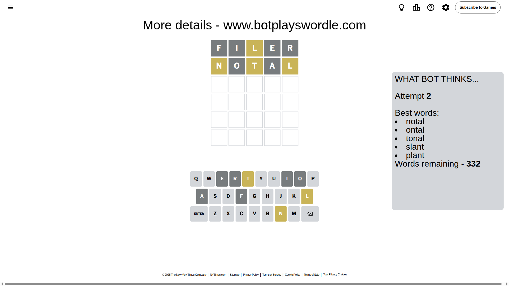
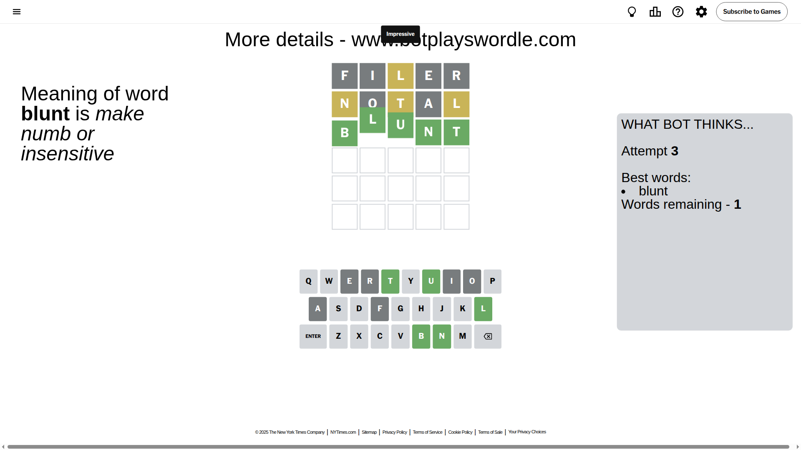

# Wordle for September 24, 2025 - \#1558

## Attempt 1

This is the first attempt and we'll choose a random word to start with.

Let's start with word `filer`

Attempt for `filer` gives us 0 correct letters, 1 present letters and 4 wrong letters.

If we look into details, we can see that:

Letter `f` is not present in the word and we will not use it any more

Letter `i` is not present in the word and we will not use it any more

Letter `l` is on a different spot - this means that it cannot be at position 3

Letter `e` is not present in the word and we will not use it any more

Letter `r` is not present in the word and we will not use it any more

Some letters are missing (like `f`, `i`, `e`, `r`) but it's also important piece of information

Word should contain letters `[l]`

That was a great guess that limited number of remaining words

## Attempt 2

Right now we have 332 words to choose from and best of them seem to be `[notal ontal tonal slant plant]`

So far we know that possible letters are:

At position 1: `[a b c d g h j k l m n o p q s t u v w x y z]`

At position 2: `[a b c d g h j k l m n o p q s t u v w x y z]`

At position 3: `[a b c d g h j k m n o p q s t u v w x y z]`

At position 4: `[a b c d g h j k l m n o p q s t u v w x y z]`

At position 5: `[a b c d g h j k l m n o p q s t u v w x y z]`

Next guess is `notal`, let's see what it gives us

Attempt for `notal` gives us 0 correct letters, 3 present letters and 2 wrong letters.

If we look into details, we can see that:

Letter `n` is on a different spot - this means that it cannot be at position 1

Letter `o` is not present in the word and we will not use it any more

Letter `t` is on a different spot - this means that it cannot be at position 3

Letter `a` is not present in the word and we will not use it any more

Letter `l` is on a different spot - this means that it cannot be at position 5

Some letters are missing (like `o`, `a`) but it's also important piece of information

Word should contain letters `[l n t]`

That was a great guess that limited number of remaining words

## Attempt 3

Right now we have 1 words to choose from and best of them seem to be `[blunt]`

So far we know that possible letters are:

At position 1: `[b c d g h j k l m p q s t u v w x y z]`

At position 2: `[b c d g h j k l m n p q s t u v w x y z]`

At position 3: `[b c d g h j k m n p q s u v w x y z]`

At position 4: `[b c d g h j k l m n p q s t u v w x y z]`

At position 5: `[b c d g h j k m n p q s t u v w x y z]`

It must be `blunt`

That's the correct answer! The word is `blunt`!

## Conclusion

Today's word is `blunt` and it took 3 attempts to guess it

