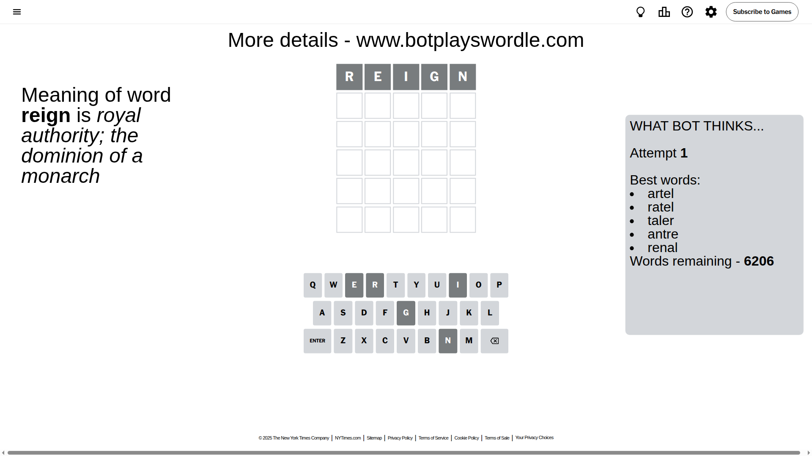
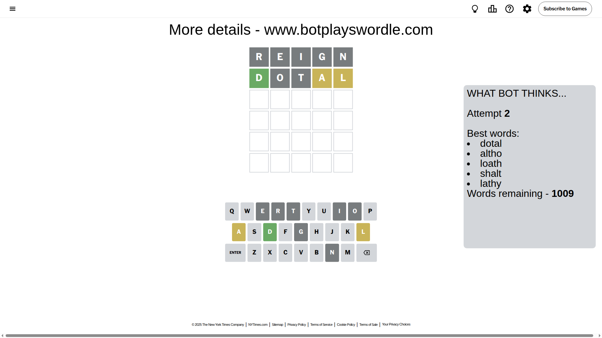
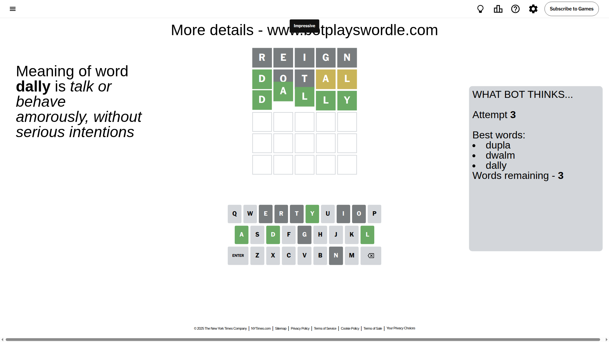

# Wordle for September 26, 2025 - \#1560

## Attempt 1

This is the first attempt and we'll choose a random word to start with.

Let's start with word `reign`

Attempt for `reign` gives us 0 correct letters, 0 present letters and 5 wrong letters.

If we look into details, we can see that:

Letter `r` is not present in the word and we will not use it any more

Letter `e` is not present in the word and we will not use it any more

Letter `i` is not present in the word and we will not use it any more

Letter `g` is not present in the word and we will not use it any more

Letter `n` is not present in the word and we will not use it any more

Some letters are missing (like `r`, `e`, `i`, `g`, `n`) but it's also important piece of information

So far we don't know any of the letters!

Not a bad guess in general

## Attempt 2

Right now we have 1009 words to choose from and best of them seem to be `[dotal altho loath shalt lathy]`

So far we know that possible letters are:

At position 1: `[a b c d f h j k l m o p q s t u v w x y z]`

At position 2: `[a b c d f h j k l m o p q s t u v w x y z]`

At position 3: `[a b c d f h j k l m o p q s t u v w x y z]`

At position 4: `[a b c d f h j k l m o p q s t u v w x y z]`

At position 5: `[a b c d f h j k l m o p q s t u v w x y z]`

Next guess is `dotal`, let's see what it gives us

Attempt for `dotal` gives us 1 correct letters, 2 present letters and 2 wrong letters.

If we look into details, we can see that:

Letter `d` should be at position 1

Letter `o` is not present in the word and we will not use it any more

Letter `t` is not present in the word and we will not use it any more

Letter `a` is on a different spot - this means that it cannot be at position 4

Letter `l` is on a different spot - this means that it cannot be at position 5

We got information about the correct letters and it should make next attempt easier

Some letters are missing (like `o`, `t`) but it's also important piece of information

Word should contain letters `[d a l]`

That was a great guess that limited number of remaining words

## Attempt 3

Right now we have 3 words to choose from and best of them seem to be `[dupla dwalm dally]`

So far we know that possible letters are:

At position 1: `[d]`

At position 2: `[a b c d f h j k l m p q s u v w x y z]`

At position 3: `[a b c d f h j k l m p q s u v w x y z]`

At position 4: `[b c d f h j k l m p q s u v w x y z]`

At position 5: `[a b c d f h j k m p q s u v w x y z]`

Next guess is `dally`, let's see what it gives us

That's the correct answer! The word is `dally`!

## Conclusion

Today's word is `dally` and it took 3 attempts to guess it

