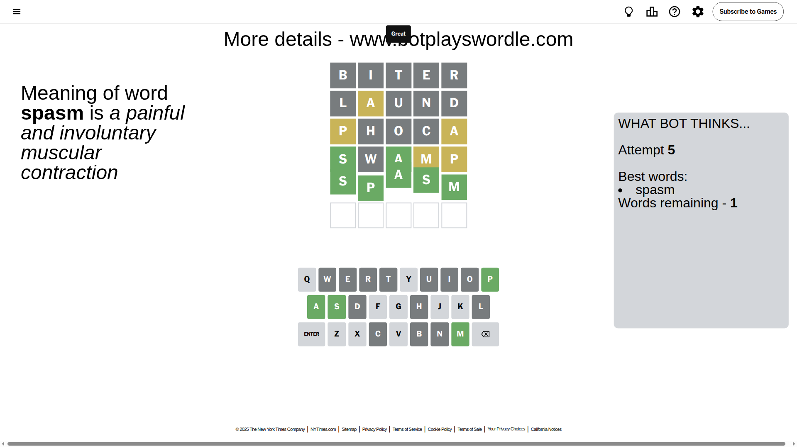

# Wordle for October 3, 2025 - \#1567

## Attempt 1

This is the first attempt and we'll choose a random word to start with.

Let's start with word `biter`

Attempt for `biter` gives us 0 correct letters, 0 present letters and 5 wrong letters.

If we look into details, we can see that:

Letter `b` is not present in the word and we will not use it any more

Letter `i` is not present in the word and we will not use it any more

Letter `t` is not present in the word and we will not use it any more

Letter `e` is not present in the word and we will not use it any more

Letter `r` is not present in the word and we will not use it any more

Some letters are missing (like `b`, `i`, `t`, `e`, `r`) but it's also important piece of information

So far we don't know any of the letters!

Not a bad guess in general

## Attempt 2

Right now we have 997 words to choose from and best of them seem to be `[nodal laund ulnad lohan unold]`

So far we know that possible letters are:

At position 1: `[a c d f g h j k l m n o p q s u v w x y z]`

At position 2: `[a c d f g h j k l m n o p q s u v w x y z]`

At position 3: `[a c d f g h j k l m n o p q s u v w x y z]`

At position 4: `[a c d f g h j k l m n o p q s u v w x y z]`

At position 5: `[a c d f g h j k l m n o p q s u v w x y z]`

Next guess is `laund`, let's see what it gives us

Attempt for `laund` gives us 0 correct letters, 1 present letters and 4 wrong letters.

If we look into details, we can see that:

Letter `l` is not present in the word and we will not use it any more

Letter `a` is on a different spot - this means that it cannot be at position 2

Letter `u` is not present in the word and we will not use it any more

Letter `n` is not present in the word and we will not use it any more

Letter `d` is not present in the word and we will not use it any more

Some letters are missing (like `l`, `u`, `n`, `d`) but it's also important piece of information

Word should contain letters `[a]`

That was a great guess that limited number of remaining words

## Attempt 3

Right now we have 83 words to choose from and best of them seem to be `[oshac shako mocha phoca poach]`

So far we know that possible letters are:

At position 1: `[a c f g h j k m o p q s v w x y z]`

At position 2: `[c f g h j k m o p q s v w x y z]`

At position 3: `[a c f g h j k m o p q s v w x y z]`

At position 4: `[a c f g h j k m o p q s v w x y z]`

At position 5: `[a c f g h j k m o p q s v w x y z]`

Next guess is `phoca`, let's see what it gives us

Attempt for `phoca` gives us 0 correct letters, 2 present letters and 3 wrong letters.

If we look into details, we can see that:

Letter `p` is on a different spot - this means that it cannot be at position 1

Letter `h` is not present in the word and we will not use it any more

Letter `o` is not present in the word and we will not use it any more

Letter `c` is not present in the word and we will not use it any more

Letter `a` is on a different spot - this means that it cannot be at position 5

Some letters are missing (like `h`, `o`, `c`) but it's also important piece of information

Word should contain letters `[a p]`

That was a great guess that limited number of remaining words

## Attempt 4

Right now we have 5 words to choose from and best of them seem to be `[swamp spasm agasp ampyx appay]`

So far we know that possible letters are:

At position 1: `[a f g j k m q s v w x y z]`

At position 2: `[f g j k m p q s v w x y z]`

At position 3: `[a f g j k m p q s v w x y z]`

At position 4: `[a f g j k m p q s v w x y z]`

At position 5: `[f g j k m p q s v w x y z]`

Next guess is `swamp`, let's see what it gives us

Attempt for `swamp` gives us 2 correct letters, 2 present letters and 1 wrong letters.

If we look into details, we can see that:

Letter `s` should be at position 1

Letter `w` is not present in the word and we will not use it any more

Letter `a` should be at position 3

Letter `m` is on a different spot - this means that it cannot be at position 4

Letter `p` is on a different spot - this means that it cannot be at position 5

We got information about the correct letters and it should make next attempt easier

Some letters are missing (like `w`) but it's also important piece of information

Word should contain letters `[a p s m]`

Not a bad guess in general

## Attempt 5

Right now we have 1 words to choose from and best of them seem to be `[spasm]`

So far we know that possible letters are:

At position 1: `[s]`

At position 2: `[f g j k m p q s v x y z]`

At position 3: `[a]`

At position 4: `[a f g j k p q s v x y z]`

At position 5: `[f g j k m q s v x y z]`

It must be `spasm`

That's the correct answer! The word is `spasm`!

## Conclusion

Today's word is `spasm` and it took 5 attempts to guess it

