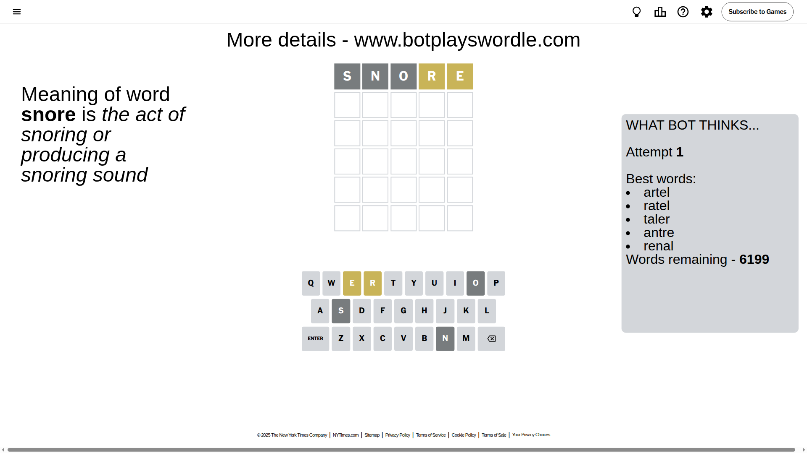
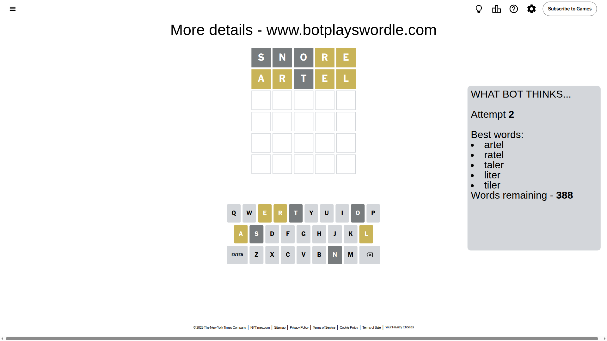
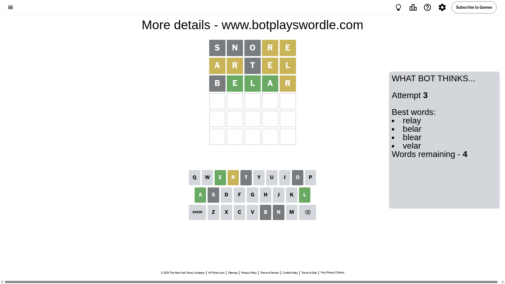
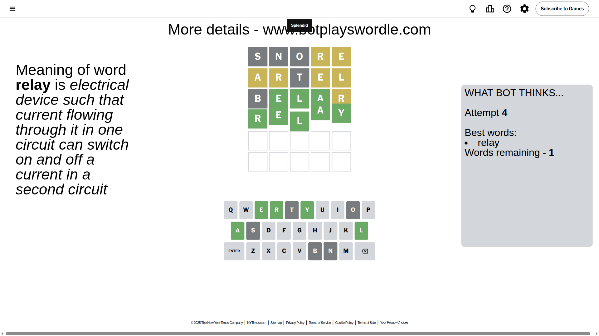

# Wordle for October 4, 2025 - \#1568

## Attempt 1

This is the first attempt and we'll choose a random word to start with.

Let's start with word `snore`

Attempt for `snore` gives us 0 correct letters, 2 present letters and 3 wrong letters.

If we look into details, we can see that:

Letter `s` is not present in the word and we will not use it any more

Letter `n` is not present in the word and we will not use it any more

Letter `o` is not present in the word and we will not use it any more

Letter `r` is on a different spot - this means that it cannot be at position 4

Letter `e` is on a different spot - this means that it cannot be at position 5

Some letters are missing (like `s`, `n`, `o`) but it's also important piece of information

Word should contain letters `[r e]`

That was a great guess that limited number of remaining words

## Attempt 2

Right now we have 388 words to choose from and best of them seem to be `[artel ratel taler liter tiler]`

So far we know that possible letters are:

At position 1: `[a b c d e f g h i j k l m p q r t u v w x y z]`

At position 2: `[a b c d e f g h i j k l m p q r t u v w x y z]`

At position 3: `[a b c d e f g h i j k l m p q r t u v w x y z]`

At position 4: `[a b c d e f g h i j k l m p q t u v w x y z]`

At position 5: `[a b c d f g h i j k l m p q r t u v w x y z]`

Next guess is `artel`, let's see what it gives us

Attempt for `artel` gives us 0 correct letters, 4 present letters and 1 wrong letters.

If we look into details, we can see that:

Letter `a` is on a different spot - this means that it cannot be at position 1

Letter `r` is on a different spot - this means that it cannot be at position 2

Letter `t` is not present in the word and we will not use it any more

Letter `e` is on a different spot - this means that it cannot be at position 4

Letter `l` is on a different spot - this means that it cannot be at position 5

Some letters are missing (like `t`) but it's also important piece of information

Word should contain letters `[r e a l]`

That was a great guess that limited number of remaining words

## Attempt 3

Right now we have 4 words to choose from and best of them seem to be `[relay belar blear velar]`

So far we know that possible letters are:

At position 1: `[b c d e f g h i j k l m p q r u v w x y z]`

At position 2: `[a b c d e f g h i j k l m p q u v w x y z]`

At position 3: `[a b c d e f g h i j k l m p q r u v w x y z]`

At position 4: `[a b c d f g h i j k l m p q u v w x y z]`

At position 5: `[a b c d f g h i j k m p q r u v w x y z]`

Next guess is `belar`, let's see what it gives us

Attempt for `belar` gives us 3 correct letters, 1 present letters and 1 wrong letters.

If we look into details, we can see that:

Letter `b` is not present in the word and we will not use it any more

Letter `e` should be at position 2

Letter `l` should be at position 3

Letter `a` should be at position 4

Letter `r` is on a different spot - this means that it cannot be at position 5

We got information about the correct letters and it should make next attempt easier

Some letters are missing (like `b`) but it's also important piece of information

Word should contain letters `[r e a l]`

Could be a better guess

## Attempt 4

Right now we have 1 words to choose from and best of them seem to be `[relay]`

So far we know that possible letters are:

At position 1: `[c d e f g h i j k l m p q r u v w x y z]`

At position 2: `[e]`

At position 3: `[l]`

At position 4: `[a]`

At position 5: `[a c d f g h i j k m p q u v w x y z]`

It must be `relay`

That's the correct answer! The word is `relay`!

## Conclusion

Today's word is `relay` and it took 4 attempts to guess it

